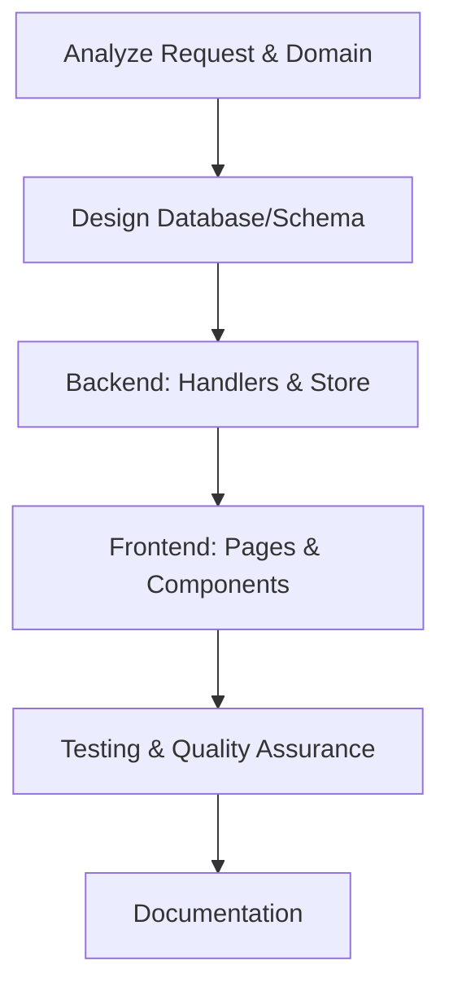

# VCT Engineering Graph (O(1) Workflow)

> **Trigger:** Tasks related to coding, database, testing, feature building, or maintenance.
> **Associated Skills:** `vct-backend`, `vct-frontend`, `vct-mobile`, `vct-database`, `vct-qa`

## 1. Feature Node (Thêm tính năng mới)

- **Backend Rules:** pgx/v5, clean architecture, authentication middleware, error wrapping.
- **Frontend Rules:** app router, `packages/ui/`, `--vct-*` css variables, Zustand 5, Zod 4, i18n keys.

## 2. Bug Fix Node (Maintenance / Sửa lỗi)
1. **Identify Root Cause**: Read logs, stack traces, check database logic.
2. **Implement Fix**: Fix backend first (if data issue), then frontend. 
3. **Verify Regression**: Run `go test` and Playwright tests.

## 3. Database Node (Quản lý Data)
- Never drop a column/table without user confirmation. Always pair up/down migrations using golang-migrate or similar.
- Use PostgreSQL. Re-index text search when changing query patterns.

## 4. Code Review Node
- **Criteria:** SOLID, Impact & Blast Radius, Security > Regulation > Architecture > Business.
