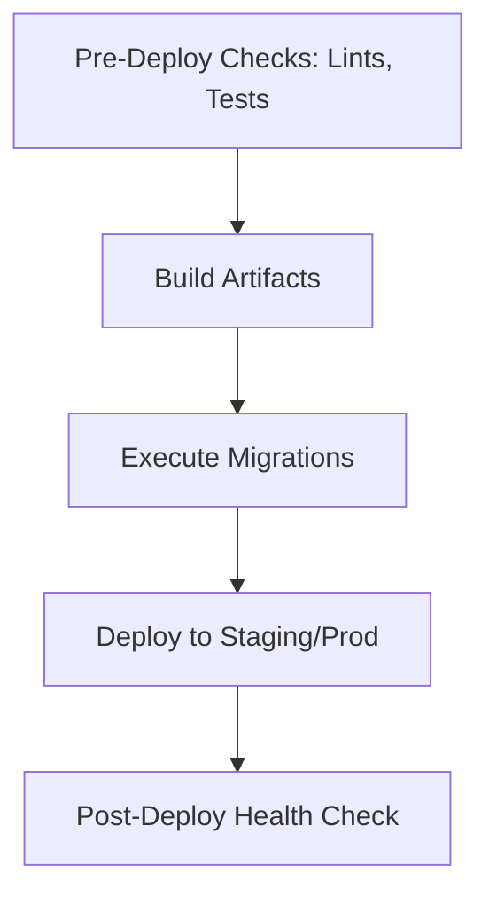

# VCT Operations Graph (O(1) Workflow)

> **Trigger:** Tasks related to CI/CD, deployment, server health, infrastructure, or admin config.
> **Associated Skills:** `vct-infra`, `vct-security`

## 1. Deployment Node (Đẩy lên môi trường)

- Vercel for Frontend. Docker/K8s for Backend.
- Hit-The-Loop: ️**ALWAYS confirm before Deploy to Production.**

## 2. Health & Admin Node (Bảo trì Server)
- Verify `healthz` or `/ping` endpoint.
- Monitor CPU/Memory metrics.
- Rollback target safely if deployment fails.
- Admin tasks require RBAC checking. No raw DB admin without confirmation.
