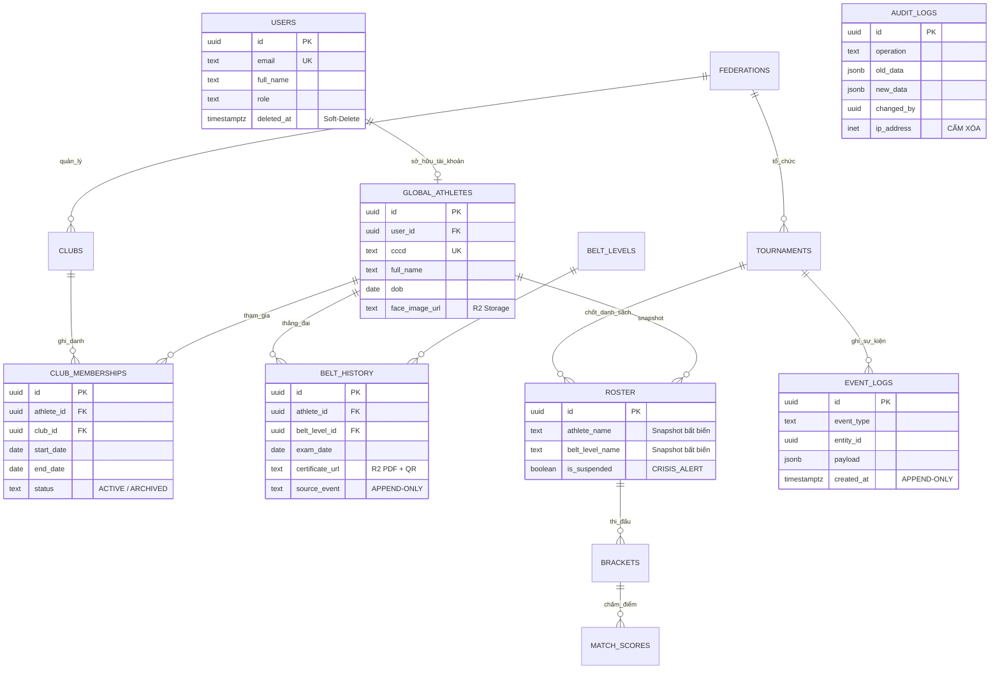

# 📐 TÀI LIỆU KỸ THUẬT — KIẾN TRÚC CƠ SỞ DỮ LIỆU VCT PLATFORM

**Mã tài liệu:** VCT-ARCH-DB-001  
**Phiên bản:** v4.0 FINAL — INFRASTRUCTURE LOCKED  
**Ngày ban hành:** 30/03/2026  
**Cập nhật lần cuối:** 30/03/2026 22:04 ICT  
**Phê duyệt:** Hoàng Bá Tùng — Chairman / CEO  
**Kiến trúc sư:** Javis (Master Commander) & Jon (CTO)  
**Phản biện:** Head of Data & Data Engineer (Phòng Data-AI-Ops), General Counsel & Compliance Officer (Phòng Legal-IP)  
**Trạng thái:** 🔒 ARCHITECTURE + INFRASTRUCTURE FREEZE — CẤM THAY ĐỔI KHI CHƯA CÓ LỆNH CHAIRMAN

---

## MỤC LỤC

1. [Tổng quan & Mục tiêu](#1-tổng-quan--mục-tiêu)
2. [Kiến trúc Tổng thể](#2-kiến-trúc-tổng-thể)
3. [Công nghệ & Hạ tầng](#3-công-nghệ--hạ-tầng)
4. [Schema Design & ERD](#4-schema-design--erd)
5. [Cơ chế Ánh xạ & Đồng bộ](#5-cơ-chế-ánh-xạ--đồng-bộ)
6. [Bảo mật & Phân quyền (RLS)](#6-bảo-mật--phân-quyền-rls)
7. [Quy ước Đặt tên (Naming Convention)](#7-quy-ước-đặt-tên-naming-convention)
8. [Chiến lược Lưu trữ & Sao lưu](#8-chiến-lược-lưu-trữ--sao-lưu)
9. [Hiệu năng & Connection Pooling](#9-hiệu-năng--connection-pooling)
10. [Offline-First & Realtime](#10-offline-first--realtime)
11. [Tổng kết 18 Tầng Giáp](#11-tổng-kết-18-tầng-giáp)

---

## 1. Tổng quan & Mục tiêu

### 1.1 Bối cảnh

VCT Platform là Nền tảng Quản trị Võ Cổ Truyền Việt Nam, phục vụ 34 Liên đoàn Tỉnh/Thành, 1,000+ Câu lạc bộ/Võ đường, và hàng chục ngàn Võ sinh trên toàn quốc. Hệ thống quản lý các dữ liệu **sống còn**: Văn bằng Đai/Đẳng, Kết quả thi đấu, Giao dịch tài chính.

### 1.2 Mục tiêu Kỹ thuật

| Mục tiêu | Thước đo | Giá trị mục tiêu |
| :--- | :--- | :--- |
| Toàn vẹn dữ liệu | ACID Compliance | 100% |
| Phân lập dữ liệu | RLS — Liên đoàn A không thể đọc Data Liên đoàn B | Bắt buộc |
| Chịu tải Giải đấu | Đồng thời 200+ Trọng tài bấm điểm Live | < 100ms latency |
| Khả dụng | Uptime SLA | 99.9% |
| Tầm nhìn | Kiến trúc phục vụ | 10 năm (2026–2036) |

### 1.3 Các Quyết định Chiến lược (do Chairman trực tiếp chỉ đạo)

1. **Database User độc lập** — Dữ liệu người dùng gốc (CCCD, Văn bằng) tách biệt hoàn toàn. Khi tham gia CLB hoặc Giải đấu mới Ánh xạ (Snapshot) qua, kết thúc thì cập nhật về.
2. **Multi-Schema Hub-and-Spoke** — Một cơ sở dữ liệu duy nhất, phân lập bằng PostgreSQL Schema.
3. **Giữ lịch sử Chuyển nhượng** — VĐV chuyển CLB A → B: Lịch sử ở A được ARCHIVED, không xóa.
4. **🇻🇳 Viettel IDC là Hạ tầng Chính** — Toàn bộ dữ liệu lưu trên đất Việt Nam (Tuân thủ NĐ 13/2023 & Luật ANMG 2018). Có Hóa đơn GTGT (Hóa đơn Đỏ) để khấu trừ thuế TNDN + VAT.
5. **Tận dụng Supabase Free ($0)** — Chỉ sử dụng Auth (xác thực), Realtime (WebSocket), Edge Functions. KHÔNG lưu dữ liệu cá nhân trên Supabase.

---

## 2. Kiến trúc Tổng thể

### 2.1 Mô hình Hạ tầng Kép (Viettel IDC + Supabase Free)

```
┌─────────────────────────────────────────────────────────────────────┐
│                   SUPABASE FREE PLAN ($0/tháng)                    │
│              ┌──────────┐  ┌──────────┐  ┌──────────────┐          │
│              │   Auth   │  │ Realtime │  │ Edge         │          │
│              │ (Login)  │  │ (WS)     │  │ Functions    │          │
│              └────┬─────┘  └────┬─────┘  └──────┬───────┘          │
│                   │             │               │                  │
│       ❌ KHÔNG LƯU DỮ LIỆU CÁ NHÂN TẠI ĐÂY ❌                     │
└───────────────────┼─────────────┼───────────────┼──────────────────┘
                    │ JWT Token   │ WebSocket     │ API calls
                    ▼             ▼               ▼
┌─────────────────────────────────────────────────────────────────────┐
│          🇻🇳 VIETTEL IDC — POSTGRESQL 16+ (PRIMARY)                 │
│              Server đặt tại Việt Nam — Hóa đơn Đỏ GTGT            │
│                                                                     │
│  ├── 📁 Schema: "core"              ← GLOBAL HUB (Bất biến)       │
│  │   ├── users, global_athletes, belt_levels, belt_history         │
│  │   ├── event_logs                  ← Event-Sourcing              │
│  │   └── audit_logs                  ← Sổ Vàng Kiểm Toán          │
│  │                                                                  │
│  ├── 📁 Schema: "fed_{mã_tỉnh}"     ← CLUB DOMAIN (Vệ tinh)      │
│  │   ├── clubs, club_memberships     ← Timeline History            │
│  │   ├── attendance                  ← Điểm danh                  │
│  │   └── local_finances              ← Thu/Chi nội bộ             │
│  │                                                                  │
│  ├── 📁 Schema: "t_{năm}_{mã}_{id}" ← TOURNAMENT ARENA            │
│  │   ├── roster (Snapshot), brackets, match_scores                 │
│  │   └── Redis cache → flush vào DB mỗi vòng                      │
│  │                                                                  │
│  └── 📁 Schema: "arch_t_{...}"       ← ARCHIVED (Read-only)       │
│                                                                     │
│  ├── 🔧 PgBouncer (Connection Pooler)                              │
│  ├── 🔧 pg_cron (Scheduled Jobs)                                   │
│  └── 🔧 NATS JetStream (Message Broker) — cùng Server hoặc riêng  │
└─────────────────────────────────────────────────────────────────────┘
```

### 2.2 Luồng Dữ liệu 3 Tầng

```
┌─────────────────────────────────────────────────────────────────┐
│                    TẦNG 1: GLOBAL HUB (core)                   │
│         Cục Căn cước Quốc gia của Võ Cổ Truyền                 │
│    Dữ liệu: CCCD, Họ tên, Đai/Đẳng gốc, Văn bằng             │
│    Tính chất: Read-heavy, Ít thay đổi, Bảo mật tối đa         │
└───────────┬─────────────────────────────────┬───────────────────┘
            │ Snapshot (Clone)                │ Snapshot (Export)
            ▼                                 ▼
┌───────────────────────┐     ┌───────────────────────────────────┐
│  TẦNG 2: CLUB DOMAIN  │     │   TẦNG 3: TOURNAMENT ARENA       │
│  (fed_lamdong, ...)   │     │   (t_2026_quocgia_001, ...)      │
│                       │     │                                   │
│  Điểm danh, Học phí   │     │  Live Scoring (Redis → DB)        │
│  Lịch sử ghi danh     │     │  Sơ đồ nhánh đấu                 │
│                       │     │                                   │
│  ❌ KHÔNG đẩy về Hub   │     │  ✅ Bế mạc → Event Log → Hub      │
└───────────────────────┘     └───────────────────────────────────┘
```

---

## 3. Công nghệ & Hạ tầng

### 3.1 Technology Stack

| Lớp | Công nghệ | Nơi chạy | Vai trò |
| :--- | :--- | :--- | :--- |
| Core Database | **PostgreSQL 18** (18.3) | 🇻🇳 **Viettel IDC** | RDBMS chính, RLS, JSONB |
| Auth (Xác thực) | **Supabase Auth** | Supabase Free ($0) | Đăng nhập Google/Phone OTP |
| Realtime (WebSocket) | **Supabase Realtime** | Supabase Free ($0) | Live Scoring Giải Tỉnh (≤ 50 TT) |
| Cache / High-Load | **Redis 7+** | 🇻🇳 Viettel IDC | Live Scoring Giải QG, Session Cache |
| Object Storage | **Viettel Cloud Storage** | 🇻🇳 Viettel IDC | Ảnh CCCD, Văn bằng PDF, QR |
| Message Broker | **NATS JetStream** | 🇻🇳 Viettel IDC | Event-Sourcing, Crisis Alert |
| Search Extension | **pg_trgm + unaccent** | PostgreSQL built-in | Tìm kiếm Tiếng Việt Fuzzy |
| Connection Pooler | **PgBouncer** | 🇻🇳 Viettel IDC | Transaction Pool Mode |
| Scheduled Jobs | **pg_cron** | PostgreSQL built-in | Materialized View refresh |
| Migration Tool | **Prisma Migrate / Flyway** | Git versioned | Schema versioning trên Git |

### 3.2 Cấu hình Viettel IDC (Chairman phê duyệt)

**Phương án A — Giai đoạn hiện tại (Startup):**

| Server | Vai trò | Cấu hình | Giá/tháng (VNĐ) |
| :--- | :--- | :--- | ---: |
| **Server 1** — DB Primary | PostgreSQL 18 + Data | T1.Base 05: 4 vCPU / 8 GB RAM / 40 GB SSD | 799,000 |
| SSD bổ sung | Mở rộng dữ liệu | +80 GB SSD | ~300,000 |
| **Server 2** — App Backend | API + NATS + Redis | T1.Base 04: 4 vCPU / 4 GB RAM / 40 GB SSD | 599,000 |
| Backup Cloud | Sao lưu hàng ngày | Theo dung lượng thực tế | ~200,000 |
| | | **TỔNG** | **~1,900,000** |

**Phương án B — Mở rộng (Giải Quốc gia):**

| Server | Vai trò | Cấu hình | Giá/tháng (VNĐ) |
| :--- | :--- | :--- | ---: |
| **Server 1** — DB Primary | PostgreSQL 18 Master | T1.Base 07: 8 vCPU / 8 GB RAM / 80 GB SSD | 1,190,000 |
| **Server 2** — DB Replica | PostgreSQL Read-Replica | T1.Base 05: 4 vCPU / 8 GB RAM / 40 GB SSD | 799,000 |
| **Server 3** — App + Cache | API + NATS + Redis | T1.Base 05: 4 vCPU / 8 GB RAM / 40 GB SSD | 799,000 |
| SSD + Backup | Mở rộng + DR | | ~500,000 |
| | | **TỔNG** | **~3,300,000** |

### 3.3 Supabase Free Plan — Scope giới hạn

| Tính năng sử dụng | Giới hạn Free Plan | Đủ cho VCT? |
| :--- | :--- | :---: |
| Auth (Đăng nhập) | 50,000 MAU | ✅ Dư sức |
| Realtime (WebSocket) | 200 concurrent connections | ✅ Đủ cho Giải Tỉnh |
| Edge Functions | 500,000 invocations/tháng | ✅ Đủ |
| Database | 500 MB | ❌ **KHÔNG DÙNG** — Data ở Viettel IDC |
| Storage | 1 GB | ❌ **KHÔNG DÙNG** — File ở Viettel IDC |

> ⚠️ **QUY TẮC TUYỆT ĐỐI:** Supabase Free **CHỈ DÙNG** Auth + Realtime + Edge Functions. **TUYỆT ĐỐI KHÔNG** lưu bất kỳ dữ liệu cá nhân nào (CCCD, tên, ảnh) trên Supabase Database/Storage.

### 3.4 Môi trường

| Môi trường | DB | Auth | Mục đích |
| :--- | :--- | :--- | :--- |
| `development` | PostgreSQL Docker (local) | Supabase Free Project | Dev/Test local |
| `staging` | Viettel IDC (Server riêng hoặc DB nhỏ) | Supabase Free Project | QA, UAT, DR Drill |
| `production` | 🇻🇳 **Viettel IDC (Primary)** | Supabase Free Project | **LIVE** |

### 3.5 Lợi ích Tài chính — Hóa đơn

| Nhà cung cấp | Chi phí/tháng | Hóa đơn GTGT | Khấu trừ TNDN | Khấu trừ VAT |
| :--- | ---: | :---: | :---: | :---: |
| Viettel IDC | ~1,900,000 VNĐ | ✅ Hóa đơn Đỏ | ✅ 100% | ✅ 8% |
| Supabase Free | 0 VNĐ | Không phát sinh | — | — |
| **TỔNG CHI PHÍ NĂM** | **~22,800,000 VNĐ** | | **Tiết kiệm thuế ~4.5 triệu/năm** | |

---

## 4. Schema Design & ERD

### 4.1 Core Schema (Bất biến)

```sql
-- ══════════════════════════════════════════════════════════
-- SCHEMA: core — Global Identity Hub
-- ══════════════════════════════════════════════════════════
CREATE SCHEMA IF NOT EXISTS core;

-- Bảng Người dùng (Tài khoản đăng nhập)
CREATE TABLE core.users (
    id            UUID PRIMARY KEY DEFAULT gen_random_uuid(),
    email         TEXT UNIQUE NOT NULL,
    phone         TEXT UNIQUE,
    full_name     TEXT NOT NULL,
    search_name   TEXT GENERATED ALWAYS AS (
                    unaccent(lower(full_name))
                  ) STORED,                        -- Fuzzy Search không dấu
    role          TEXT NOT NULL DEFAULT 'athlete'
                    CHECK (role IN ('admin','federation_admin','club_owner','coach','athlete','referee','parent')),
    avatar_url    TEXT,                             -- Link đến Cloudflare R2
    created_at    TIMESTAMPTZ NOT NULL DEFAULT now(),
    updated_at    TIMESTAMPTZ NOT NULL DEFAULT now(),
    deleted_at    TIMESTAMPTZ                      -- Soft-Delete
);

-- Bảng Liên đoàn
CREATE TABLE core.federations (
    id            UUID PRIMARY KEY DEFAULT gen_random_uuid(),
    name          TEXT NOT NULL,                    -- "Liên đoàn VCT Lâm Đồng"
    region        TEXT NOT NULL,                    -- "tinh" | "quocgia"
    province_code TEXT UNIQUE,                      -- "lamdong", "binhdinh"
    admin_id      UUID REFERENCES core.users(id),
    is_active     BOOLEAN NOT NULL DEFAULT true,
    created_at    TIMESTAMPTZ NOT NULL DEFAULT now(),
    deleted_at    TIMESTAMPTZ
);

-- Bảng Võ sinh Toàn cầu (Master Record)
CREATE TABLE core.global_athletes (
    id            UUID PRIMARY KEY DEFAULT gen_random_uuid(),
    user_id       UUID UNIQUE REFERENCES core.users(id),
    cccd          TEXT UNIQUE,                      -- Căn cước Công dân
    full_name     TEXT NOT NULL,
    search_name   TEXT GENERATED ALWAYS AS (
                    unaccent(lower(full_name))
                  ) STORED,
    dob           DATE NOT NULL,
    gender        TEXT CHECK (gender IN ('male','female','other')),
    province      TEXT,
    face_image_url TEXT,                            -- Ảnh thẻ (R2)
    cccd_scan_url  TEXT,                            -- Ảnh quét CCCD (R2)
    created_at    TIMESTAMPTZ NOT NULL DEFAULT now(),
    updated_at    TIMESTAMPTZ NOT NULL DEFAULT now(),
    deleted_at    TIMESTAMPTZ
);

-- Bảng Hệ thống Cấp Đai
CREATE TABLE core.belt_levels (
    id            UUID PRIMARY KEY DEFAULT gen_random_uuid(),
    name          TEXT NOT NULL,                    -- "Lam Đai", "Lục Đai"
    rank_order    INT NOT NULL UNIQUE,              -- 1, 2, 3... (thứ tự tăng dần)
    color_hex     TEXT,                             -- "#0000FF"
    description   TEXT,
    branch        TEXT DEFAULT 'default'            -- Rẽ nhánh theo Môn phái
);

-- Bảng Lịch sử Thăng Đai (Append-Only - Event Sourcing)
CREATE TABLE core.belt_history (
    id              UUID PRIMARY KEY DEFAULT gen_random_uuid(),
    athlete_id      UUID NOT NULL REFERENCES core.global_athletes(id),
    belt_level_id   UUID NOT NULL REFERENCES core.belt_levels(id),
    exam_date       DATE NOT NULL,
    examiner_id     UUID REFERENCES core.users(id), -- Giám khảo
    federation_id   UUID REFERENCES core.federations(id),
    certificate_url TEXT,                            -- Bằng PDF (R2)
    qr_code_data    TEXT,                            -- Dữ liệu mã QR
    source_event    TEXT DEFAULT 'manual',           -- 'manual' | 'tournament_sync'
    created_at      TIMESTAMPTZ NOT NULL DEFAULT now()
    -- KHÔNG CÓ updated_at, deleted_at → APPEND-ONLY, BẤT BIẾN
);

-- Bảng Nhật ký Sự kiện (Event Log — trái tim của Event-Sourcing)
CREATE TABLE core.event_logs (
    id            UUID PRIMARY KEY DEFAULT gen_random_uuid(),
    event_type    TEXT NOT NULL,
    -- Ví dụ: 'MEDAL_WON', 'BELT_PROMOTED', 'ATHLETE_SUSPENDED',
    --         'CLUB_TRANSFER', 'TOURNAMENT_CLOSED'
    entity_type   TEXT NOT NULL,                    -- 'athlete', 'tournament', 'club'
    entity_id     UUID NOT NULL,
    payload       JSONB NOT NULL,                   -- Dữ liệu sự kiện chi tiết
    source_schema TEXT,                             -- Schema gốc phát sự kiện
    actor_id      UUID REFERENCES core.users(id),   -- Ai thực hiện
    created_at    TIMESTAMPTZ NOT NULL DEFAULT now()
    -- APPEND-ONLY: Không UPDATE, Không DELETE
);

-- Bảng Kiểm Toán (Audit Trail — Sổ Vàng)
CREATE TABLE core.audit_logs (
    id            UUID PRIMARY KEY DEFAULT gen_random_uuid(),
    table_schema  TEXT NOT NULL,
    table_name    TEXT NOT NULL,
    operation     TEXT NOT NULL CHECK (operation IN ('INSERT','UPDATE','DELETE')),
    old_data      JSONB,
    new_data      JSONB,
    changed_by    UUID,                             -- User thực hiện
    ip_address    INET,
    user_agent    TEXT,
    reason        TEXT,                             -- Lý do thay đổi (bắt buộc với UPDATE)
    created_at    TIMESTAMPTZ NOT NULL DEFAULT now()
    -- KHÔNG AI ĐƯỢC QUYỀN DELETE/TRUNCATE BẢNG NÀY — KỂ CẢ CTO
);

-- Index cho Tìm kiếm Tiếng Việt
CREATE EXTENSION IF NOT EXISTS pg_trgm;
CREATE EXTENSION IF NOT EXISTS unaccent;

CREATE INDEX idx_athletes_search ON core.global_athletes
    USING gin (search_name gin_trgm_ops);
CREATE INDEX idx_users_search ON core.users
    USING gin (search_name gin_trgm_ops);
```

### 4.2 Federation Schema (Template)

```sql
-- ══════════════════════════════════════════════════════════
-- SCHEMA TEMPLATE: fed_{province_code}
-- Ví dụ: fed_lamdong, fed_binhdinh
-- ══════════════════════════════════════════════════════════

-- Bảng CLB/Võ Đường
CREATE TABLE fed_{code}.clubs (
    id              UUID PRIMARY KEY DEFAULT gen_random_uuid(),
    federation_id   UUID NOT NULL REFERENCES core.federations(id),
    name            TEXT NOT NULL,
    master_id       UUID REFERENCES core.users(id), -- Võ sư Quản đốc
    address         TEXT,
    phone           TEXT,
    is_active       BOOLEAN NOT NULL DEFAULT true,
    annual_fee_paid BOOLEAN NOT NULL DEFAULT false,
    created_at      TIMESTAMPTZ NOT NULL DEFAULT now(),
    deleted_at      TIMESTAMPTZ
);

-- Bảng Lịch sử Ghi danh (Timeline History)
-- Lưu ý: KHÔNG dùng trường club_id đơn lẻ trên athletes.
-- Thay vào đó, dùng bảng này để truy vết toàn bộ lịch sử.
CREATE TABLE fed_{code}.club_memberships (
    id            UUID PRIMARY KEY DEFAULT gen_random_uuid(),
    athlete_id    UUID NOT NULL REFERENCES core.global_athletes(id),
    club_id       UUID NOT NULL REFERENCES fed_{code}.clubs(id),
    start_date    DATE NOT NULL DEFAULT CURRENT_DATE,
    end_date      DATE,                              -- NULL = đang tập
    status        TEXT NOT NULL DEFAULT 'ACTIVE'
                    CHECK (status IN ('ACTIVE', 'ARCHIVED', 'SUSPENDED')),
    transfer_note TEXT,                              -- Lý do chuyển
    created_at    TIMESTAMPTZ NOT NULL DEFAULT now(),
    deleted_at    TIMESTAMPTZ
);

-- Bảng Điểm danh
CREATE TABLE fed_{code}.attendance (
    id            UUID PRIMARY KEY DEFAULT gen_random_uuid(),
    athlete_id    UUID NOT NULL,
    club_id       UUID NOT NULL,
    check_in_at   TIMESTAMPTZ NOT NULL DEFAULT now(),
    session_type  TEXT DEFAULT 'regular'
);

-- Bảng Thu/Chi Nội bộ
CREATE TABLE fed_{code}.local_finances (
    id            UUID PRIMARY KEY DEFAULT gen_random_uuid(),
    club_id       UUID NOT NULL,
    athlete_id    UUID,
    type          TEXT NOT NULL CHECK (type IN ('income','expense')),
    category      TEXT NOT NULL,                    -- 'tuition', 'equipment', 'rental'
    amount        NUMERIC(12,2) NOT NULL,
    description   TEXT,
    recorded_at   TIMESTAMPTZ NOT NULL DEFAULT now(),
    deleted_at    TIMESTAMPTZ
);
```

### 4.3 Tournament Schema (Template)

```sql
-- ══════════════════════════════════════════════════════════
-- SCHEMA TEMPLATE: t_{year}_{scope}_{id}
-- Ví dụ: t_2026_quocgia_001, t_2026_lamdong_003
-- ══════════════════════════════════════════════════════════

-- Bảng Đội hình (Snapshot từ core — IMMUTABLE sau khi khóa)
CREATE TABLE t_{id}.roster (
    id              UUID PRIMARY KEY,               -- Giữ nguyên ID từ core
    athlete_name    TEXT NOT NULL,                   -- Snapshot tên tại thời điểm đăng ký
    cccd            TEXT,
    dob             DATE,
    gender          TEXT,
    belt_level_name TEXT NOT NULL,                   -- Snapshot cấp đai tại thời điểm
    belt_rank_order INT,
    weight_kg       NUMERIC(5,2),
    club_name       TEXT,
    federation_name TEXT,
    face_image_url  TEXT,
    is_locked       BOOLEAN NOT NULL DEFAULT false,  -- TRUE sau khi điểm danh vòng 1
    is_suspended    BOOLEAN NOT NULL DEFAULT false,  -- TRUE nếu nhận CRISIS_ALERT
    suspend_reason  TEXT,
    snapshot_at     TIMESTAMPTZ NOT NULL DEFAULT now()
);

-- Bảng Sơ đồ Nhánh đấu
CREATE TABLE t_{id}.brackets (
    id              UUID PRIMARY KEY DEFAULT gen_random_uuid(),
    round_number    INT NOT NULL,
    match_order     INT NOT NULL,
    category        TEXT NOT NULL,                   -- "Nam_50kg_LamDai"
    red_athlete_id  UUID REFERENCES t_{id}.roster(id),
    blue_athlete_id UUID REFERENCES t_{id}.roster(id),
    winner_id       UUID,
    status          TEXT DEFAULT 'pending'
                      CHECK (status IN ('pending','in_progress','completed','cancelled')),
    scheduled_at    TIMESTAMPTZ
);

-- Bảng Điểm Thi đấu (Redis → Flush vào đây mỗi cuối vòng)
CREATE TABLE t_{id}.match_scores (
    id              UUID PRIMARY KEY DEFAULT gen_random_uuid(),
    bracket_id      UUID NOT NULL REFERENCES t_{id}.brackets(id),
    referee_id      UUID NOT NULL,
    referee_position TEXT DEFAULT 'corner',          -- 'corner', 'center', 'head'
    red_points      INT NOT NULL DEFAULT 0,
    blue_points     INT NOT NULL DEFAULT 0,
    penalties_red   INT DEFAULT 0,
    penalties_blue  INT DEFAULT 0,
    notes           TEXT,
    scored_at       TIMESTAMPTZ NOT NULL DEFAULT now()
);
```

### 4.4 ERD Diagram



---

## 5. Cơ chế Ánh xạ & Đồng bộ

### 5.1 Gia nhập CLB (Club Join)

```
1. Võ sinh bấm "Xin gia nhập CLB B"
2. Backend kiểm tra core.global_athletes → Lấy thông tin
3. Nếu có membership ACTIVE tại CLB A:
   → UPDATE club_memberships SET status='ARCHIVED', end_date=today WHERE athlete_id=X AND status='ACTIVE'
4. INSERT club_memberships (athlete_id, club_id_B, start_date, status='ACTIVE')
5. INSERT core.event_logs (event_type='CLUB_TRANSFER', payload={from: A, to: B})
```

### 5.2 Mở Giải đấu (Tournament Check-in)

```
1. Liên đoàn bấm "TẠO GIẢI ĐẤU"
2. Backend: CREATE SCHEMA t_2026_quocgia_001 (từ Template)
3. CLB đăng ký VĐV → Backend:
   SELECT * FROM core.global_athletes WHERE id IN (...)
   JOIN core.belt_history (lấy Đai mới nhất)
   → INSERT INTO t_2026_quocgia_001.roster (Snapshot)
4. Trước vòng 1: UPDATE roster SET is_locked = true
   → Từ đây mọi thay đổi trên core KHÔNG ảnh hưởng Roster
```

### 5.3 Bế mạc Giải (Merge-back via Event-Sourcing)

```
1. Ban Tổ chức bấm "ĐÓNG GIẢI ĐẤU" (Cần mật khẩu Cấp Tỉnh/QG)
2. Arena Schema → READ-ONLY
3. Backend KHÔNG gửi UPDATE lên core. Thay vào đó:
   → PUBLISH via NATS: {
       event_type: "TOURNAMENT_CLOSED",
       results: [
         { athlete_id: "X", event: "MEDAL_WON", medal: "GOLD", category: "Nam_50kg" },
         { athlete_id: "Y", event: "BELT_PROMOTION_RECOMMENDED", new_belt: "Lục Đai" }
       ]
     }
4. Global Hub (Consumer) nhận Event → INSERT INTO core.event_logs
5. Hệ thống tự tính toán: Nếu có BELT_PROMOTION → INSERT core.belt_history
6. Schema Giải chuyển tên: RENAME t_2026_quocgia_001 → arch_t_2026_quocgia_001
```

### 5.4 Lệnh Cấm Khẩn Cấp (Crisis Alert — Mid-Tournament)

```
1. Chủ tịch Liên đoàn phát hiện gian lận → Bấm "ĐÌNH CHỈ THI ĐẤU" trên Web Admin
2. Global Hub → PUBLISH NATS Channel: VCT.CRISIS_ALERT
   Payload: { action: "SUSPEND_ATHLETE", athlete_id: "X", reason: "Gian lận hồ sơ" }
3. Tournament Arena (đang chạy) → Worker lắng nghe Channel nhận Alert
4. → UPDATE t_{id}.roster SET is_suspended=true, suspend_reason='...' WHERE id='X'
5. → WebSocket push tới tất cả Tablet Trọng tài: Màn hình nhấp nháy 🛑
6. → Chặn mọi INSERT vào match_scores có athlete_id = X
```

---

## 6. Bảo mật & Phân quyền (RLS)

### 6.1 Row-Level Security Policies

```sql
-- Bật RLS cho tất cả bảng Core
ALTER TABLE core.global_athletes ENABLE ROW LEVEL SECURITY;
ALTER TABLE core.belt_history ENABLE ROW LEVEL SECURITY;

-- Policy: Liên đoàn chỉ thấy VĐV thuộc tỉnh mình
CREATE POLICY "federation_athletes_read" ON core.global_athletes
    FOR SELECT
    USING (
        province = (
            SELECT province_code FROM core.federations
            WHERE admin_id = auth.uid()
        )
    );

-- Policy: CLB chỉ thấy thành viên ACTIVE của mình
CREATE POLICY "club_members_read" ON fed_lamdong.club_memberships
    FOR SELECT
    USING (
        club_id IN (
            SELECT id FROM fed_lamdong.clubs
            WHERE master_id = auth.uid()
        )
    );

-- Policy: Audit Logs — KHÔNG AI được DELETE
CREATE POLICY "audit_no_delete" ON core.audit_logs
    FOR DELETE USING (false);
CREATE POLICY "audit_no_update" ON core.audit_logs
    FOR UPDATE USING (false);
```

### 6.2 Audit Trail Trigger

```sql
-- Trigger tự động ghi Audit Log cho mọi bảng
CREATE OR REPLACE FUNCTION core.fn_audit_trigger()
RETURNS TRIGGER AS $$
BEGIN
    INSERT INTO core.audit_logs (
        table_schema, table_name, operation,
        old_data, new_data, changed_by
    ) VALUES (
        TG_TABLE_SCHEMA, TG_TABLE_NAME, TG_OP,
        CASE WHEN TG_OP IN ('UPDATE','DELETE') THEN row_to_json(OLD) END,
        CASE WHEN TG_OP IN ('INSERT','UPDATE') THEN row_to_json(NEW) END,
        auth.uid()
    );
    RETURN COALESCE(NEW, OLD);
END;
$$ LANGUAGE plpgsql SECURITY DEFINER;

-- Gắn Trigger vào các bảng trọng yếu
CREATE TRIGGER trg_audit_athletes
    AFTER INSERT OR UPDATE OR DELETE ON core.global_athletes
    FOR EACH ROW EXECUTE FUNCTION core.fn_audit_trigger();

CREATE TRIGGER trg_audit_belts
    AFTER INSERT OR UPDATE OR DELETE ON core.belt_history
    FOR EACH ROW EXECUTE FUNCTION core.fn_audit_trigger();
```

### 6.3 Soft-Delete Convention

```sql
-- Mọi bảng (trừ Append-Only) phải có cột:
deleted_at TIMESTAMPTZ  -- NULL = còn hoạt động, NOT NULL = đã "xóa"

-- Mọi Query phải thêm điều kiện:
WHERE deleted_at IS NULL

-- Khôi phục dữ liệu đã xóa:
UPDATE core.global_athletes SET deleted_at = NULL WHERE id = 'X';
```

---

## 7. Quy ước Đặt tên (Naming Convention)

### 7.1 Schema Names

| Loại | Pattern | Ví dụ |
| :--- | :--- | :--- |
| Liên đoàn | `fed_{province_code}` | `fed_lamdong`, `fed_binhdinh` |
| Giải đấu Active | `t_{year}_{scope}_{seq}` | `t_2026_quocgia_001`, `t_2026_lamdong_003` |
| Giải đấu Archived | `arch_t_{year}_{scope}_{seq}` | `arch_t_2026_quocgia_001` |

### 7.2 Quy tắc Bắt buộc

- Viết **thường toàn bộ** (lowercase)
- Không dấu Tiếng Việt (unaccented)
- Phân cách bằng **gạch dưới** `_`
- Bảng: danh từ số nhiều (ví dụ: `clubs`, `athletes`)
- Cột: danh từ số ít + snake_case (ví dụ: `full_name`, `created_at`)
- Vi phạm → **CI/CD pipeline tự động reject Migration**

### 7.3 Migration File Names

```
db_migrations/
├── 001_create_core_schema.sql
├── 002_create_core_users.sql
├── 003_create_core_athletes.sql
├── 004_create_core_belts.sql
├── 005_create_core_event_logs.sql
├── 006_create_core_audit.sql
├── 007_create_fed_template.sql
├── 008_create_tournament_template.sql
├── 009_enable_rls_policies.sql
├── 010_create_indexes.sql
└── 011_create_materialized_views.sql
```

---

## 8. Chiến lược Lưu trữ & Sao lưu

### 8.1 Data Retention Policy

| Loại dữ liệu | Hot Storage (Viettel IDC) | Cold Storage (Viettel Cloud/Tape) |
| :--- | :--- | :--- |
| VĐV đang hoạt động | Vĩnh viễn | — |
| VĐV nghỉ > 3 năm | Chuyển Cold | Giữ 10 năm |
| Giải đấu Schema | 1 năm | Nén ZIP, giữ vĩnh viễn |
| Audit Logs | 2 năm | Archive 7 năm |
| Event Logs | 3 năm | Archive 10 năm |
| File (Ảnh CCCD, Văn bằng) | Viettel Cloud Storage | Replica tự động |

### 8.2 Disaster Recovery

| Hạng mục | Chi tiết |
| :--- | :--- |
| **Backup tự động** | `pg_dump` + cron job tự động hàng ngày lúc 2:00 AM |
| **Backup lưu trữ** | Đẩy sang Viettel Cloud Storage (tài khoản backup riêng) |
| **Giữ backup** | 7 bản daily + 4 bản weekly + 3 bản monthly |
| **DR Drill** | Mỗi Quý: Lấy backup → Restore lên staging → Xác nhận toàn vẹn |
| **RTO** | < 4 giờ (Recovery Time Objective) |
| **RPO** | < 1 giờ (Recovery Point Objective) |
| **Pháp lý** | 100% dữ liệu nằm trên đất Việt Nam — Tuân thủ NĐ 13/2023 |

---

## 9. Hiệu năng & Connection Pooling

### 9.1 PgBouncer Configuration (Viettel IDC)

```ini
# /etc/pgbouncer/pgbouncer.ini
[databases]
vct_production = host=127.0.0.1 port=5432 dbname=vct_platform

[pgbouncer]
listen_port = 6432
listen_addr = 0.0.0.0
auth_type = md5
auth_file = /etc/pgbouncer/userlist.txt
pool_mode = transaction          # KHÔNG dùng session mode
max_client_conn = 500            # Tổng kết nối client cho phép
default_pool_size = 40           # Pool mặc định cho mỗi user/db pair
min_pool_size = 10               # Giữ sẵn 10 kết nối
reserve_pool_size = 5            # Dự phòng cho spike
reserve_pool_timeout = 3         # Chờ 3s trước khi dùng reserve
server_idle_timeout = 300        # Đóng kết nối idle sau 5 phút
log_connections = 1
log_disconnections = 1
```

**Phân bổ Connection Budget:**

| Service | Pool Size | Ghi chú |
| :--- | :---: | :--- |
| API Backend (Node.js) | 30 | Xử lý request chính |
| NATS Worker (Event-Sourcing) | 10 | Ghi Event logs |
| Redis → DB Flush Worker | 10 | Flush điểm thi đấu |
| Admin Dashboard | 5 | Truy vấn báo cáo |
| pg_cron (Scheduled Jobs) | 3 | Refresh Materialized Views |
| **Tổng** | **58** | Trong giới hạn PostgreSQL max_connections=100 |

### 9.2 Materialized Views (Dashboard CEO)

```sql
-- Cập nhật tự động mỗi 15 phút bằng pg_cron
CREATE MATERIALIZED VIEW core.mv_national_dashboard AS
SELECT
    f.name AS federation_name,
    f.province_code,
    (SELECT COUNT(*) FROM fed_{code}.clubs WHERE deleted_at IS NULL) AS total_clubs,
    (SELECT COUNT(*) FROM fed_{code}.club_memberships WHERE status = 'ACTIVE') AS total_active_athletes,
    (SELECT COUNT(*) FROM core.belt_history bh
     JOIN core.global_athletes ga ON bh.athlete_id = ga.id
     WHERE ga.province = f.province_code) AS total_belt_certifications
FROM core.federations f
WHERE f.deleted_at IS NULL;

-- Cron Job (Supabase pg_cron)
SELECT cron.schedule(
    'refresh_dashboard',
    '*/15 * * * *',  -- Mỗi 15 phút
    'REFRESH MATERIALIZED VIEW CONCURRENTLY core.mv_national_dashboard;'
);
```

---

## 10. Offline-First & Realtime

### 10.1 Offline-First Architecture (Tablet Trọng tài)

```
┌──────────────────────────────────────────────────┐
│              TABLET TRỌNG TÀI                    │
│                                                  │
│  ┌─────────────┐    ┌──────────────────────┐    │
│  │ UI Bấm điểm │───▶│ IndexedDB / SQLite   │    │
│  │  (React)    │    │ (Local Queue)        │    │
│  └─────────────┘    └──────────┬───────────┘    │
│                                │                 │
│              ┌─────────────────┼──────────┐      │
│              │  Background     │          │      │
│              │  Sync Worker    ▼          │      │
│              │  (Service Worker)          │      │
│              │  ┌──────────────────┐      │      │
│              │  │ Có mạng? → Push  │      │      │
│              │  │ Mất mạng? → Queue│      │      │
│              │  └──────────────────┘      │      │
│              └────────────────────────────┘      │
└───────────────────────┬──────────────────────────┘
                        │ (Khi có mạng)
                        ▼
         ┌─────────────────────────────┐
         │  🇻🇳 Viettel IDC              │
         │  PostgreSQL + Redis          │
         │  (Dữ liệu trên đất VN)      │
         └─────────────────────────────┘
```

### 10.2 Realtime Strategy

| Quy mô Giải | Engine | Nơi chạy | Chi phí |
| :--- | :--- | :--- | :--- |
| Giải Tỉnh (≤ 50 TT) | Supabase Realtime (WebSocket) | Supabase Free | $0 |
| Giải Quốc gia (200+ TT) | Redis Pub/Sub trên Viettel IDC | 🇻🇳 Viettel IDC | Đã bao gồm trong Server 2 |

---

## 11. Tổng kết 18 Tầng Giáp + Hạ tầng

### 11.1 Kiến trúc 18 Tầng

|  #  | Tầng                    | Giải pháp                                         |    Ưu tiên     | Hạ tầng         |
| :-: | :---------------------- | :------------------------------------------------ | :------------: | :-------------- |
|  1  | Core Database           | PostgreSQL 18 (18.3 — Latest Stable)              |       —        | 🇻🇳 Viettel IDC  |
|  2  | Kiến trúc Phân ly       | Multi-Schema Hub-and-Spoke                        |       —        | 🇻🇳 Viettel IDC  |
|  3  | Chuyển nhượng VĐV       | Timeline History (ACTIVE/ARCHIVED)                |       —        | 🇻🇳 Viettel IDC  |
|  4  | Chống ghi đè            | Event-Sourcing (Append-Only Log)                  |       —        | 🇻🇳 Viettel IDC  |
|  5  | Cảnh báo Khẩn           | NATS + Redis Pub/Sub → Tablet Trọng tài           |       —        | 🇻🇳 Viettel IDC  |
|  6  | Kiểm toán               | Audit Trail Trigger (Sổ Vàng)                     |      P1        | 🇻🇳 Viettel IDC  |
|  7  | Live Scoring            | Supabase Realtime (Tỉnh) / Redis (QG)             |      P1        | Supabase + IDC  |
|  8  | Dashboard CEO           | Materialized Views (< 0.5s)                       |      P2        | 🇻🇳 Viettel IDC  |
|  9  | Nâng cấp DB             | Migration Files + Git Versioning                  |      P1        | Git + IDC       |
| 10  | Tạo Giải tự động        | Tournament Schema Template                        |      P1        | 🇻🇳 Viettel IDC  |
| 11  | Offline-First           | Local Storage + Background Sync Queue             |    **🔴 P0**   | Client-side     |
| 12  | Soft-Delete             | Không xóa cứng, chỉ ẩn (deleted_at)               |    **🟠 P1**   | 🇻🇳 Viettel IDC  |
| 13  | Tìm kiếm VN            | unaccent + pg_trgm Fuzzy Search                   |    **🟡 P2**   | 🇻🇳 Viettel IDC  |
| 14  | Báo cáo B2G             | Xuất Excel/PDF chuẩn Bộ VHTTDL                    |    **🟡 P2**   | 🇻🇳 Viettel IDC  |
| 15  | Data Retention          | Phân tầng Hot/Cold + NĐ 13/2023                   |    **🟠 P1**   | 🇻🇳 Viettel IDC  |
| 16  | Disaster Recovery       | pg_dump hàng ngày + DR Drill hàng Quý             |    **🔴 P0**   | 🇻🇳 Viettel IDC  |
| 17  | Naming Convention       | Quy ước đặt tên Schema + CI reject                |    **🟠 P1**   | Git + CI/CD     |
| 18  | Connection Pooling      | PgBouncer Transaction Pool Mode                    |    **🔴 P0**   | 🇻🇳 Viettel IDC  |

### 11.2 Tổng Chi phí Hạ tầng

| Hạng mục | Chi phí/tháng (VNĐ) | Hóa đơn | Ghi chú |
| :--- | ---: | :---: | :--- |
| Viettel IDC (2 Server + Backup) | ~1,900,000 | ✅ HĐGTGT | Khấu trừ TNDN + VAT |
| Supabase Free (Auth + Realtime) | 0 | — | Miễn phí vĩnh viễn |
| Domain + SSL | ~500,000/năm | ✅ HĐGTGT | vctplatform.vn |
| **TỔNG NĂM ĐẦU** | **~23,500,000** | | **~1.96 triệu/tháng** |

### 11.3 Tuân thủ Pháp lý

| Tiêu chí | Trạng thái |
| :--- | :---: |
| NĐ 13/2023 — Dữ liệu cá nhân lưu tại VN | ✅ Tuân thủ (Viettel IDC) |
| Luật ANMG 2018 — Server tại VN | ✅ Tuân thủ (Viettel IDC) |
| Hóa đơn GTGT — Khấu trừ thuế | ✅ Có (Viettel IDC) |
| Sẵn sàng B2G — Ký hợp đồng Liên đoàn QG | ✅ "Made in Vietnam" |
| Consent Screen — Thu thập CCCD | ⏳ Harvey đang soạn |
| Privacy Policy — Website | ⏳ Harvey đang soạn |
| DPIA — Đánh giá tác động | ⏳ Compliance Officer lập |

---

> **⚠️ ARCHITECTURE + INFRASTRUCTURE FREEZE — v4.0 FINAL**  
> Tài liệu này đã được Chairman Hoàng Bá Tùng phê duyệt ngày 30/03/2026.  
> Hạ tầng: **Viettel IDC (Primary) + Supabase Free (Auth/Realtime only)**.  
> Mọi thay đổi kiến trúc/hạ tầng phải trình lên Chairman qua quy trình War Room.  
> Tài liệu gốc: `vct-agent-business/_agent/shared_knowledge/technical_specs/`  
> Bản sao triển khai: `vct-platform/docs/architecture/`

---

_Tài liệu được lập bởi: Jen (CoS), Javis (Master Commander), Jon (CTO)_  
_Phản biện: Head of Data, Data Engineer (Phòng Data-AI-Ops)_  
_Tư vấn Pháp lý: General Counsel, Compliance Officer (Phòng Legal-IP)_  
_Phê duyệt: Hoàng Bá Tùng — Chairman / CEO_  
_Ngày ban hành: 30/03/2026 · Phiên bản: v4.0 FINAL — INFRASTRUCTURE LOCKED_
