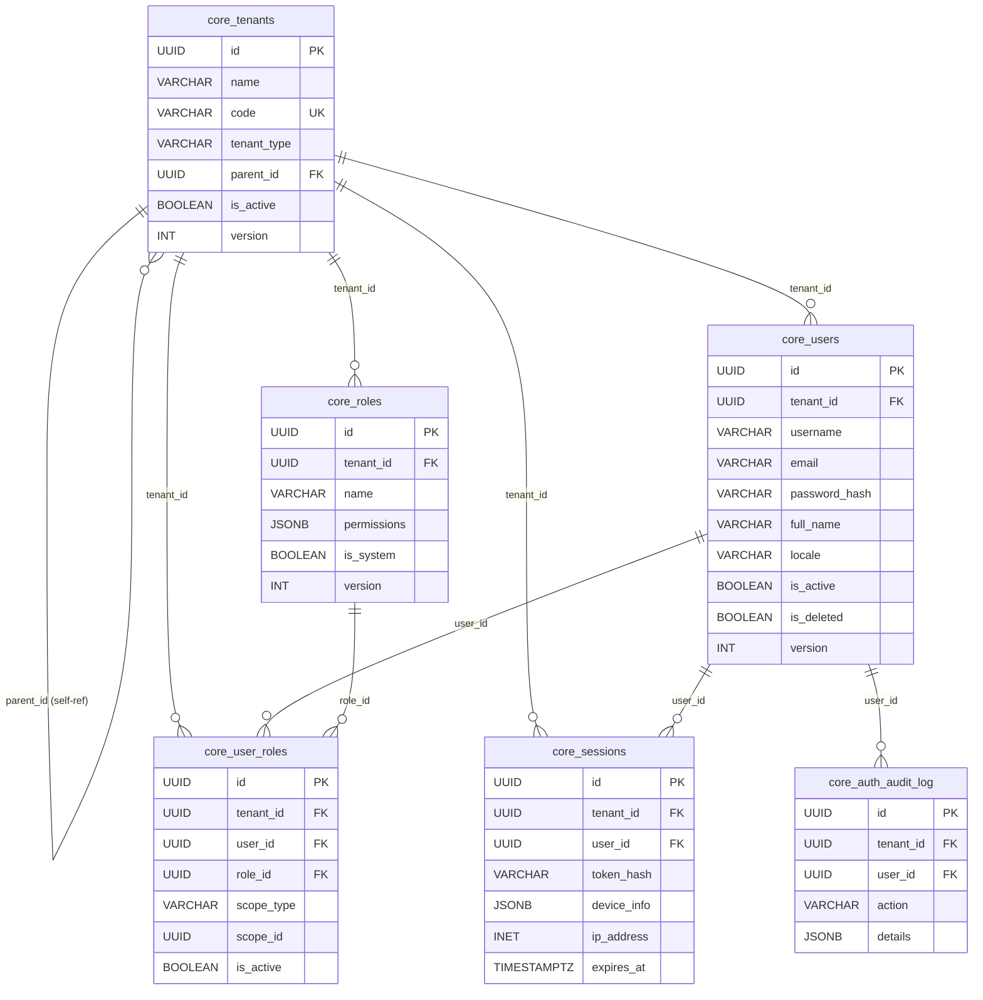
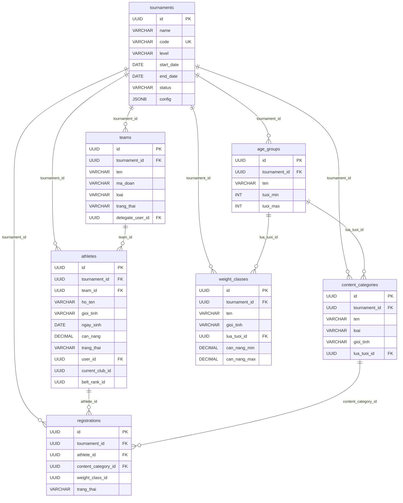
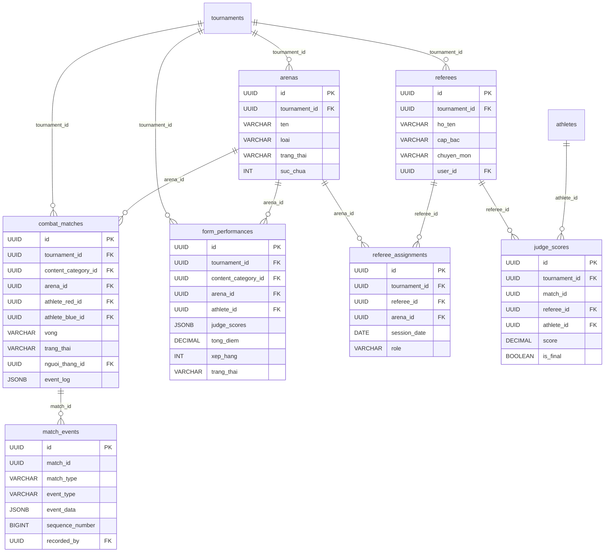
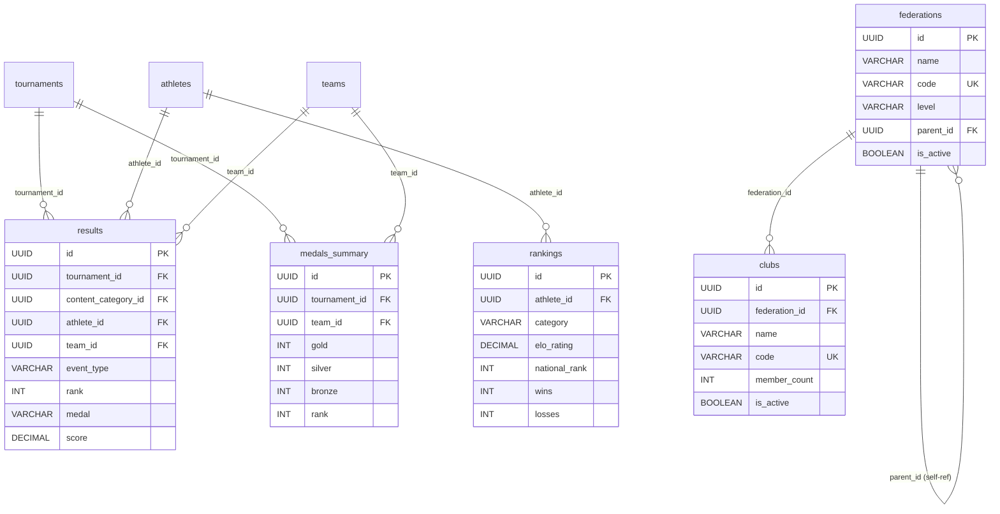
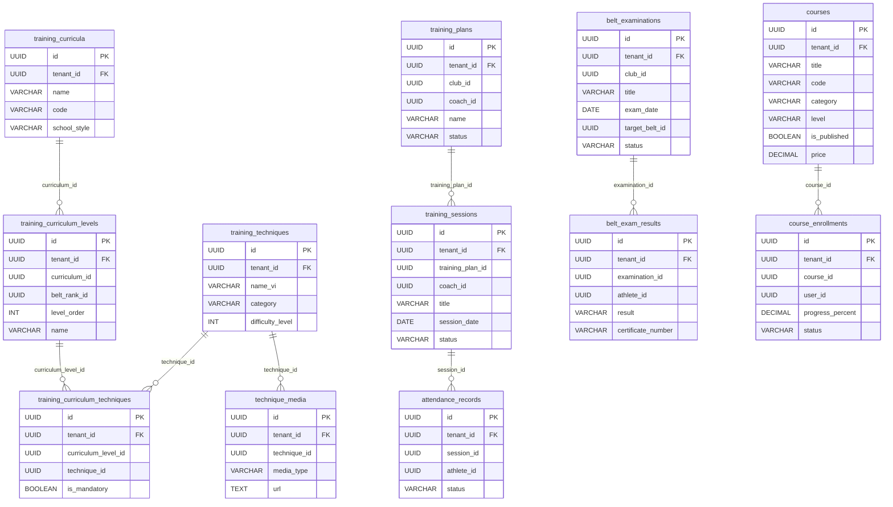
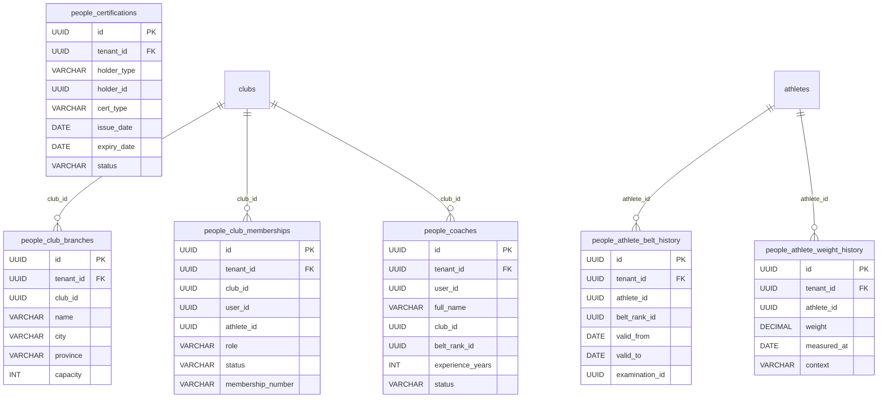
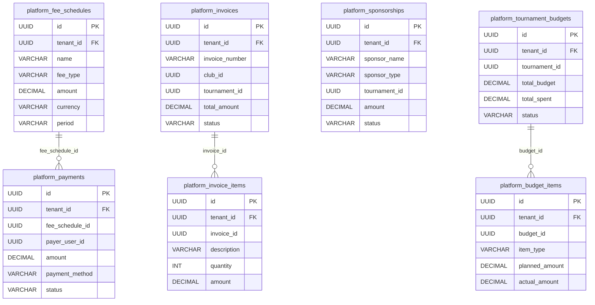
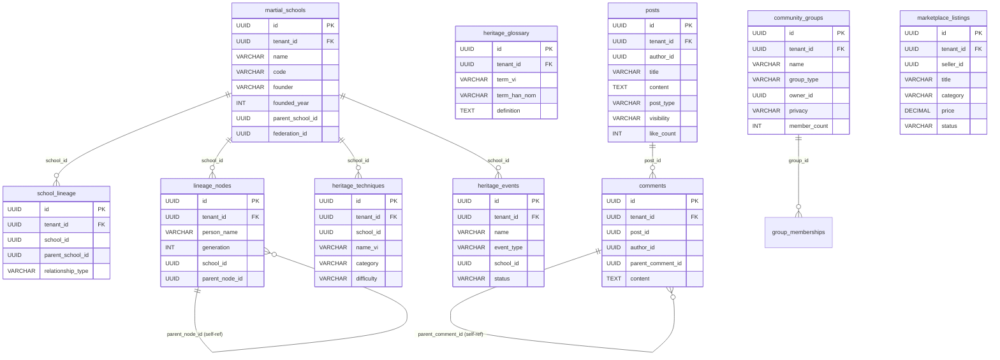

# 📊 VCT Platform — Báo cáo phân tích Database & ERD

> **Ngày phân tích**: 16/03/2026  
> **Nguồn dữ liệu**: 10 migration files (0001–0010)  
> **Tổng số tables**: **64 tables** across **7 schemas**

---

## 1. Tổng quan kiến trúc Database

| Schema | Mục đích | Số tables |
|--------|----------|-----------|
| `public` | Tournament, Competition, Auth (legacy) | 22 |
| `core` | Multi-tenant, Users, RBAC, Sessions | 5 |
| `training` | Curricula, E-learning, Belt exams | 10 |
| `people` | Club branches, Coaches, Certifications | 6 |
| `platform` (Finance) | Fees, Payments, Invoices, Budgets | 7 |
| `platform` (Heritage) | Martial schools, Lineage, Glossary | 7 |
| `platform` (Community) | Posts, Groups, Marketplace | 7 |

> [!IMPORTANT]
> Database sử dụng **multi-tenant architecture** với `tenant_id` trên mọi table enterprise (core/training/people/platform). Schema `public` chứa legacy tables chưa migrate sang tenant model.

---

## 2. ERD — Sơ đồ quan hệ tổng thể

### 2.1 Core & Authentication

### 2.2 Tournament & Competition (public schema)

### 2.3 Competition — Matches & Scoring

### 2.4 Results, Rankings & Organizations

### 2.5 Training Module

### 2.6 People Module

### 2.7 Finance Module (platform schema)

### 2.8 Heritage & Community Modules (platform schema)

---

## 3. Reference Tables (Bảng tham chiếu)

| Table | Mô tả | Số records mẫu |
|-------|--------|-----------------|
| `ref_sport_types` | Loại hình thi đấu (Quyền, Đối kháng, Binh khí...) | 6 |
| `ref_competition_formats` | Thể thức thi đấu (Loại trực tiếp, Vòng tròn...) | 5 |
| `ref_penalty_types` | Các loại phạt (Cảnh cáo, Trừ điểm...) | 7 |
| `ref_scoring_criteria` | Tiêu chí chấm điểm (Kỹ thuật, Lực, Tốc độ...) | 7 |
| `ref_belt_ranks` | Hệ thống đai (Trắng → Đen) | 6 |
| `ref_age_categories` | Lứa tuổi (Thiếu nhi → Cao tuổi) | 5 |
| `ref_equipment_types` | Loại thiết bị | 0 |

---

## 4. Utility Tables (public schema)

| Table | Mô tả |
|-------|--------|
| `entity_records` | Legacy EAV store (JSONB) |
| `users` | Legacy auth users |
| `sessions` | Legacy JWT sessions |
| `auth_audit_log` | Legacy auth audit |
| `notifications` | Hệ thống thông báo |
| `medical_records` | Hồ sơ y tế VĐV |
| `media_files` | File media (ảnh, video) |
| `data_audit_log` | Audit trail dữ liệu |
| `schedule_entries` | Lịch thi đấu |
| `appeals` | Khiếu nại / Kháng nghị |
| `weigh_ins` | Cân nặng thi đấu |

---

## 5. Thống kê kiến trúc

### Quan hệ & Foreign Keys

| Loại quan hệ | Số lượng |
|--------------|----------|
| Foreign Keys (explicit) | ~45 |
| Self-referencing FK | 4 (tenants, federations, lineage_nodes, comments) |
| Cross-schema references | Core tenants → mọi enterprise schemas |

### Security Features

| Feature | Áp dụng |
|---------|---------|
| Row Level Security (RLS) | Tất cả tables trong `core`, `training`, `people`, `platform` |
| Tenant isolation policy | Mọi enterprise table |
| Soft delete (`is_deleted`) | Mọi entity tables (enterprise) |
| Audit trigger (`updated_at`) | ~30 tables |
| Hard delete prevention | `core.users` |

### Patterns sử dụng

| Pattern | Mô tả |
|---------|--------|
| **UUIDv7** | Time-ordered UUID cho enterprise tables |
| **Multi-tenant** | `tenant_id` FK trên mọi table enterprise |
| **Bitemporal** | `people.athlete_belt_history` (valid_from/valid_to + recorded_at/superseded_at) |
| **Event Sourcing** | `match_events` với sequence_number |
| **Versioning** | Cột `version` trên mọi mutable entity |
| **JSONB** | Metadata, configs, scores, tags |

---

## 6. Sơ đồ tổng thể theo Module (High-Level)

```mermaid
graph TB
    subgraph CORE["🔐 Core (Tenant & Auth)"]
        T[tenants] --> U[users]
        T --> R[roles]
        U --> UR[user_roles]
        R --> UR
        U --> S[sessions]
        U --> AAL[auth_audit_log]
    end

    subgraph TOURNAMENT["🏆 Tournament (public)"]
        TN[tournaments] --> TM[teams]
        TN --> AG[age_groups]
        TN --> CC[content_categories]
        TN --> WC[weight_classes]
        TN --> AR[arenas]
        TN --> REF[referees]
        TM --> ATH[athletes]
        ATH --> REG[registrations]
        CC --> REG
        ATH --> CM[combat_matches]
        ATH --> FP[form_performances]
        AR --> CM
        REF --> RA[referee_assignments]
        CM --> ME["match_events (Event Sourcing)"]
        ATH --> JS[judge_scores]
    end

    subgraph RESULTS["🏅 Results & Rankings"]
        ATH --> RES[results]
        TM --> MS[medals_summary]
        ATH --> RK[rankings]
    end

    subgraph ORGS["🏛️ Organizations"]
        FED[federations] --> CLB[clubs]
    end

    subgraph TRAINING["📚 Training"]
        CUR[curricula] --> CL[curriculum_levels]
        CL --> CT[curriculum_techniques]
        TECH[techniques] --> CT
        TP[training_plans] --> TS[training_sessions]
        TS --> ATT[attendance_records]
        BE[belt_examinations] --> BER[belt_exam_results]
        CRS[courses] --> CE[course_enrollments]
    end

    subgraph PEOPLE["👥 People"]
        CLB --> CB[club_branches]
        CLB --> CMB[club_memberships]
        CLB --> CO[coaches]
        ATH --> ABH[athlete_belt_history]
        ATH --> AWH[athlete_weight_history]
        CERT[certifications]
    end

    subgraph FINANCE["💰 Finance"]
        FS[fee_schedules] --> PAY[payments]
        INV[invoices] --> II[invoice_items]
        SP[sponsorships]
        TB[tournament_budgets] --> BI[budget_items]
    end

    subgraph HERITAGE["📜 Heritage"]
        MSC["martial_schools"] --> SL[school_lineage]
        MSC --> LN[lineage_nodes]
        MSC --> HT[heritage_techniques]
        HG[heritage_glossary]
        HE[heritage_events]
    end

    subgraph COMMUNITY["🌐 Community"]
        POST[posts] --> CMT[comments]
        REACT[reactions]
        FLW[follows]
        GRP[community_groups] --> GM[group_memberships]
        MKT[marketplace_listings]
    end

    T -.->|tenant_id| TRAINING
    T -.->|tenant_id| PEOPLE
    T -.->|tenant_id| FINANCE
    T -.->|tenant_id| HERITAGE
    T -.->|tenant_id| COMMUNITY
    FED -.-> MSC
    CLB -.-> TRAINING

    style CORE fill:#1a1a2e,stroke:#e94560,color:#fff
    style TOURNAMENT fill:#16213e,stroke:#0f3460,color:#fff
    style RESULTS fill:#1a1a2e,stroke:#e94560,color:#fff
    style ORGS fill:#0f3460,stroke:#533483,color:#fff
    style TRAINING fill:#2c3333,stroke:#2e4f4f,color:#fff
    style PEOPLE fill:#2c3333,stroke:#0e8388,color:#fff
    style FINANCE fill:#1b2430,stroke:#51557e,color:#fff
    style HERITAGE fill:#2b2e4a,stroke:#e84545,color:#fff
    style COMMUNITY fill:#1b1b2f,stroke:#1a1a40,color:#fff
```

---

## 7. Đánh giá & Nhận xét

### ✅ Điểm mạnh
1. **Multi-tenant architecture** vững chắc — RLS + tenant isolation policy
2. **Event Sourcing** cho scoring — replay, audit trail hoàn hảo
3. **Bitemporal data** cho belt history — truy vấn lịch sử chính xác
4. **UUIDv7** — hiệu suất insert tốt hơn 40-60% so với UUIDv4
5. **Soft delete** — bảo vệ dữ liệu, cho phép restore
6. **Reference tables** — chuẩn hóa dữ liệu domain VCT

### ⚠️ Điểm cần lưu ý
1. **Dual schema** — `public.users` và `core.users` tồn tại song song (legacy migration)
2. **Mối quan hệ cross-schema** chưa đầy đủ FK constraints giữa enterprise tables (dùng UUID nhưng thiếu explicit FK do composite PK)
3. **JSONB usage** — Nhiều trường dùng JSONB (scores, config) — cần GIN indexes cho query performance
4. **No partitioning** declared yet cho `match_events` — cần khi data grow lớn
