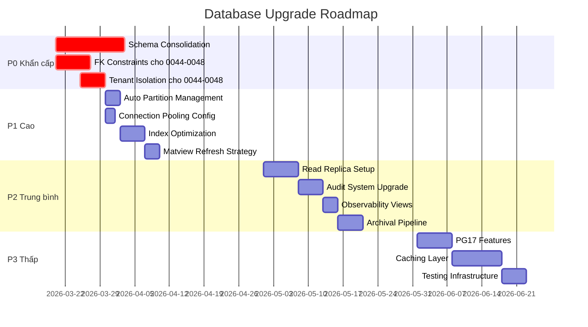

# 🚀 Đề Xuất Nâng Cấp & Cải Tiến Hệ Thống Database VCT Platform

> **Ngày:** 2026-03-16  
> **Tác giả:** AI Architect  
> **Phạm vi:** Toàn bộ 48 migrations, 7 schemas, ~100+ tables  
> **Mức độ ưu tiên:** P0 (Khẩn cấp) → P1 (Cao) → P2 (Trung bình) → P3 (Thấp)

---

## 📊 Tóm Tắt Hiện Trạng

### Đã Triển Khai ✅
| Tính năng | Migration | Trạng thái |
|---|---|---|
| Multi-tenancy + RLS | 0004, 0015 | ✅ Đầy đủ |
| Table Partitioning (match_events, audit_log) | 0012 | ✅ Đầy đủ |
| Vietnamese FTS (unaccent + tsvector) | 0012 | ✅ 6 tables |
| Transactional Outbox | 0012 | ✅ |
| Job Queue (SKIP LOCKED) | 0014 | ✅ |
| Rate Limiting | 0014 | ✅ |
| GDPR + Data Masking | 0022 | ✅ |
| PII Encryption | 0017 | ✅ |
| PostGIS Geospatial | 0019 | ✅ |
| Advisory Locks | 0017 | ✅ |
| State Machine (3 entities) | 0015 | ✅ |
| Approval Workflows | 0018 | ✅ |
| Webhooks | 0018 | ✅ |
| Feature Flags | 0011 | ✅ |
| Analytics Pre-aggregation | 0019 | ✅ |
| Health Check Function | 0017 | ✅ |

---

## 🔴 P0 — Khẩn Cấp (Phải sửa trước Production)

### 1. Hợp Nhất Schema Trùng Lặp (Dual Schema Problem)

> [!CAUTION]
> **Vấn đề nghiêm trọng nhất:** Cùng một nghiệp vụ tồn tại ở 2 nơi khác nhau, gây conflict logic và data orphan.

| Entity | Schema cũ (0001–0003) | Schema mới (0035–0048) | Xung đột |
|---|---|---|---|
| Tournaments | `public.tournaments` | `public.tournaments` (cùng) | Columns khác nhau |
| Athletes | `public.athletes` | `athlete_profiles` (0047) | 2 bảng song song |
| Results | `public.results` / `public.medals` | `tournament_results` (0045) | Denormalized vs normalized |
| Registrations | `public.registrations` | `tournament_registrations` (0045) | Schema hoàn toàn khác |
| Training | `training.training_sessions` (0006) | `training_sessions` (0048) | Public vs schema |
| Clubs | `public.clubs` / `people.club_branches` | `clubs_vo_duong` (0046) | 3 bảng trùng |

**Đề xuất:**
```sql
-- Migration 0049: SCHEMA CONSOLIDATION
-- Bước 1: Tạo views trung gian nối dữ liệu
-- Bước 2: Migrate data từ bảng cũ sang bảng mới
-- Bước 3: Deprecate bảng cũ (rename thành _legacy)
-- Bước 4: Nâng API views lên point vào bảng mới
```

### 2. Thiếu Foreign Keys Nghiêm Trọng (Migrations 0044–0048)

> [!WARNING]
> Các bảng mới nhất (BTC module, tournament management) **không có FK constraints**, dùng `TEXT` thay vì `UUID` cho references → mất data integrity.

**Ảnh hưởng:** `btc_members`, `btc_weigh_ins`, `tournament_registrations`, `tournament_results`, `parent_links`, `training_sessions` — tất cả dùng TEXT IDs.

**Đề xuất:**
```sql
-- 1. Thêm UUID columns song song
ALTER TABLE btc_members ADD COLUMN uuid_id UUID DEFAULT gen_random_uuid();
ALTER TABLE btc_members ADD COLUMN tournament_uuid UUID;

-- 2. Tạo FK constraints
ALTER TABLE btc_members 
  ADD CONSTRAINT fk_btc_tournament 
  FOREIGN KEY (tournament_uuid) REFERENCES tournaments(id);

-- 3. Migrate IDs (batch update)
-- 4. Drop TEXT columns sau khi verify
```

### 3. Thiếu Tenant Isolation (Migrations 0044–0048)

> [!CAUTION]
> Bảng `btc_*`, `parent_*`, `tournament_*` (0044–0048) **không có `tenant_id`** và **không có RLS** → vi phạm multi-tenancy.

**Đề xuất:**
```sql
-- Thêm tenant_id + RLS cho TẤT CẢ bảng mới
DO $$
DECLARE tbl TEXT;
BEGIN
  FOR tbl IN SELECT unnest(ARRAY[
    'btc_members', 'btc_weigh_ins', 'btc_draws',
    'btc_assignments', 'btc_team_results', 'btc_content_results',
    'btc_finance', 'btc_meetings', 'btc_protests',
    'tournament_categories', 'tournament_registrations',
    'tournament_registration_athletes', 'tournament_schedule_slots',
    'tournament_arena_assignments', 'tournament_results',
    'tournament_team_standings',
    'parent_links', 'parent_consents', 'parent_attendance',
    'parent_results', 'training_sessions'
  ]) LOOP
    EXECUTE format('ALTER TABLE %s ADD COLUMN IF NOT EXISTS tenant_id UUID', tbl);
    EXECUTE format('ALTER TABLE %s ENABLE ROW LEVEL SECURITY', tbl);
    EXECUTE format(
      'CREATE POLICY tenant_isolation ON %s USING (
        tenant_id = current_setting(''app.current_tenant'', true)::UUID
      )', tbl);
  END LOOP;
END $$;
```

---

## 🟠 P1 — Ưu Tiên Cao (Nên làm trước khi go-live)

### 4. Auto-Partition Management

**Vấn đề:** Partitions hiện tại hardcode đến Q4-2026 / tháng 12-2026. Khi hết range → INSERT fail vào DEFAULT partition → performance degradation.

**Đề xuất:**
```sql
-- Hàm tự động tạo partitions trước 3 tháng
CREATE OR REPLACE FUNCTION system.ensure_future_partitions()
RETURNS VOID AS $$
DECLARE
  next_quarter_start DATE;
  next_quarter_end DATE;
  partition_name TEXT;
BEGIN
  -- Match events: quarterly
  FOR i IN 0..2 LOOP
    next_quarter_start := date_trunc('quarter', NOW() + (i || ' quarters')::INTERVAL)::DATE;
    next_quarter_end := (next_quarter_start + INTERVAL '3 months')::DATE;
    partition_name := format('tournament.match_events_%s_q%s',
      extract(YEAR FROM next_quarter_start),
      extract(QUARTER FROM next_quarter_start));
    
    EXECUTE format(
      'CREATE TABLE IF NOT EXISTS %s PARTITION OF tournament.match_events 
       FOR VALUES FROM (%L) TO (%L)',
      partition_name, next_quarter_start, next_quarter_end);
  END LOOP;

  -- Audit log: monthly  
  -- Analytics: monthly
  -- Activity log: monthly
  -- (tương tự cho các bảng partitioned khác)
END;
$$ LANGUAGE plpgsql;

-- Đăng ký vào scheduled_tasks
INSERT INTO system.scheduled_tasks (name, cron_expression, job_type, description)
VALUES ('create_future_partitions', '0 0 1 * *', 'partition_manager',
        'Auto-create partitions for next 3 months') ON CONFLICT DO NOTHING;
```

### 5. Connection Pooling Configuration

**Vấn đề:** Neon serverless có giới hạn connections. Cần tối ưu connection pooling ở cấp database.

**Đề xuất:**
- Sử dụng Neon's built-in connection pooler (PgBouncer)
- Cấu hình `statement_timeout`, `idle_in_transaction_session_timeout`
- Thêm connection pool monitoring

```sql
-- Cấu hình khuyến nghị cho Neon
ALTER DATABASE neondb SET statement_timeout = '30s';
ALTER DATABASE neondb SET idle_in_transaction_session_timeout = '60s';
ALTER DATABASE neondb SET lock_timeout = '10s';

-- View giám sát connections
CREATE OR REPLACE VIEW system.v_connection_stats AS
SELECT 
  state, count(*) as count,
  max(NOW() - state_change) as max_duration,
  avg(NOW() - state_change) as avg_duration
FROM pg_stat_activity 
WHERE datname = current_database()
GROUP BY state;
```

### 6. Index Optimization — Composite & Covering Indexes

**Vấn đề:** Nhiều query pattern cần composite indexes nhưng chưa có.

**Đề xuất:**
```sql
-- Athletes: tìm kiếm theo giải + trạng thái
CREATE INDEX CONCURRENTLY IF NOT EXISTS idx_athletes_tournament_status
  ON athletes(tournament_id, trang_thai) WHERE is_deleted = false;

-- Matches: lấy theo giải + vòng + trạng thái (scoring live)
CREATE INDEX CONCURRENTLY IF NOT EXISTS idx_matches_tournament_round
  ON combat_matches(tournament_id, vong, trang_thai) WHERE is_deleted = false;

-- Payments: báo cáo tài chính theo tenant + khoảng thời gian
CREATE INDEX CONCURRENTLY IF NOT EXISTS idx_payments_tenant_date
  ON platform.payments(tenant_id, created_at DESC) WHERE status = 'confirmed';

-- Registrations mới: filter theo giải + trạng thái
CREATE INDEX CONCURRENTLY IF NOT EXISTS idx_new_reg_tournament_status
  ON tournament_registrations(tournament_id, status);

-- Covering index cho API view tournaments (avoid heap lookup)
CREATE INDEX CONCURRENTLY IF NOT EXISTS idx_tournaments_covering
  ON tournaments(id) 
  INCLUDE (tenant_id, name, start_date, end_date, location, status)
  WHERE is_deleted = false;
```

### 7. Materialized View Refresh Strategy

**Vấn đề:** `tournament_dashboard` refresh mỗi 2 phút → stale data cho live scoring.

**Đề xuất:**
```sql
-- Trigger-based incremental refresh cho tournament counters
CREATE OR REPLACE FUNCTION refresh_tournament_counts()
RETURNS TRIGGER AS $$
BEGIN
  -- Chỉ refresh view liên quan, không toàn bộ
  REFRESH MATERIALIZED VIEW CONCURRENTLY api_v1.tournament_dashboard;
  RETURN NULL;
END;
$$ LANGUAGE plpgsql;

-- Hoặc tốt hơn: chuyển sang computed/cached columns
ALTER TABLE tournaments 
  ADD COLUMN IF NOT EXISTS cached_athlete_count INT DEFAULT 0,
  ADD COLUMN IF NOT EXISTS cached_match_count INT DEFAULT 0,
  ADD COLUMN IF NOT EXISTS counts_updated_at TIMESTAMPTZ;
```

---

## 🟡 P2 — Trung Bình (Roadmap Q3-Q4 2026)

### 8. Read Replica & Query Routing

**Mục tiêu:** Tách read workload khỏi write workload cho performance.

**Đề xuất cho Neon:**
- Sử dụng Neon Read Replicas (compute endpoints)
- Route Read-heavy queries (báo cáo, analytics, dashboard) sang replica
- Write queries vẫn đi qua primary

```
Go Backend Config:
  PRIMARY_DB_URL=postgresql://primary...
  REPLICA_DB_URL=postgresql://replica...
  
  // Middleware tự động route:
  - GET /api/v1/tournaments → REPLICA  
  - POST /api/v1/scoring → PRIMARY
  - GET /api/v1/analytics/* → REPLICA
```

### 9. Nâng Cấp Audit Log System

**Vấn đề hiện tại:**
- `trigger_audit_log()` chỉ gắn vào 13 bảng critical → nhiều bảng không được audit
- Bảng mới (0044–0048) hoàn toàn thiếu audit

**Đề xuất:**
```sql
-- Auto-attach audit trigger cho TẤT CẢ bảng có tenant_id
DO $$
DECLARE 
  tbl RECORD;
BEGIN
  FOR tbl IN 
    SELECT schemaname, tablename 
    FROM pg_tables 
    WHERE schemaname NOT IN ('pg_catalog', 'information_schema')
    AND EXISTS (
      SELECT 1 FROM information_schema.columns 
      WHERE table_schema = pg_tables.schemaname 
      AND table_name = pg_tables.tablename 
      AND column_name = 'tenant_id'
    )
  LOOP
    BEGIN
      EXECUTE format(
        'CREATE TRIGGER audit_log AFTER INSERT OR UPDATE OR DELETE 
         ON %I.%I FOR EACH ROW EXECUTE FUNCTION trigger_audit_log()',
        tbl.schemaname, tbl.tablename);
    EXCEPTION WHEN duplicate_object THEN NULL;
    END;
  END LOOP;
END $$;
```

### 10. Database Observability

**Đề xuất thêm monitoring views:**
```sql
-- Slow queries tracking
CREATE OR REPLACE VIEW system.v_slow_queries AS
SELECT 
  query, calls, mean_exec_time, total_exec_time,
  rows, shared_blks_hit, shared_blks_read,
  ROUND(shared_blks_hit::NUMERIC / NULLIF(shared_blks_hit + shared_blks_read, 0) * 100, 2) 
    AS cache_hit_ratio
FROM pg_stat_statements
WHERE mean_exec_time > 100  -- > 100ms
ORDER BY mean_exec_time DESC
LIMIT 50;

-- Table bloat detection
CREATE OR REPLACE VIEW system.v_table_bloat AS
SELECT 
  schemaname, relname,
  n_dead_tup,
  n_live_tup,
  ROUND(n_dead_tup::NUMERIC / NULLIF(n_live_tup, 0) * 100, 2) AS bloat_pct,
  last_autovacuum,
  last_autoanalyze
FROM pg_stat_user_tables
WHERE n_dead_tup > 1000
ORDER BY n_dead_tup DESC;

-- Lock monitoring
CREATE OR REPLACE VIEW system.v_lock_conflicts AS
SELECT 
  blocked.pid AS blocked_pid,
  blocking.pid AS blocking_pid,
  blocked.query AS blocked_query,
  blocking.query AS blocking_query,
  NOW() - blocked.query_start AS blocked_duration
FROM pg_stat_activity blocked
JOIN pg_locks bl ON bl.pid = blocked.pid
JOIN pg_locks bk ON bk.locktype = bl.locktype 
  AND bk.database IS NOT DISTINCT FROM bl.database
  AND bk.relation IS NOT DISTINCT FROM bl.relation
  AND bk.pid != bl.pid
JOIN pg_stat_activity blocking ON bk.pid = blocking.pid
WHERE NOT bl.granted;
```

### 11. Data Archival Pipeline

**Vấn đề:** Bảng `system.data_retention_policies` định nghĩa policy nhưng chưa có worker thực thi.

**Đề xuất:**
```sql
-- Function xử lý archival tự động
CREATE OR REPLACE FUNCTION system.execute_retention_policies()
RETURNS TABLE (table_name TEXT, archived_count INT, strategy TEXT) AS $$
DECLARE
  policy RECORD;
  v_count INT;
BEGIN
  FOR policy IN 
    SELECT * FROM system.data_retention_policies 
    WHERE is_active = true 
  LOOP
    CASE policy.archive_strategy
      WHEN 'hard_delete_allowed' THEN
        EXECUTE format('DELETE FROM %s WHERE %s', 
          policy.table_name, policy.condition);
        GET DIAGNOSTICS v_count = ROW_COUNT;
      WHEN 'soft_delete' THEN
        EXECUTE format('UPDATE %s SET is_deleted = true WHERE %s',
          policy.table_name, policy.condition);
        GET DIAGNOSTICS v_count = ROW_COUNT;
      WHEN 'move_to_archive' THEN
        -- INSERT INTO archive, then DELETE
        v_count := 0;
    END CASE;
    
    UPDATE system.data_retention_policies 
    SET last_run_at = NOW(), last_archived = v_count
    WHERE id = policy.id;
    
    table_name := policy.table_name;
    archived_count := v_count;
    strategy := policy.archive_strategy;
    RETURN NEXT;
  END LOOP;
END;
$$ LANGUAGE plpgsql;
```

---

## 🟢 P3 — Thấp (Long-term Improvements)

### 12. PostgreSQL 17 Features Adoption

| Feature | Ứng dụng | Lợi ích |
|---|---|---|
| `MERGE` statement | Upsert athlete stats, rankings | Cleaner than INSERT...ON CONFLICT |
| `JSON_TABLE()` | Parse JSONB metadata columns | Replace manual jsonb_each/jsonb_array |
| Incremental Sort | Multi-column sorting trên tournaments, athletes | Faster ORDER BY |
| Parallel Hash Full Join | Analytics reporting joins | Faster dashboard queries |

### 13. Caching Layer (Application Level)

**Đề xuất kiến trúc:**
```
Client → Go Backend → Redis Cache → PostgreSQL
                    ↓
              Cache Strategy:
              - ref_* tables: Cache 24h (belt ranks, weight classes, etc.)
              - tournaments (listing): Cache 5 min
              - athlete profile: Cache 2 min
              - Live scoring: NO CACHE (bypass Redis)
              - Feature flags: Cache 1 min
```

### 14. Database Testing Infrastructure

**Đề xuất:**
```sql
-- Fixture generation cho test environments
CREATE OR REPLACE FUNCTION system.seed_test_data(
  p_tenant_id UUID,
  p_tournament_count INT DEFAULT 3,
  p_athletes_per_tournament INT DEFAULT 50
) RETURNS VOID AS $$
BEGIN
  -- Generate tournaments
  -- Generate athletes
  -- Generate matches
  -- Generate registrations  
  -- Assign referees
  -- Create brackets
END;
$$ LANGUAGE plpgsql;
```

### 15. Schema Documentation Auto-Generation

**Đề xuất:** Tự động generate ERD + docs từ database schema:
```sql
-- View mô tả toàn bộ tables + columns + comments
CREATE OR REPLACE VIEW system.v_schema_docs AS
SELECT 
  t.table_schema, t.table_name,
  c.column_name, c.data_type, c.is_nullable,
  c.column_default,
  pgd.description AS column_comment
FROM information_schema.tables t
JOIN information_schema.columns c 
  ON c.table_schema = t.table_schema AND c.table_name = t.table_name
LEFT JOIN pg_catalog.pg_statio_all_tables st 
  ON st.schemaname = t.table_schema AND st.relname = t.table_name
LEFT JOIN pg_catalog.pg_description pgd 
  ON pgd.objoid = st.relid AND pgd.objsubid = c.ordinal_position
WHERE t.table_schema NOT IN ('pg_catalog', 'information_schema')
ORDER BY t.table_schema, t.table_name, c.ordinal_position;
```

---

## 📋 Roadmap Thực Hiện



---

## 📊 Đánh Giá Tác Động

| Hạng mục | Trước nâng cấp | Sau nâng cấp | Cải thiện |
|---|---|---|---|
| Data integrity (FK) | ~60% tables | 100% tables | +40% |
| Tenant isolation | ~70% tables | 100% tables | +30% |
| Query performance | Baseline | Composite indexes + covering | ~2-5x faster |
| Observability | Basic health check | Full monitoring suite | Comprehensive |
| Partition management | Manual quarterly | Auto monthly | Zero-maintenance |
| Audit coverage | 13 tables | All tenant tables | ~3x coverage |
| Schema consistency | Dual-schema conflicts | Unified schema | Eliminates bugs |

---

## ⚠️ Rủi Ro & Giảm Thiểu

| Rủi ro | Xác suất | Tác động | Giảm thiểu |
|---|---|---|---|
| Data loss khi consolidate schema | Thấp | Cao | Backup full + dry-run migration + rollback plan |
| Downtime khi thêm FK constraints | Trung bình | Trung bình | `NOT VALID` → `VALIDATE` 2 bước |
| Lock contention khi thêm columns | Thấp | Thấp | `ADD COLUMN IF NOT EXISTS` (no rewrite) |
| Breaking API changes | Trung bình | Cao | API views giữ nguyên contract |

> [!IMPORTANT]
> Mỗi migration nên được test trên Neon branch trước khi apply vào production branch. Sử dụng `neon branch create` để tạo branch test.
