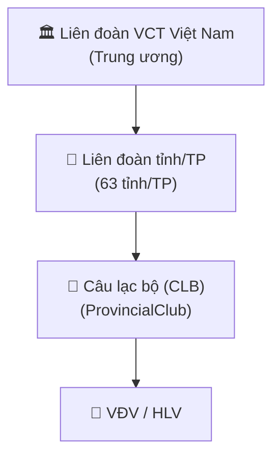
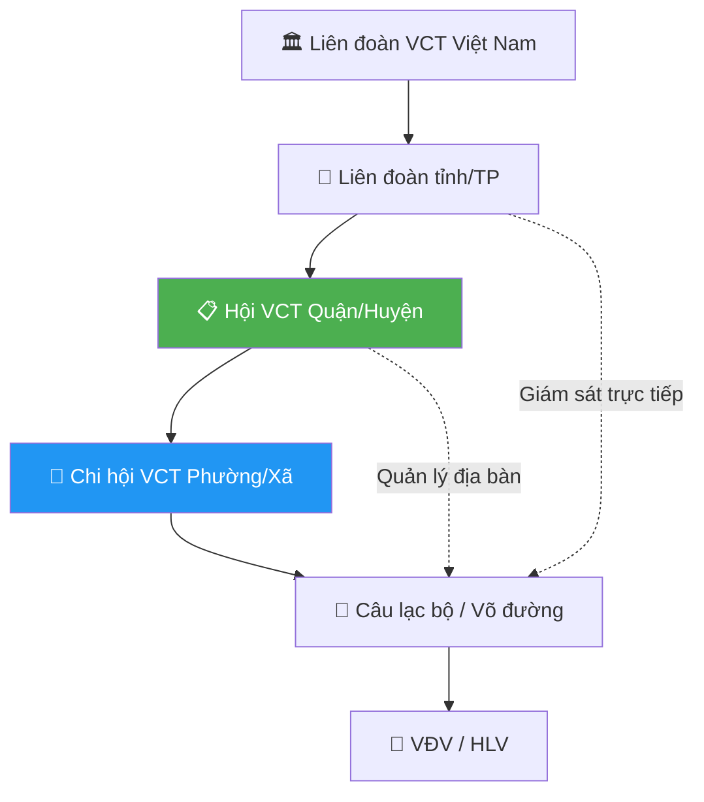
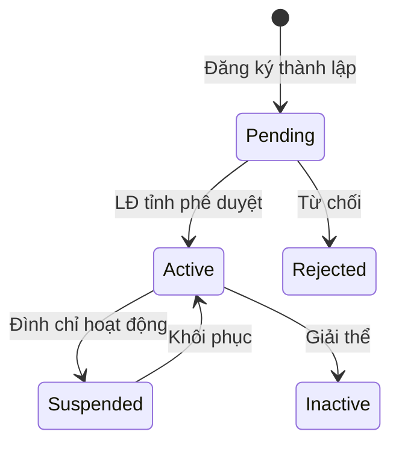
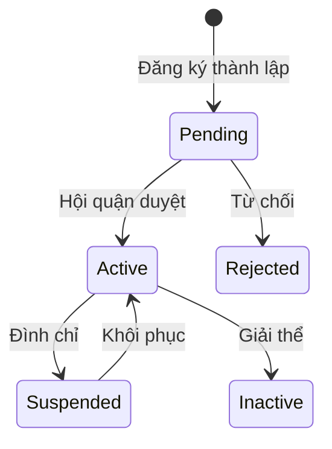
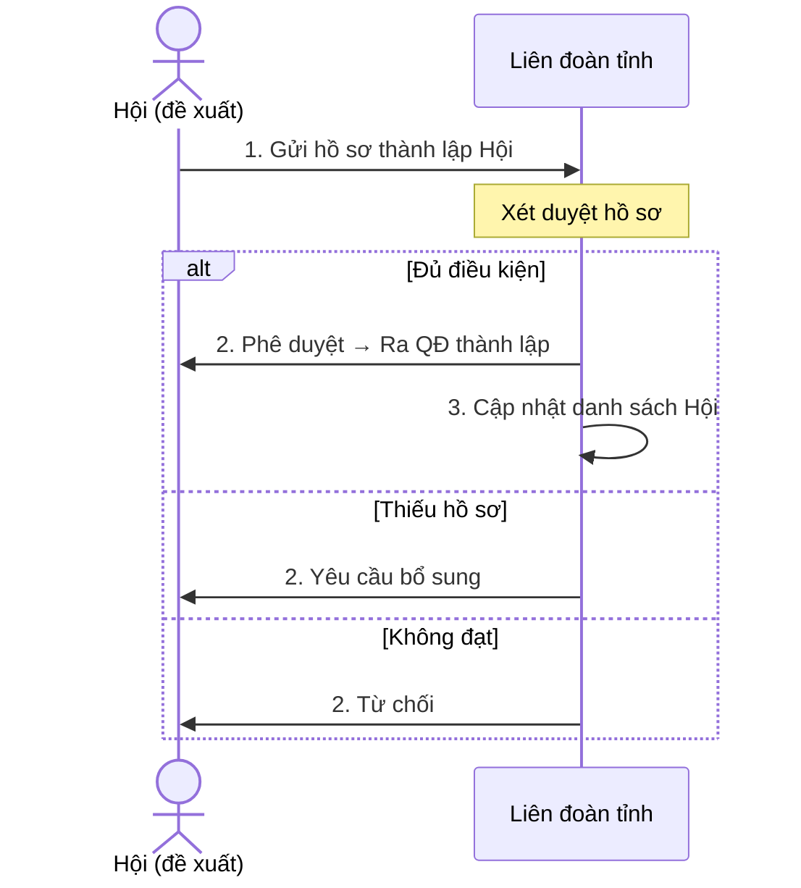
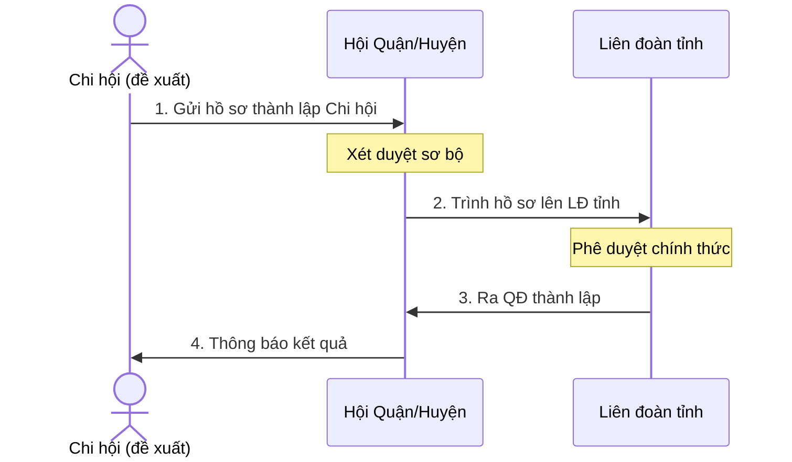
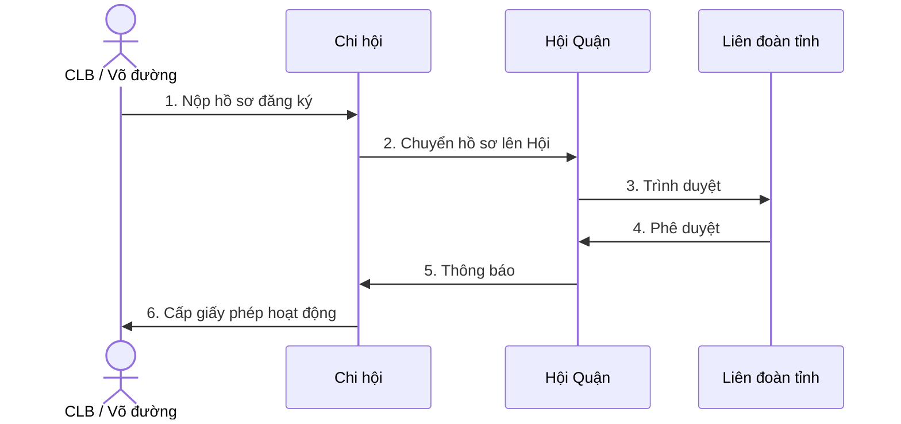
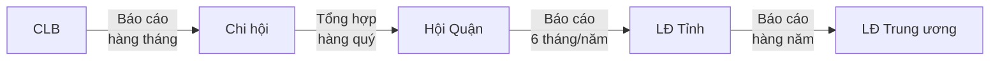

# Phân tích nghiệp vụ Chi hội & Hội dưới Liên đoàn tỉnh

## 1. Sơ đồ cấu trúc tổ chức hiện tại



> [!IMPORTANT]
> Cấu trúc **hiện tại** trong codebase đang thiếu tầng **Hội** và **Chi hội** — đây là 2 cấp tổ chức trung gian rất quan trọng trong thực tế vận hành của Liên đoàn Võ cổ truyền tại các tỉnh/TP.

## 2. Cấu trúc tổ chức đề xuất (đầy đủ)



---

## 3. Phân tích nghiệp vụ Hội (Quận/Huyện)

### 3.1 Định nghĩa
**Hội Võ cổ truyền Quận/Huyện** là tổ chức đại diện cho phong trào võ cổ truyền tại cấp quận/huyện, trực thuộc Liên đoàn tỉnh/TP.

### 3.2 Vai trò & Chức năng

| STT | Chức năng | Mô tả |
|-----|-----------|-------|
| 1 | **Quản lý Chi hội** | Theo dõi, phê duyệt thành lập, đình chỉ hoạt động các chi hội trên địa bàn |
| 2 | **Quản lý CLB trực thuộc** | Giám sát các CLB/Võ đường hoạt động trên địa bàn quận/huyện |
| 3 | **Nhân sự BCH Hội** | Quản lý Ban Chấp hành Hội: Chủ tịch, Phó CT, Thư ký, Ủy viên |
| 4 | **Quản lý VĐV/HLV** | Tổng hợp danh sách VĐV, HLV thuộc địa bàn |
| 5 | **Tổ chức giải đấu cấp Quận** | Đề xuất, tổ chức giải đấu cấp quận/huyện |
| 6 | **Báo cáo** | Tổng hợp, gửi báo cáo định kỳ lên Liên đoàn tỉnh |
| 7 | **Phát triển phong trào** | Tuyển sinh, quảng bá, mở rộng võ cổ truyền trên địa bàn |
| 8 | **Xử lý chuyển nhượng** | Duyệt chuyển nhượng VĐV giữa CLB trong cùng quận/huyện |

### 3.3 Nhân sự BCH Hội

| Chức danh | Vai trò trong hệ thống |
|-----------|----------------------|
| Chủ tịch Hội | `district_president` — Quản trị cấp cao nhất tại Hội |
| Phó Chủ tịch | `district_vice_president` — Phó CT chuyên môn / phong trào |
| Thư ký | `district_secretary` — Hành chính, biên bản |
| Trưởng ban Chuyên môn | `district_technical_head` — Kỹ thuật, thi đấu |
| Kế toán | `district_accountant` — Tài chính |
| Ủy viên | `district_committee_member` — Thành viên BCH |

### 3.4 Trạng thái Hội



### 3.5 Domain Model đề xuất

| Field | Type | Mô tả |
|-------|------|-------|
| `id` | string | Mã định danh |
| `province_id` | string | FK → Liên đoàn tỉnh |
| `name` | string | Tên hội (VD: "Hội VCT Quận 1") |
| `short_name` | string | Tên viết tắt |
| `code` | string | Mã hội (VD: "HOI-HCM-Q1") |
| `district` | string | Quận/Huyện |
| `address` | string | Địa chỉ trụ sở |
| `phone` | string | SĐT liên hệ |
| `email` | string | Email |
| `president_name` | string | Chủ tịch Hội |
| `president_phone` | string | SĐT Chủ tịch |
| `founded_date` | string | Ngày thành lập |
| `decision_no` | string | Số QĐ thành lập |
| `status` | enum | pending / active / suspended / inactive / rejected |
| `total_chi_hoi` | int | Tổng số chi hội trực thuộc |
| `total_clubs` | int | Tổng số CLB trực thuộc |
| `total_athletes` | int | Tổng VĐV |
| `total_coaches` | int | Tổng HLV |
| `term` | string | Nhiệm kỳ (VD: "2024-2029") |
| `created_at` | timestamp | Ngày tạo |
| `updated_at` | timestamp | Ngày cập nhật |

---

## 4. Phân tích nghiệp vụ Chi hội (Phường/Xã)

### 4.1 Định nghĩa
**Chi hội Võ cổ truyền Phường/Xã** là đơn vị cơ sở, trực thuộc Hội quận/huyện, quản lý các CLB/Võ đường trên địa bàn phường/xã.

### 4.2 Vai trò & Chức năng

| STT | Chức năng | Mô tả |
|-----|-----------|-------|
| 1 | **Quản lý CLB trực thuộc** | Giám sát các CLB/Võ đường hoạt động trên địa bàn phường/xã |
| 2 | **Nhân sự Chi hội** | Quản lý Chi hội trưởng, Chi hội phó, Thư ký |
| 3 | **Thu thập hồ sơ VĐV/HLV** | Tiếp nhận hồ sơ đăng ký VĐV, HLV từ CLB |
| 4 | **Phát triển phong trào cơ sở** | Tuyển sinh, quảng bá tại phường/xã |
| 5 | **Tổ chức giao lưu** | Giao lưu, thi đấu nội bộ cấp phường/xã |
| 6 | **Báo cáo lên Hội** | Gửi báo cáo định kỳ lên Hội quận/huyện |
| 7 | **Đề xuất gia nhập/chuyển nhượng** | Đề xuất cho VĐV gia nhập CLB hoặc chuyển CLB |

### 4.3 Nhân sự Chi hội

| Chức danh | Vai trò trong hệ thống |
|-----------|----------------------|
| Chi hội trưởng | `ward_leader` — Quản lý cấp cao nhất tại Chi hội |
| Chi hội phó | `ward_deputy` — Hỗ trợ chi hội trưởng |
| Thư ký | `ward_secretary` — Hành chính |

### 4.4 Trạng thái Chi hội



### 4.5 Domain Model đề xuất

| Field | Type | Mô tả |
|-------|------|-------|
| `id` | string | Mã định danh |
| `province_id` | string | FK → Liên đoàn tỉnh |
| `district_association_id` | string | FK → Hội quận/huyện |
| `name` | string | Tên chi hội (VD: "Chi hội VCT Phường Bến Nghé") |
| `short_name` | string | Tên viết tắt |
| `code` | string | Mã chi hội (VD: "CH-HCM-Q1-BN") |
| `ward` | string | Phường/Xã |
| `address` | string | Địa chỉ |
| `phone` | string | SĐT liên hệ |
| `email` | string | Email |
| `leader_name` | string | Chi hội trưởng |
| `leader_phone` | string | SĐT Chi hội trưởng |
| `founded_date` | string | Ngày thành lập |
| `decision_no` | string | Số QĐ thành lập |
| `status` | enum | pending / active / suspended / inactive / rejected |
| `total_clubs` | int | Tổng CLB trực thuộc |
| `total_athletes` | int | Tổng VĐV |
| `created_at` | timestamp | Ngày tạo |
| `updated_at` | timestamp | Ngày cập nhật |

---

## 5. Luồng nghiệp vụ chính

### 5.1 Thành lập Hội mới



### 5.2 Thành lập Chi hội mới



### 5.3 Đăng ký CLB trực thuộc Chi hội



### 5.4 Báo cáo theo cấp



---

## 6. Phân quyền (Authorization Matrix)

| Hành động | LĐ Tỉnh | Hội Quận | Chi hội | CLB |
|-----------|:--------:|:--------:|:-------:|:---:|
| Tạo Hội quận | ✅ | ❌ | ❌ | ❌ |
| Phê duyệt Hội | ✅ | ❌ | ❌ | ❌ |
| Tạo Chi hội | ✅ | ✅ | ❌ | ❌ |
| Phê duyệt Chi hội | ✅ | ✅ | ❌ | ❌ |
| Tạo CLB | ✅ | ✅ | ✅ | ❌ |
| Phê duyệt CLB | ✅ | ✅ | ❌ | ❌ |
| Đăng ký VĐV | ❌ | ❌ | ✅ | ✅ |
| Phê duyệt VĐV | ✅ | ✅ | ✅ | ❌ |
| Chuyển nhượng VĐV (cùng quận) | ❌ | ✅ | ❌ | ❌ |
| Chuyển nhượng VĐV (khác quận) | ✅ | ❌ | ❌ | ❌ |
| Xem dashboard | ✅ | ✅ | ✅ | ✅ |
| Xem báo cáo toàn tỉnh | ✅ | ❌ | ❌ | ❌ |
| Xem báo cáo quận | ✅ | ✅ | ❌ | ❌ |
| Tổ chức giải quận | ✅ | ✅ | ❌ | ❌ |
| Tổ chức giao lưu phường | ❌ | ✅ | ✅ | ❌ |

---

## 7. API Endpoints dự kiến

### Hội (District Association)
```
GET    /api/v1/provincial/associations              → Danh sách Hội
POST   /api/v1/provincial/associations              → Tạo Hội
GET    /api/v1/provincial/associations/:id           → Chi tiết Hội
PUT    /api/v1/provincial/associations/:id           → Cập nhật Hội
POST   /api/v1/provincial/associations/:id/approve   → Phê duyệt Hội
POST   /api/v1/provincial/associations/:id/suspend   → Đình chỉ Hội
GET    /api/v1/provincial/associations/:id/dashboard → Dashboard Hội
GET    /api/v1/provincial/associations/:id/clubs     → CLB thuộc Hội
GET    /api/v1/provincial/associations/:id/committee → BCH Hội
```

### Chi hội (Ward Sub-Association)
```
GET    /api/v1/provincial/sub-associations                   → Danh sách Chi hội
POST   /api/v1/provincial/sub-associations                   → Tạo Chi hội
GET    /api/v1/provincial/sub-associations/:id                → Chi tiết Chi hội
PUT    /api/v1/provincial/sub-associations/:id                → Cập nhật
POST   /api/v1/provincial/sub-associations/:id/approve        → Phê duyệt
POST   /api/v1/provincial/sub-associations/:id/suspend        → Đình chỉ
GET    /api/v1/provincial/sub-associations/:id/clubs          → CLB thuộc Chi hội
```

---

## 8. So sánh với cấu trúc hiện tại trong codebase

| Khía cạnh | Hiện tại | Đề xuất bổ sung |
|-----------|----------|-----------------|
| Cấp tổ chức | LĐ Tỉnh → CLB | LĐ Tỉnh → **Hội** → **Chi hội** → CLB |
| Scope dữ liệu | `province_id` | `province_id` + `association_id` + `sub_association_id` |
| CLB thuộc về | `province_id` trực tiếp | `sub_association_id` (hoặc `association_id`) |
| Phê duyệt CLB | LĐ tỉnh duyệt | Hội/Chi hội đề xuất → LĐ tỉnh duyệt |
| Chuyển nhượng | LĐ tỉnh xử lý tất cả | Cùng quận: Hội duyệt. Khác quận: LĐ tỉnh duyệt |
| Dashboard | 1 cấp (tỉnh) | 3 cấp (tỉnh, quận, phường) |
| Auth roles | `provincial_*` | Thêm `district_*` và `ward_*` |

> [!TIP]
> Khi triển khai, nên mở rộng `ProvincialClub` hiện tại bằng cách thêm `association_id` và `sub_association_id` thay vì tạo model mới cho CLB, để tương thích ngược (backward-compatible).
