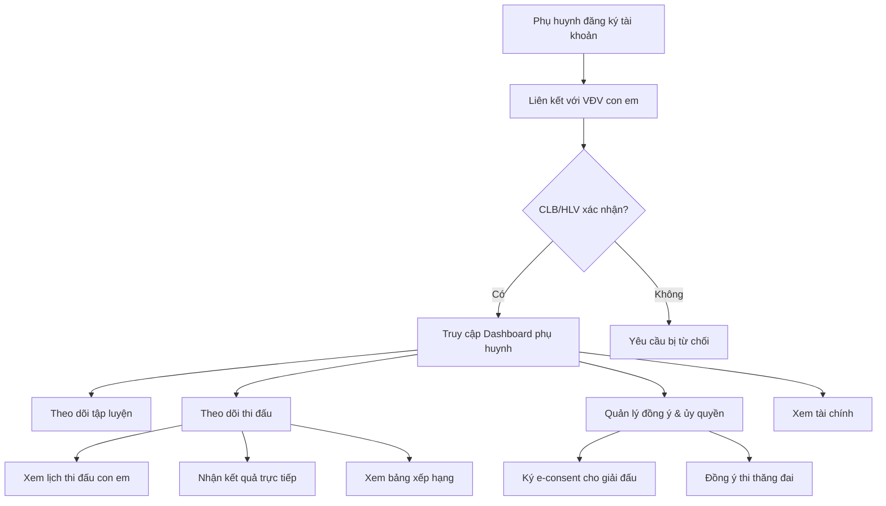
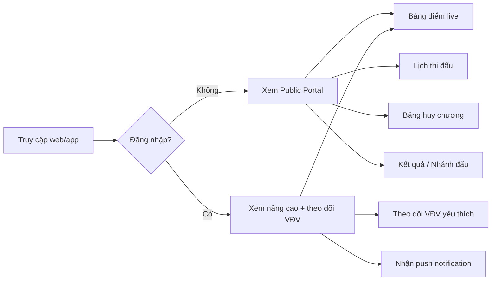
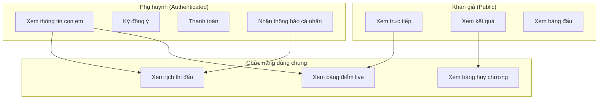

# Phân tích nghiệp vụ: Phụ huynh & Khán giả

> Phân tích vai trò, nhu cầu và chức năng của **Phụ huynh** (Parent/Guardian) và **Khán giả** (Spectator/Viewer) trong Nền tảng VCT.

---

## 1. Tổng quan hai đối tượng

| Tiêu chí | Phụ huynh (Parent) | Khán giả (Spectator) |
|---|---|---|
| **Định nghĩa** | Người giám hộ hợp pháp của võ sinh/VĐV dưới 18 tuổi | Người xem thi đấu, không tham gia trực tiếp |
| **Yêu cầu đăng nhập** | ✅ Có tài khoản (liên kết với VĐV) | ❌ Không bắt buộc (public access) |
| **Mối quan hệ** | 1 phụ huynh → N VĐV con em | Không liên kết ai |
| **Tần suất sử dụng** | Thường xuyên (theo dõi con em) | Theo mùa giải / sự kiện |

---

## 2. Phụ huynh (Parent/Guardian)

### 2.1. Vai trò trong hệ sinh thái VCT

Phụ huynh là **người giám hộ hợp pháp** của võ sinh/VĐV chưa đủ tuổi tự quyết. Trong võ cổ truyền, đa số học viên bắt đầu từ nhỏ, nên phụ huynh đóng vai trò quan trọng:

- **Pháp lý**: Ký đồng ý cho con em thi đấu, chịu trách nhiệm pháp lý
- **Tài chính**: Đóng phí CLB, phí thi đấu, phí thi thăng đai
- **Theo dõi**: Giám sát tiến độ tập luyện và thành tích thi đấu của con em

### 2.2. Các chức năng nghiệp vụ

#### A. Quản lý hồ sơ con em
| Chức năng | Mô tả |
|---|---|
| Xem hồ sơ VĐV | Xem thông tin cá nhân, lịch sử thi đấu, đai/cấp của con em |
| Liên kết VĐV | Yêu cầu liên kết tài khoản phụ huynh với hồ sơ VĐV (cần xác nhận từ CLB/HLV) |
| Cập nhật thông tin | Cập nhật thông tin y tế, dị ứng, liên hệ khẩn cấp |
| Xem thành tích | Bảng tổng hợp huy chương, kết quả thi đấu, lịch sử thăng đai |

#### B. Đồng ý & Ủy quyền
| Chức năng | Mô tả |
|---|---|
| Ký đồng ý thi đấu | Ký xác nhận (e-consent) cho con em tham gia giải đấu |
| Đồng ý đăng ký giải | Phê duyệt đăng ký giải của con em (nếu dưới 18 tuổi) |
| Đồng ý thi thăng đai | Chấp thuận cho con em dự thi thăng đai/cấp |
| Ủy quyền y tế | Cung cấp thông tin y tế và đồng ý sơ cứu khẩn cấp |
| Chấp thuận hình ảnh | Đồng ý hoặc từ chối quyền sử dụng hình ảnh con em trên nền tảng |

#### C. Theo dõi & Thông báo
| Chức năng | Mô tả |
|---|---|
| Lịch thi đấu | Xem lịch thi đấu của con em (giải nào, sàn nào, giờ nào) |
| Kết quả trực tiếp | Nhận thông báo push khi con em ra thi đấu và kết quả trận |
| Điểm danh tập luyện | Xem lịch sử điểm danh, số buổi tập, tỷ lệ chuyên cần |
| Nhận xét HLV | Xem đánh giá, nhận xét từ HLV về tiến bộ con em |
| Thông báo CLB | Nhận thông báo từ CLB (lịch nghỉ, sự kiện, thay đổi lịch tập) |

#### D. Tài chính
| Chức năng | Mô tả |
|---|---|
| Xem học phí | Xem chi tiết học phí hàng tháng, phí thi đấu |
| Lịch sử thanh toán | Xem lịch sử đóng phí |
| Thanh toán online | Đóng phí qua cổng thanh toán tích hợp |
| Hóa đơn/Biên lai | Tải biên lai thanh toán |

### 2.3. Luồng nghiệp vụ chính

### 2.4. Đề xuất Role trong hệ thống

| Role code | Scope type | Mô tả |
|---|---|---|
| `parent` | `self` | Phụ huynh VĐV — scope tới hồ sơ con em liên kết |

**Permissions đề xuất:**
- `athlete:view:child` — Xem hồ sơ VĐV con em
- `attendance:view:child` — Xem điểm danh con em
- `tournament:consent` — Ký đồng ý thi đấu
- `belt_exam:consent` — Đồng ý thi thăng đai
- `payment:view` — Xem thông tin thanh toán
- `payment:create` — Thực hiện thanh toán
- `notification:receive` — Nhận thông báo

---

## 3. Khán giả (Spectator/Viewer)

### 3.1. Vai trò trong hệ sinh thái VCT

Khán giả là **người xem** giải đấu, bao gồm:
- Khán giả tại chỗ (xem trực tiếp tại sân)
- Khán giả online (xem livestream, theo dõi kết quả)
- Phóng viên / truyền thông
- Fan / hâm mộ

### 3.2. Trạng thái hiện tại trong codebase

Hệ thống **đã có sẵn** cơ sở phục vụ khán giả:

| Thành phần | Trạng thái | Chi tiết |
|---|---|---|
| Public API Handler | ✅ Đã có | `public_handler.go` — 5 endpoints không cần auth |
| Spectator Workspace | ✅ Đã có | `public_spectator` type trong RBAC |
| Live Scoreboard | ✅ Đã có | `GET /api/v1/public/scoreboard` |
| Tournament Bracket | ✅ Đã có | `GET /api/v1/public/bracket/{id}` |
| Schedule | ✅ Đã có | `GET /api/v1/public/schedule` (filter date/arena) |
| Medal Table | ✅ Đã có | `GET /api/v1/public/medals` |
| Competition Results | ✅ Đã có | `GET /api/v1/public/results` (filter category) |

### 3.3. Các chức năng nghiệp vụ

#### A. Xem trực tiếp (Không cần đăng nhập)
| Chức năng | API hiện tại | Mô tả |
|---|---|---|
| Bảng điểm trực tiếp | `/public/scoreboard` | Xem trận đấu đang diễn ra, điểm real-time |
| Bảng đấu / Nhánh đấu | `/public/bracket/{id}` | Xem sơ đồ vòng loại, bán kết, chung kết |
| Lịch thi đấu | `/public/schedule` | Xem lịch theo ngày, theo sàn |
| Bảng huy chương | `/public/medals` | Xem bảng tổng sắp huy chương theo đoàn |
| Kết quả thi đấu | `/public/results` | Xem kết quả theo nội dung |

#### B. Tính năng nâng cao (Đề xuất mở rộng)
| Chức năng | Mô tả | Ưu tiên |
|---|---|---|
| Tìm kiếm VĐV | Tìm VĐV theo tên, đoàn, nội dung thi đấu | 🟡 Trung bình |
| Theo dõi VĐV yêu thích | Đánh dấu VĐV quan tâm, nhận thông báo khi thi đấu | 🟢 Thấp |
| Livestream tích hợp | Embed video livestream từ YouTube/Facebook | 🟡 Trung bình |
| Thống kê giải đấu | Số trận, số VĐV, phân bổ huy chương | 🟢 Thấp |
| Lịch sử giải đấu | Xem kết quả các giải trước | 🟢 Thấp |
| Bình luận / Reaction | Tương tác trên trang xem trực tiếp | 🔴 Cao rủi ro |
| QR Check-in | Quét QR tại sân để check-in khán giả, đếm lượt | 🟡 Trung bình |
| Bản đồ sân đấu | Xem layout sân, vị trí các sàn đấu | 🟢 Thấp |

### 3.4. Luồng trải nghiệm khán giả

---

## 4. So sánh & Mối quan hệ giữa hai đối tượng

> **Lưu ý**: Phụ huynh thực chất có **tất cả quyền** của khán giả, cộng thêm quyền quản lý riêng liên quan đến con em.

---

## 5. Tác động lên hệ thống hiện tại

### 5.1. Cần bổ sung

| Hạng mục | Chi tiết |
|---|---|
| **Auth Role mới** | `parent` — thêm vào danh sách `UserRole` trong `auth/service.go` |
| **Domain model mới** | `ParentGuardianLink` — bảng liên kết parent_user_id ↔ athlete_id |
| **E-consent module** | Module quản lý chữ ký điện tử đồng ý (thi đấu, thăng đai, hình ảnh) |
| **Notification mở rộng** | Thêm kênh thông báo cho phụ huynh (push/email khi con em thi đấu) |
| **Payment gateway** | Tích hợp thanh toán online (học phí, phí thi đấu) — nếu chưa có |

### 5.2. Đã có sẵn (không cần thay đổi nhiều)

| Hạng mục | Chi tiết |
|---|---|
| Public API | `public_handler.go` đã đầy đủ cho khán giả cơ bản |
| Spectator workspace | RBAC đã có `public_spectator` type |
| Training domain | Đã có `AttendanceRecord` — phụ huynh chỉ cần quyền xem |
| Community domain | Club, Member, Event đã sẵn sàng |

---

## 6. Khuyến nghị ưu tiên triển khai

| Ưu tiên | Chức năng | Đối tượng | Lý do |
|---|---|---|---|
| 🔴 P0 | E-consent (đồng ý thi đấu cho trẻ vị thành niên) | Phụ huynh | **Yêu cầu pháp lý bắt buộc** |
| 🟠 P1 | Liên kết phụ huynh ↔ VĐV | Phụ huynh | Nền tảng cho mọi chức năng parent |
| 🟠 P1 | Dashboard phụ huynh (xem hồ sơ, thành tích) | Phụ huynh | Nhu cầu cốt lõi |
| 🟡 P2 | Thông báo kết quả thi đấu cho phụ huynh | Phụ huynh | Trải nghiệm người dùng |
| 🟡 P2 | Xem điểm danh & nhận xét HLV | Phụ huynh | Giá trị gia tăng |
| 🟢 P3 | Tìm kiếm VĐV cho khán giả | Khán giả | Tăng tính tương tác |
| 🟢 P3 | Livestream tích hợp | Khán giả | Phụ thuộc hạ tầng bên ngoài |
| 🟢 P3 | Thanh toán online | Phụ huynh | Cần tích hợp payment gateway |
