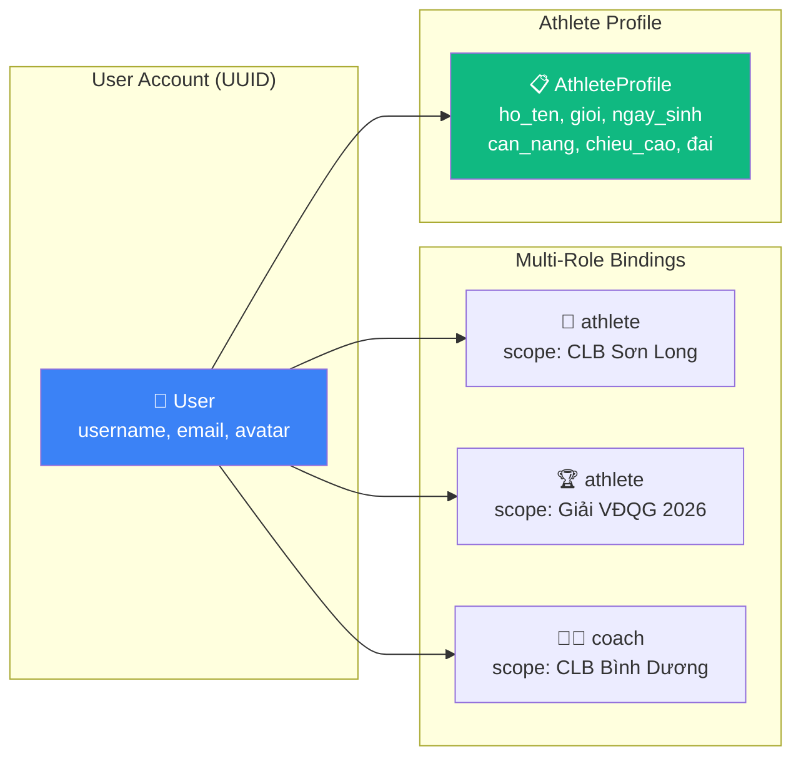
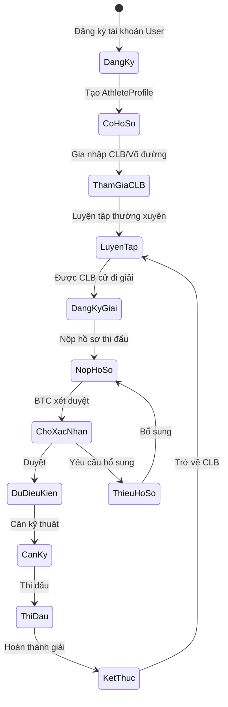
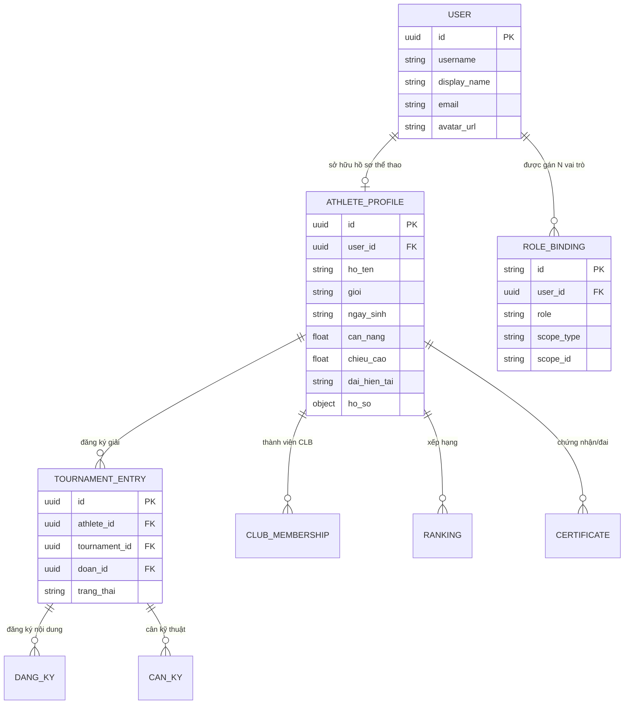

# Phân Tích Nghiệp Vụ: Vận Động Viên (VĐV)

## 1. Nguyên Tắc Cốt Lõi

> [!IMPORTANT]
> **Vận động viên (VĐV) KHÔNG phải thực thể độc lập — VĐV là một VAI TRÒ của Người dùng (User).**
> Khi một User **tham gia giải đấu** hoặc **luyện tập trong đội tuyển/CLB**, họ mang thêm vai trò `athlete` bên cạnh các vai trò khác (HLV, trọng tài, cán bộ đoàn...).

### Kiến Trúc Danh Tính Kép



| Lớp | Mô tả | Đã có? |
|-----|--------|--------|
| **User Account** | Tài khoản đăng nhập (UUID, username, password) | ✅ `auth.AuthUser` |
| **RoleBinding** | Gán vai trò `athlete` với scope (CLB/giải/đội tuyển) | ✅ `auth.RoleBinding` |
| **AthleteProfile** | Hồ sơ thể thao (cân nặng, chiều cao, đai, lịch sử) | ⚠️ Hiện tách rời, chưa liên kết User |

---

## 2. Hệ Thống Vai Trò Hiện Tại

`RoleAthlete = "athlete"` đã tồn tại trong [auth/service.go](file:///d:/VCT%20PLATFORM/vct-platform/backend/internal/auth/service.go#L32) cùng hệ thống multi-role:

| Thành phần | Chức năng |
|------------|-----------|
| `RoleBinding` | Gán vai trò + phạm vi (system/federation/tournament/club/self) |
| `ActiveContext` | Vai trò đang hoạt động (1 tại 1 thời điểm) |
| `SwitchContext()` | Chuyển đổi vai trò, re-issue JWT |
| `athlete_portal` | Workspace type cho scope `self` |

### Kịch Bản Sử Dụng

```
Nguyễn Hoàng Nam (User UUID: abc-123)
├── Role: athlete  │ scope: CLB Sơn Long TP.HCM    │ luyện tập hàng tuần
├── Role: athlete  │ scope: Giải VĐQG 2026         │ thi đấu ĐK 60kg + Quyền
└── Role: athlete  │ scope: Đội tuyển TP.HCM        │ tập huấn
```

Khi đăng nhập, User chọn context → hệ thống chuyển sang workspace `athlete_portal` tương ứng.

---

## 3. Vòng Đời Tham Gia



---

## 4. Mô Hình Dữ Liệu

### 4.1 Quan Hệ User → AthleteProfile



### 4.2 Trạng Thái VĐV Trong Giải

| Trạng thái | Label | Ý nghĩa |
|------------|-------|---------|
| `nhap` | Nháp | Mới tạo, hồ sơ chưa đầy đủ |
| `thieu_ho_so` | Thiếu hồ sơ | Hồ sơ chưa đủ 4 mục |
| `cho_xac_nhan` | Chờ xác nhận | Đã nộp, chờ BTC duyệt |
| `du_dieu_kien` | Đủ điều kiện | Đã duyệt, sẵn sàng thi đấu |

### 4.3 Checklist Hồ Sơ (4 hạng mục)

| Mục | Mô tả |
|-----|-------|
| `kham_sk` | Giấy khám sức khoẻ |
| `bao_hiem` | Bảo hiểm y tế |
| `anh` | Ảnh 3x4 |
| `cmnd` | CCCD / Định danh cá nhân |

---

## 5. Các Nghiệp Vụ Chính

### 5.1 Tạo Hồ Sơ Thể Thao

User đăng ký → tạo `AthleteProfile` kèm thông tin cá nhân, chiều cao, cân nặng → liên kết qua `user_id`.

### 5.2 Gia Nhập CLB / Võ Đường

User xin gia nhập CLB → Admin CLB duyệt → hệ thống tạo `RoleBinding(role=athlete, scope=club, scopeId=CLB-xxx)`.

### 5.3 Đăng Ký Tham Gia Giải Đấu

CLB/Đoàn cử VĐV đi giải → tạo `TournamentEntry` + `RoleBinding(role=athlete, scope=tournament, scopeId=T-xxx)`.

### 5.4 Nộp & Duyệt Hồ Sơ Thi Đấu

VĐV/Đoàn nộp giấy tờ theo checklist → BTC kiểm tra → duyệt/yêu cầu bổ sung.

### 5.5 Đăng Ký Nội Dung Thi Đấu

VĐV đăng ký nội dung cụ thể (Đối kháng 60kg, Quyền thuật Nam...) → BTC duyệt.

### 5.6 Cân Kỹ Thuật

VĐV đối kháng qua cân → hệ thống kiểm tra hạng cân → `dat` / `khong_dat`.

### 5.7 Luyện Tập & Điểm Danh

VĐV điểm danh buổi tập tại CLB → hệ thống ghi nhận lịch sử luyện tập.

---

## 6. Domain Liên Quan

| Domain | Liên kết | Mô tả |
|--------|----------|-------|
| **Ranking** | `AthleteProfile → AthleteRanking` | ELO rating, thống kê thắng/thua, huy chương |
| **Certification** | `AthleteProfile → Certificate` | Đai, chứng nhận y tế, bảo hiểm |
| **DailyLoad** | `AthleteProfile → AthleteDailyLoad` | Theo dõi tải trọng thi đấu trong ngày |
| **TeamEntry** | `AthleteProfile → TeamEntry` | Đội hình đồng đội (đội trưởng/thành viên/dự bị) |
| **GDPR** | `AthleteProfile → AthleteDataKey` | Mã hoá dữ liệu cá nhân, quyền xoá |

---

## 7. Phân Tích Gaps

### 🔴 Thiếu Sót Nghiêm Trọng

| # | Vấn đề | Ảnh hưởng |
|---|--------|-----------|
| 1 | **Athlete model tách rời User** | Backend `Athlete` không có `user_id`, không liên kết tài khoản đăng nhập |
| 2 | **Không có AthleteProfile** | Thiếu lớp hồ sơ thể thao lâu dài (đai, lịch sử, CLB) |
| 3 | **Chưa có ClubMembership** | VĐV chưa quản lý tư cách thành viên CLB/võ đường |
| 4 | **Chưa có TournamentEntry** | Chưa phân biệt "VĐV thuộc hệ thống" vs "VĐV đăng ký giải cụ thể" |

### 🟡 Cần Bổ Sung

| # | Đề xuất | Ưu tiên |
|---|---------|---------|
| 1 | Thêm `user_id` vào Athlete model, tạo quan hệ User ↔ AthleteProfile | **Cao** |
| 2 | Tạo `ClubMembership` entity (user, club, join_date, status) | **Cao** |
| 3 | Tạo `TournamentEntry` entity phân biệt hồ sơ giải vs hồ sơ lâu dài | **Cao** |
| 4 | Tự động tạo `RoleBinding(athlete)` khi VĐV được thêm vào CLB/giải | Trung bình |
| 5 | Upload hồ sơ thực tế (ảnh, scan giấy tờ) | Trung bình |
| 6 | Module luyện tập & điểm danh cho CLB | Trung bình |
| 7 | Cổng VĐV tự quản (xem hồ sơ, kết quả, lịch thi) | Trung bình |
