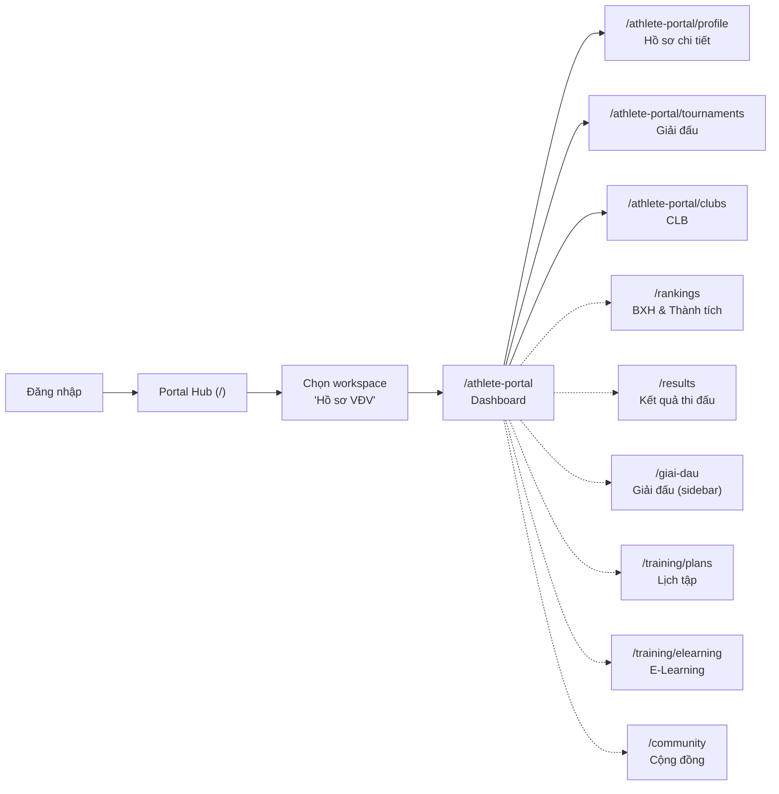

# Phân Tích Luồng Trải Nghiệm Vận Động Viên

## 1. Tổng quan luồng hiện tại



> [!NOTE]
> → Đường nét liền: đã có page & route  
> → Đường nét đứt: sidebar link trỏ tới, nhưng **chưa rõ page nào render**

---

## 2. Đánh giá từng thành phần

### ✅ Điểm mạnh — Đã làm tốt

| Thành phần | Đánh giá |
|---|---|
| **Portal Hub → Workspace** | Luồng rõ ràng, card hiển thị stats (BXH, Huy chương, ELO). Chuyên nghiệp |
| **Dashboard (Portal)** | Layout 2 cột, hero profile, skill stats, tournaments, goals, belt timeline, clubs — đầy đủ thông tin tổng quan |
| **API Integration** | Tất cả 4 pages đều dùng `useApiQuery` thay vì hardcode mock data |
| **Loading Skeleton** | Mỗi page đều có skeleton loading states |
| **Empty States** | Xử lý tốt case chưa có hồ sơ VĐV |
| **Tournaments** | Filter (upcoming/past), search, sort, progress bar hồ sơ — rất chuyên nghiệp |
| **Clubs** | Modal join/leave, confirm dialog, vai trò (Đội trưởng/Thành viên) |
| **Profile Detail** | Inline edit mode, belt timeline, avatar upload indicator |

### ⚠️ Điểm yếu — Cần cải thiện

#### A. Sidebar không khớp với thực tế pages

| Sidebar Item | Path | Trang thực tế | Vấn đề |
|---|---|---|---|
| Hồ sơ cá nhân | `/athlete-portal` | ✅ `Page_athlete_portal` | OK — nhưng label sai, đây là Dashboard chứ không phải Profile |
| BXH & Thành tích | `/rankings` | ❌ **Shared page** | Chung với public — không riêng cho VĐV |
| Kết quả thi đấu | `/results` | ❌ **Shared page** | Chung với public — không riêng cho VĐV |
| Giải đấu | `/giai-dau` | ❌ **Shared page** | Link đến trang quản lý giải — không phải `/athlete-portal/tournaments` |
| Lịch tập | `/training/plans` | ❌ **Chưa có page** | Route trống |
| E-Learning | `/training/elearning` | ❌ **Chưa có page** | Route trống |
| Cộng đồng | `/community` | ❌ **Shared page** | Chung với federation |

> [!CAUTION]
> **3/7 sidebar items trỏ đến route chưa có page riêng cho VĐV**, và **4/7 items trỏ đến shared routes** (dùng chung với workspace khác). Khi VĐV click, có thể thấy nội dung không liên quan hoặc trang trống.

#### B. Naming & Navigation hỗn loạn

- Sidebar ghi "Hồ sơ cá nhân" (`/athlete-portal`) → nhưng page thực tế là **Dashboard** (skill stats, tournaments, goals...)
- Page "Hồ sơ chi tiết" (`/athlete-portal/profile`) mới là Profile thực sự → **không có trong sidebar!**
- Page "Giải đấu" (`/athlete-portal/tournaments`) và "CLB" (`/athlete-portal/clubs`) cũng **không có trong sidebar!**
- Sidebar link `/giai-dau` trỏ đến trang quản lý giải chung, khác `/athlete-portal/tournaments`

#### C. Dữ liệu hardcode trong Dashboard

- `SKILL_STATS`, `BELT_HISTORY`, `GOALS` — hoàn toàn hardcode tĩnh, không từ API
- Stats trên Portal Hub card (BXH #42, 7 HCV, 1680 ELO) là mock data cứng

#### D. Thiếu chức năng quan trọng

| Chức năng | Status |
|---|---|
| Lịch tập / Điểm danh | ❌ Không có |
| E-Learning / Học bài quyền | ❌ Không có |
| Thông báo cá nhân | ❌ Chỉ có banner cảnh báo hồ sơ |
| Lịch sử thi đấu chi tiết | ❌ Chỉ có list giải đấu |
| Upload hồ sơ thực tế | ❌ Nút "Bổ sung hồ sơ" chưa có handler |
| Đăng ký giải tự do | ❌ Không có |

---

## 3. Đề xuất cải thiện

### Ưu tiên 1: Sửa Sidebar (Impact cao, effort thấp)

```
ATHLETE_SIDEBAR (Đề xuất mới):

TỔNG QUAN
├── 🏠 Trang chủ VĐV         → /athlete-portal          (Dashboard)

HỒ SƠ & ĐẲNG CẤP
├── 👤 Hồ sơ cá nhân          → /athlete-portal/profile
├── 🥋 Đẳng cấp & Thăng đai  → /athlete-portal/belts     [MỚI]

THÀNH TÍCH
├── 📊 BXH & ELO              → /athlete-portal/rankings  [MỚI - riêng VĐV]
├── 🏆 Kết quả thi đấu        → /athlete-portal/results   [MỚI - riêng VĐV]

HOẠT ĐỘNG
├── 🏅 Giải đấu               → /athlete-portal/tournaments
├── 🏠 Câu lạc bộ             → /athlete-portal/clubs
├── 📅 Lịch tập               → /athlete-portal/training   [MỚI]

HỌC TẬP
├── 📖 E-Learning             → /athlete-portal/elearning  [MỚI]
```

### Ưu tiên 2: Tách biệt route namespace

Tất cả route VĐV nên nằm dưới `/athlete-portal/...` thay vì share route với workspace khác. Điều này:
- Tránh conflict khi VĐV click sidebar mà thấy nội dung không phải dành cho mình
- Dễ quản lý RBAC/permission
- Consistent URL patterns

### Ưu tiên 3: Kết nối dữ liệu thật

- Skill stats, belt history, goals → lấy từ API `/api/v1/athlete-profiles/me` mở rộng
- Portal Hub workspace card stats → lấy từ profile thực tế

---

## 4. Tóm tắt

| Tiêu chí | Điểm | Ghi chú |
|---|---|---|
| **Vision & Concept** | ⭐⭐⭐⭐⭐ | Rất rõ ràng, workspace model chuyên nghiệp |
| **UI/UX Design** | ⭐⭐⭐⭐ | Dashboard đẹp, skeleton tốt, nhưng sidebar chưa khớp |
| **API Integration** | ⭐⭐⭐⭐ | Cơ bản xong, nhưng nhiều section còn hardcode |
| **Navigation/Routing** | ⭐⭐☆☆☆ | **Vấn đề nghiêm trọng nhất** — sidebar conflicted routes |
| **Feature Completeness** | ⭐⭐⭐☆☆ | 4/7 sidebar features chưa có page riêng |
| **Tổng thể** | **7/10** | Nền tảng tốt, cần refactor sidebar + thêm pages |

> [!IMPORTANT]
> **Ưu tiên cao nhất**: Sửa ATHLETE_SIDEBAR để các path trỏ đến namespace `/athlete-portal/...` riêng. Đây là thay đổi nhỏ (chỉ sửa config) nhưng impact lớn nhất đến trải nghiệm VĐV.
