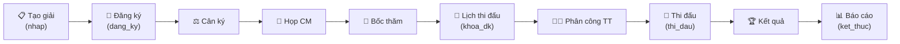
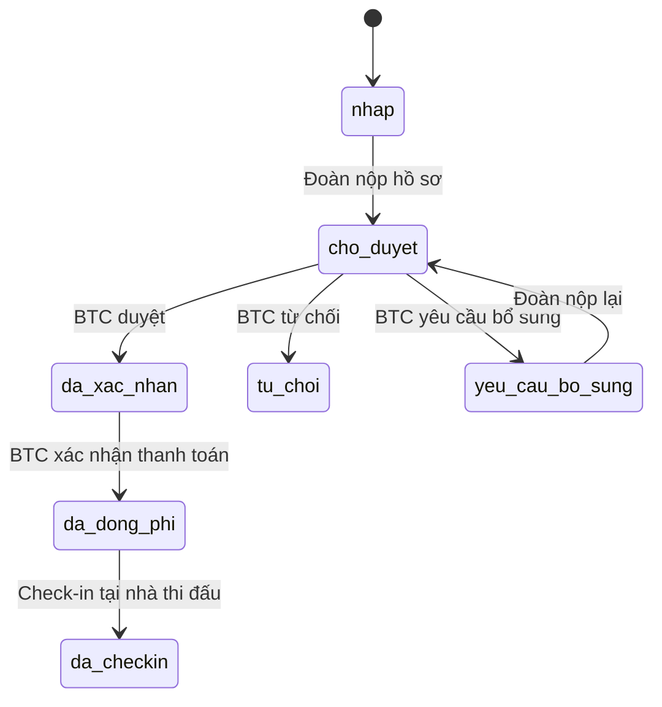

# 📋 Phân Tích Nghiệp Vụ — Ban Tổ Chức Giải (BTC Giải)

## 1. Tổng quan

**Ban Tổ Chức Giải (BTC)** là nhóm nhân sự chịu trách nhiệm **toàn bộ vòng đời** của một giải đấu Võ Cổ Truyền — từ khởi tạo, tiếp nhận đăng ký, điều hành thi đấu, đến tổng kết và báo cáo. BTC là trung tâm điều phối của hệ thống, kết nối tất cả các bên liên quan: Liên đoàn, Đoàn tham dự, VĐV, Trọng tài, Y tế, Tài chính, và Truyền thông.

---

## 2. Cơ cấu tổ chức BTC

Dựa trên dữ liệu từ [tournament-config.ts](file:///d:/VCT%20PLATFORM/vct-platform/packages/app/features/data/tournament-config.ts), BTC gồm các **ban chuyên môn**:

| Ban | Trưởng ban | Trách nhiệm chính |
|-----|-----------|-------------------|
| **Ban Tổ Chức** (ban_to_chuc) | Trưởng BTC, Phó BTC | Điều phối tổng thể, logistics, cơ sở vật chất |
| **Ban Chuyên Môn** (ban_chuyen_mon) | Trưởng Ban CM | Nội dung thi, hạng cân, bốc thăm, xếp lịch |
| **Ban Trọng Tài** (ban_trong_tai) | Trưởng Ban TT | Phân công trọng tài, giám sát chấm điểm |
| **Ban Y Tế** (ban_y_te) | Trưởng Ban Y Tế | Đảm bảo an toàn sức khỏe, xe cấp cứu, đội y tế |
| **Ban Kháng Nghị** (ban_khang_nghi) | Trưởng Ban KN | Tiếp nhận & xử lý khiếu nại, phân xử tranh chấp |

Mỗi thành viên BTC có thuộc tính: `ten`, `chuc_vu`, `ban`, `cap` (cấp bậc), `sdt`, `email`, `dv` (đơn vị công tác).

---

## 3. Vòng đời giải đấu & Vai trò BTC

BTC quản lý giải đấu qua **10 bước tuần tự**, được thể hiện trong [TournamentWorkflowStepper.tsx](file:///d:/VCT%20PLATFORM/vct-platform/packages/app/features/tournament/TournamentWorkflowStepper.tsx):

### Trạng thái hệ thống (State Machine)

Backend hỗ trợ 5 trạng thái chính với state transitions nghiêm ngặt (từ [orchestrator/tournament.go](file:///d:/VCT%20PLATFORM/vct-platform/backend/internal/domain/orchestrator/tournament.go)):

| Trạng thái | Mô tả | Ai thao tác |
|-------------|--------|------------|
| `nhap` | Bản nháp, đang soạn thảo | Trưởng BTC |
| `dang_ky` | Mở đăng ký cho các đoàn | BTC → thông báo các đoàn |
| `khoa_dk` | Khóa đăng ký, freeze dữ liệu | BTC → hệ thống tự freeze |
| `thi_dau` | Đang thi đấu | BTC điều hành |
| `ket_thuc` | Giải kết thúc | BTC → hệ thống tổng hợp |

---

## 4. Các nghiệp vụ chi tiết của BTC

### 4.1. Giai đoạn Chuẩn Bị (Pre-Tournament)

#### a) Khởi tạo giải đấu
- **Wizard 4 bước** ([Page_tournament_wizard.tsx](file:///d:/VCT%20PLATFORM/vct-platform/packages/app/features/tournament/Page_tournament_wizard.tsx)):
  1. Thông tin chung: Tên giải, mã giải, cấp độ (`quoc_gia` / `khu_vuc` / `tinh` / `clb`)
  2. Thời gian & Địa điểm: Ngày thi, hạn đăng ký, nhà thi đấu
  3. Cấu hình kỹ thuật: Quota VĐV, số giám định, luật chấm
  4. Xác nhận & Tạo bản nháp

#### b) Cấu hình chi tiết
- **Nội dung thi đấu**: Đối kháng (nam/nữ, theo hạng cân), Quyền thuật (cá nhân/đội/đồng đội), Biểu diễn
- **Cấu hình chấm điểm**:
  - Quyền: 5 hoặc 7 giám định, bỏ điểm cao/thấp
  - Đối kháng: 3 hoặc 5 giám định, thời gian hiệp (120s), thời gian nghỉ (60s)
- **Quota**: max VĐV/đoàn (40), max nội dung/VĐV (5), max HLV/đoàn (5), max đoàn (60)
- **Sàn đấu**: Thiết lập sàn (số lượng, kích thước, loại), trạng thái sẵn sàng/bảo trì
- **Lệ phí**: VĐV (200K), nội dung (100K), đoàn (2M)
- **Giải thưởng**: HCV (3M), HCB (2M), HCĐ (1M); Toàn đoàn: Nhất (15M), Nhì (10M), Ba (5M)

#### c) Pháp lý & Y tế
- QĐ tổ chức, phiên bản luật, bảo hiểm
- Bệnh viện kế hoạch, xe cấp cứu, đội y tế

#### d) Tài trợ
- Quản lý danh sách nhà tài trợ theo cấp: `chinh`, `vang`, `bac`, `dong_hanh`

#### e) Checklist chuẩn bị
- 9 mục kiểm tra: QĐ tổ chức → Điều lệ → Hợp đồng NTĐ → HĐ tài trợ → Tuyển chọn TT → Trang thiết bị → Hệ thống CNTT → Họp kỹ thuật → Tổng duyệt

---

### 4.2. Giai đoạn Đăng Ký (Registration)

- **Mở đăng ký** (`nhap → dang_ky`): BTC kích hoạt, hệ thống gửi thông báo đến các đoàn
- **Duyệt đoàn tham dự**: Quy trình 6 trạng thái:

- **Hồ sơ yêu cầu cho mỗi đoàn**: Công văn cử đoàn, danh sách VĐV, ảnh 3×4, giấy khám, bảo hiểm, bằng HLV
- **Khóa đăng ký** (`dang_ky → khoa_dk`): Freeze toàn bộ đăng ký, hệ thống tạo invoice

---

### 4.3. Giai đoạn Thi Đấu (Competition)

- **Bốc thăm & Xếp nhánh**: Xếp nhánh đối kháng (vòng loại → tứ kết → bán kết → chung kết), thứ tự quyền
- **Xếp lịch thi đấu**: Theo sàn, phiên thi (`sang` / `chieu` / `toi`), có giờ bắt đầu/kết thúc
- **Phân công trọng tài**: Phân TT vào sàn theo ca, đảm bảo không xung đột lợi ích
- **Điều hành trận đấu**: Event Sourcing — ghi lại mọi sự kiện (điểm, phạt, timeout) trong [MatchEvent](file:///d:/VCT%20PLATFORM/vct-platform/backend/internal/domain/tournament/entity.go#L53-L63):
  - `SCORE_RED`, `PENALTY_BLUE`, `TIMEOUT`, `ROUND_START`...
  - Mỗi event có `sequence_number`, `recorded_by`, `device_id`, `sync_status`
- **Khiếu nại & Kháng nghị** ([Page_tournament_protests.tsx](file:///d:/VCT%20PLATFORM/vct-platform/packages/app/features/tournament/Page_tournament_protests.tsx)):
  - Luồng: Gửi → Xem xét → Quyết định → Kháng nghị (nếu có)
  - Loại: Chấm điểm, Phạm luật, Cân lượng
  - Hỗ trợ VAR (Video Review)

---

### 4.4. Giai đoạn Kết Thúc (Post-Tournament)

- **Tổng hợp kết quả**: BXH toàn đoàn (theo huy chương hoặc theo điểm), BXH cá nhân
- **Thống kê** ([Page_tournament_statistics.tsx](file:///d:/VCT%20PLATFORM/vct-platform/packages/app/features/tournament/Page_tournament_statistics.tsx)):
  - Phân bổ VĐV theo hạng cân, giới tính
  - Kết quả trận đấu: KO/TKO, thắng điểm, hòa
  - So sánh với giải trước (year-over-year)
- **Tài chính**: Tính phụ cấp trọng tài, hóa đơn lệ phí
- **Xuất báo cáo**: Tổng kết giải, BXH chính thức
- **Audit Trail**: Ghi nhận mọi thao tác quan trọng (ai, lúc nào, làm gì)

---

## 5. Ma trận phân quyền BTC

| Nghiệp vụ | Ban TC | Ban CM | Ban TT | Ban YT | Ban KN |
|-----------|:------:|:------:|:------:|:------:|:------:|
| Tạo/sửa giải | ✅ | ❌ | ❌ | ❌ | ❌ |
| Mở/khóa đăng ký | ✅ | ❌ | ❌ | ❌ | ❌ |
| Duyệt đoàn | ✅ | ☑️ | ❌ | ❌ | ❌ |
| Cấu hình nội dung thi | ☑️ | ✅ | ❌ | ❌ | ❌ |
| Bốc thăm/xếp nhánh | ❌ | ✅ | ❌ | ❌ | ❌ |
| Xếp lịch thi đấu | ❌ | ✅ | ☑️ | ❌ | ❌ |
| Phân công trọng tài | ❌ | ❌ | ✅ | ❌ | ❌ |
| Chấm điểm/ghi kết quả | ❌ | ☑️ | ✅ | ❌ | ❌ |
| Xử lý khiếu nại | ❌ | ❌ | ❌ | ❌ | ✅ |
| Quản lý y tế | ❌ | ❌ | ❌ | ✅ | ❌ |
| Bắt đầu/kết thúc giải | ✅ | ❌ | ❌ | ❌ | ❌ |
| Xem thống kê/báo cáo | ✅ | ✅ | ✅ | ✅ | ✅ |

> ✅ = Quyền chính &nbsp;&nbsp; ☑️ = Quyền phụ/hỗ trợ &nbsp;&nbsp; ❌ = Không có quyền

---

## 6. Hiện trạng triển khai trong Codebase

| Module | Trạng thái | Files chính |
|--------|-----------|-------------|
| Domain Entity (Tournament, Match, MatchEvent) | ✅ Đã có | `backend/internal/domain/tournament/` |
| Orchestrator (Lifecycle + Team) | ✅ Đã có | `backend/internal/domain/orchestrator/tournament.go` |
| CRUD API | ✅ Đã có | `backend/internal/httpapi/tournament_handler.go` |
| Shared Types | ✅ Đã có | `packages/shared-types/src/tournament.ts` |
| Wizard (Tạo giải) | ✅ Đã có | `packages/app/features/tournament/Page_tournament_wizard.tsx` |
| Cấu hình giải | ✅ Đã có | `packages/app/features/tournament/Page_tournament_config.tsx` |
| Thống kê | ✅ Đã có | `packages/app/features/tournament/Page_tournament_statistics.tsx` |
| Khiếu nại | ✅ Đã có | `packages/app/features/tournament/Page_tournament_protests.tsx` |
| Workflow Stepper | ✅ Đã có | `packages/app/features/tournament/TournamentWorkflowStepper.tsx` |
| Media Gallery | ⚠️ Có file | `packages/app/features/tournament/Page_tournament_media*.tsx` |
| Đăng ký đoàn/VĐV | ⚠️ Chưa rõ | Cần kiểm tra thêm |
| Bốc thăm/Xếp nhánh | ❌ Chưa có | Cần phát triển |
| Phân công trọng tài | ❌ Chưa có | Cần phát triển |
| Chấm điểm real-time | ❌ Chưa có | Event Sourcing đã thiết kế |
| Cân ký (Weigh-in) | ❌ Chưa có | Cần phát triển |
| Họp chuyên môn | ❌ Chưa có | Cần phát triển |
| BXH & Kết quả | ⚠️ Mock data | Cần kết nối thực |
| Tài chính giải | ❌ Chưa có | Invoice, phụ cấp TT |

---

## 7. Tóm tắt

BTC giải là **trung tâm điều phối** của toàn bộ giải đấu với 5 ban chuyên môn, quản lý vòng đời 10 bước từ tạo giải đến báo cáo. Hệ thống hiện đã có nền tảng vững (domain entities, orchestrator, CRUD API, frontend pages) nhưng còn thiếu một số module quan trọng ở giai đoạn thi đấu thực tế (bốc thăm, phân công TT, chấm điểm real-time, cân ký). Backend đã thiết kế Event Sourcing cho match events, sẵn sàng cho việc phát triển tiếp.
