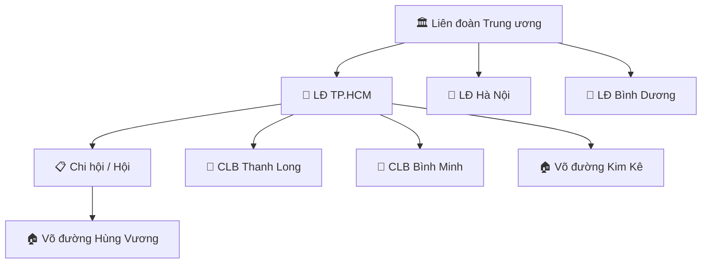
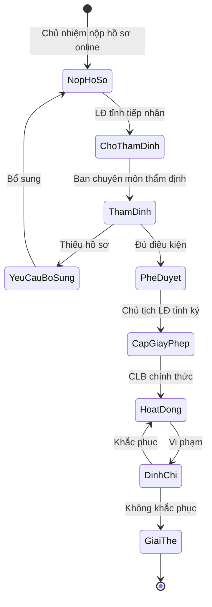
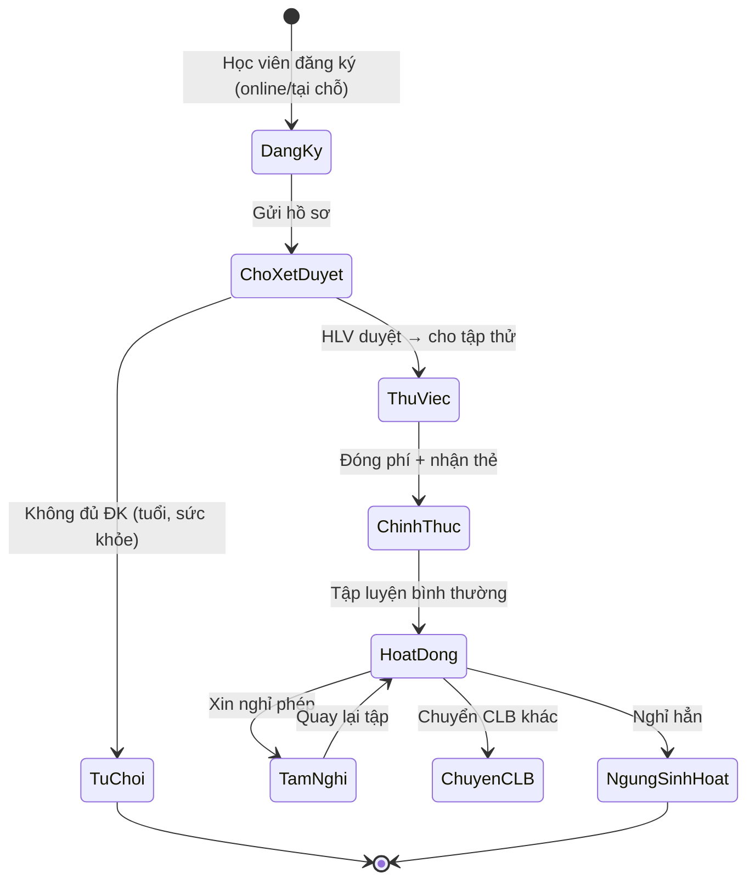
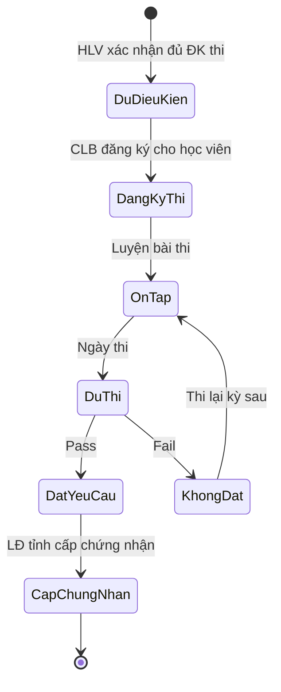

# Phân Tích Nghiệp Vụ — Câu Lạc Bộ & Võ Đường

## 1. Tổng Quan

Câu lạc bộ (CLB) và Võ đường là **đơn vị cơ sở** trong hệ thống tổ chức Liên đoàn Võ cổ truyền Việt Nam. Đây là nơi trực tiếp hoạt động huấn luyện, đào tạo và phát triển phong trào võ thuật.

### 1.1 Vị Trí Trong Tổ Chức



### 1.2 Phân Biệt CLB vs Võ Đường

| Đặc điểm | Câu Lạc Bộ (CLB) | Võ Đường |
|-----------|-------------------|----------|
| **Bản chất** | Tổ chức thể thao, sinh hoạt tập thể | Cơ sở đào tạo võ thuật chuyên sâu |
| **Người đứng đầu** | Chủ nhiệm CLB | Chưởng môn / Võ sư trưởng |
| **Quy mô** | 20–200+ thành viên, nhiều HLV | 10–100 học viên, 1–3 võ sư |
| **Mô hình** | Phi lợi nhuận, hội phí | Có thể thu phí đào tạo |
| **Tính chất** | Đa môn phái, phong trào | Đơn môn phái, truyền thống |
| **Trực thuộc** | LĐ tỉnh hoặc Chi hội | LĐ tỉnh hoặc Chi hội |
| **Pháp lý** | Cần giấy phép hoạt động CLB | Cần giấy phép mở lớp dạy võ |
| **Đặc trưng** | Thi đấu, giao lưu, phong trào | Truyền dạy bài quyền, bí truyền |

> [!IMPORTANT]
> Trong hệ thống VCT Platform, CLB và Võ đường **dùng chung model** với trường `type` để phân biệt (`club` vs `vo_duong`). Lý do: cả hai đều có chung các nhu cầu quản lý thành viên, tài chính, giải đấu.

---

## 2. Các Vai Trò (Roles) Tại CLB / Võ Đường

| # | Vai Trò | Code | Mô Tả | Scope |
|---|---------|------|--------|-------|
| 1 | **Chủ nhiệm CLB / Chưởng môn** | `club_leader` | Người đứng đầu, đại diện pháp lý, quản trị toàn bộ | `club` |
| 2 | **Phó chủ nhiệm / Phó chưởng môn** | `club_vice_leader` | Hỗ trợ chủ nhiệm, thay mặt khi vắng | `club` |
| 3 | **Huấn luyện viên (HLV)** | `coach` | Trực tiếp dạy luyện, quản lý lớp, điểm danh | `club` |
| 4 | **Trợ lý HLV** | `assistant_coach` | Hỗ trợ HLV, dẫn khởi động, dạy cơ bản | `club` |
| 5 | **Thư ký / Hành chính CLB** | `club_secretary` | Quản lý hồ sơ, văn bản, liên lạc | `club` |
| 6 | **Thủ quỹ CLB** | `club_accountant` | Quản lý tài chính, thu-chi, hội phí | `club` |
| 7 | **Học viên / VĐV** | `member` | Tập luyện, tham gia giải, thi đẳng | `self` |
| 8 | **Phụ huynh** | `guardian` | Theo dõi con em, đóng phí, xem lịch | `self` |

---

## 3. Phân Tích Nghiệp Vụ Chi Tiết

### 3.1 🏠 Quản Lý Thông Tin CLB / Võ Đường

| Tính năng | Mô tả | Vai trò |
|-----------|-------|---------|
| Hồ sơ CLB | Tên, logo, địa chỉ, SĐT, email, website, mạng XH | `club_leader` |
| Loại hình | CLB thể thao / Võ đường / Trung tâm đào tạo | `club_leader` |
| Giấy phép | Giấy phép hoạt động, giấy phép dạy võ (số, ngày cấp, hạn) | `club_leader` |
| Cơ sở vật chất | Phòng tập, sàn đấu, thiết bị (diện tích, sức chứa) | `club_leader`, `club_secretary` |
| Lịch sử CLB | Năm thành lập, các mốc phát triển, thành tích nổi bật | `club_leader` |
| Chi nhánh | Quản lý nhiều điểm tập (nếu CLB có nhiều cơ sở) | `club_leader` |

### 3.2 👥 Quản Lý Thành Viên

| Tính năng | Mô tả | Vai trò |
|-----------|-------|---------|
| Đăng ký thành viên | Form đăng ký online, QR code đăng ký tại chỗ | `member`, `club_secretary` |
| Duyệt hồ sơ | Workflow chủ nhiệm xét duyệt thành viên mới | `club_leader` |
| Danh sách thành viên | Lọc theo: lớp, đẳng cấp, giới, độ tuổi, trạng thái | `club_leader`, `coach` |
| Hồ sơ thành viên | Ảnh, CCCD, SĐT, địa chỉ, người liên hệ khẩn cấp | `club_secretary`, `member` (xem riêng) |
| Đẳng cấp & Đai | Theo dõi cấp đai hiện tại, lịch sử thăng đẳng | `coach`, `member` |
| Thẻ thành viên | Cấp thẻ thành viên số (QR), gia hạn hàng năm | `club_secretary` |
| Nghỉ phép / Tạm ngưng | Quản lý thành viên xin nghỉ, tạm dừng tập | `club_secretary` |
| Chuyển CLB | Chuyển thành viên sang CLB khác (cần LĐ tỉnh duyệt) | `club_leader` → LĐ tỉnh |

### 3.3 📅 Quản Lý Lớp Học & Lịch Tập

| Tính năng | Mô tả | Vai trò |
|-----------|-------|---------|
| Tạo lớp học | Lớp cơ bản, nâng cao, thi đấu, thiếu nhi, VIP | `club_leader`, `coach` |
| Lịch tập tuần | Thứ, giờ, phòng/sàn, HLV phụ trách | `coach` |
| Đăng ký lớp | Thành viên đăng ký vào lớp phù hợp | `member` |
| Điểm danh | Check-in/out bằng QR, NFC hoặc thủ công | `coach`, `assistant_coach` |
| Báo cáo chuyên cần | Tỷ lệ tham gia, thống kê theo tháng/quý | `club_leader`, `coach` |
| Thay thế HLV | Sắp xếp HLV thay thế khi HLV chính vắng | `club_leader` |
| Buổi tập đặc biệt | Tập bổ sung, giao lưu, tập trung chuẩn bị giải | `coach` |

### 3.4 🥋 Chương Trình Huấn Luyện

| Tính năng | Mô tả | Vai trò |
|-----------|-------|---------|
| Giáo trình | Xây dựng giáo trình theo cấp đai (giáo trình mẫu LĐ) | `coach` |
| Kế hoạch tập | Lập kế hoạch tập luyện theo tuần/tháng/kỳ thi | `coach` |
| Bài quyền & Kỹ thuật | Thư viện bài quyền, video hướng dẫn, mô tả kỹ thuật | `coach`, `member` (xem) |
| Đánh giá học viên | Đánh giá định kỳ theo tiêu chí (kỹ thuật, thể lực, lý thuyết) | `coach` |
| Chuẩn bị thi đai | Danh sách học viên đủ điều kiện thi, lịch ôn tập | `coach` |

### 3.5 🏆 Tham Gia Giải Đấu

| Tính năng | Mô tả | Vai trò |
|-----------|-------|---------|
| Xem giải đấu | Duyệt giải đấu cấp tỉnh/toàn quốc đang mở đăng ký | Tất cả |
| Đăng ký thi đấu | Lập đoàn, chọn VĐV, đăng ký nội dung | `club_leader`, `coach` |
| Quản lý đoàn | Danh sách VĐV, HLV đi cùng, logistic | `club_leader` |
| Theo dõi kết quả | Xem kết quả real-time, huy chương, xếp hạng | Tất cả |
| Thành tích CLB | Bảng vàng thành tích qua các giải đấu | Tất cả |

### 3.6 📜 Thi Thăng Đẳng (Thi Đai)

| Tính năng | Mô tả | Vai trò |
|-----------|-------|---------|
| Đệ trình danh sách | CLB gửi danh sách thí sinh đủ điều kiện | `coach`, `club_leader` |
| Xem kỳ thi | Lịch thi, địa điểm, yêu cầu | `member` |
| Kết quả thi | Xem kết quả, chứng nhận đẳng cấp | `member`, `club_leader` |
| Lịch sử đẳng cấp | Quá trình thăng đẳng của từng thành viên | `coach`, `member` |

### 3.7 💰 Tài Chính CLB

| Tính năng | Mô tả | Vai trò |
|-----------|-------|---------|
| Cấu hình hội phí | Thiết lập mức phí: tháng, quý, năm; phí đăng ký | `club_leader` |
| Thu phí | Ghi nhận và theo dõi đóng phí thành viên | `club_accountant` |
| Nhắc phí | Tự động nhắc thành viên nợ phí (push, SMS) | Hệ thống |
| Chi tiêu | Ghi nhận chi phí: thuê sàn, thiết bị, di chuyển giải | `club_accountant` |
| Báo cáo thu-chi | Tổng kết theo tháng/quý/năm | `club_leader`, `club_accountant` |
| Nộp hội phí LĐ tỉnh | Quản lý khoản hội phí nộp lên LĐ tỉnh | `club_accountant` |
| Hóa đơn điện tử | Xuất biên lai, hóa đơn cho thành viên | `club_accountant` |

### 3.8 📊 Dashboard & Báo Cáo

| Tính năng | Mô tả | Vai trò |
|-----------|-------|---------|
| Dashboard CLB | Tổng thành viên, chuyên cần, tài chính, sự kiện sắp tới | `club_leader` |
| Thống kê thành viên | Biểu đồ tăng trưởng, phân bổ đẳng cấp, giới, tuổi | `club_leader` |
| Báo cáo định kỳ | Báo cáo hoạt động gửi LĐ tỉnh (bắt buộc hàng quý) | `club_leader` |
| Xuất dữ liệu | Export PDF / Excel cho báo cáo, danh sách | `club_leader` |

### 3.9 📢 Truyền Thông & Thông Báo

| Tính năng | Mô tả | Vai trò |
|-----------|-------|---------|
| Thông báo CLB | Gửi thông báo cho toàn bộ hoặc theo lớp | `club_leader`, `coach` |
| Lịch CLB | Calendar tổng hợp (lịch tập, thi, sự kiện) | Tất cả |
| Tin tức | Đăng tin hoạt động CLB (nội bộ/public) | `club_leader` |
| Liên lạc phụ huynh | Gửi thông báo cho PH thiếu nhi (kết quả, nhắc phí) | `coach`, `club_secretary` |

### 3.10 🔑 Đặc Thù Riêng Cho Võ Đường

| Tính năng | Mô tả | Vai trò |
|-----------|-------|---------|
| Huyết thống môn phái | Sơ đồ truyền thừa (sư tổ → chưởng môn → trưởng tràng) | `club_leader` |
| Bài quyền bí truyền | Quản lý bài quyền riêng của môn phái (truy cập giới hạn) | `club_leader` |
| Nghi lễ & Truyền thống | Lịch lễ tổ, lễ xuất sư, lễ nhập môn | `club_leader` |
| Quy tắc võ đường | Nội quy riêng, triết lý võ đạo | `club_leader` |
| Chứng nhận môn phái | Cấp chứng nhận nội bộ (ngoài chứng nhận LĐ) | `club_leader` |

---

## 4. Workflow Nghiệp Vụ Chính

### 4.1 Đăng Ký Thành Lập CLB / Võ Đường



### 4.2 Đăng Ký Thành Viên Mới



### 4.3 Quy Trình Thi Thăng Đẳng



---

## 5. Hiện Trạng Code & Gap Analysis

### Đã Có (Existing)

| Thành phần | File | Mô tả |
|-----------|------|-------|
| `ProvincialClub` model | [service.go](file:///D:/VCT%20PLATFORM/vct-platform/backend/internal/domain/provincial/service.go#L58-L78) | Model cơ bản: name, address, leader, status |
| Club CRUD + Approve/Suspend | [service.go](file:///D:/VCT%20PLATFORM/vct-platform/backend/internal/domain/provincial/service.go#L322-L356) | Tạo, xem, duyệt, đình chỉ CLB |
| `ProvincialAthlete` model | [service.go](file:///D:/VCT%20PLATFORM/vct-platform/backend/internal/domain/provincial/service.go#L81-L100) | VĐV thuộc CLB |
| `ClubTransfer` model | [service.go](file:///D:/VCT%20PLATFORM/vct-platform/backend/internal/domain/provincial/service.go#L157-L172) | Chuyển VĐV giữa CLB |
| `TrainingPlan` domain | [training/service.go](file:///D:/VCT%20PLATFORM/vct-platform/backend/internal/domain/training/service.go) | Kế hoạch tập, điểm danh, thi đai |
| HTTP API endpoints | [provincial_handler.go](file:///D:/VCT%20PLATFORM/vct-platform/backend/internal/httpapi/provincial_handler.go) | REST API clubs, athletes, coaches, referees |

### Còn Thiếu (Gaps)

| # | Tính năng | Mức ưu tiên | Ghi chú |
|---|-----------|-------------|---------|
| 1 | **Phân loại CLB vs Võ đường** (`type` field) | 🔴 Cao | Model hiện tại không có `type` |
| 2 | **Quản lý lớp học** (Class/Group) | 🔴 Cao | Chưa có model Class, chỉ có TrainingPlan |
| 3 | **Điểm danh liên kết lớp** | 🔴 Cao | AttendanceRecord tồn tại nhưng chưa gắn lớp |
| 4 | **Tài chính CLB** (thu phí, chi tiêu) | 🟠 TB | Chưa có finance scope cho CLB |
| 5 | **Dashboard riêng cho CLB** | 🟠 TB | Hiện dashboard ở scope tỉnh |
| 6 | **Cơ sở vật chất** (Facility) | 🟡 Thấp | Phòng tập, sàn đấu CLB |
| 7 | **Chi nhánh/Điểm tập** | 🟡 Thấp | CLB có nhiều cơ sở |
| 8 | **Quản lý phụ huynh** | 🟡 Thấp | Liên kết PH với học viên thiếu nhi |
| 9 | **Bài quyền môn phái** (Võ đường) | 🟡 Thấp | Di sản riêng từng võ đường |
| 10 | **Sơ đồ truyền thừa** (Lineage chart) | 🟡 Thấp | Đặc thù võ đường truyền thống |

---

## 6. Đề Xuất Model Mở Rộng

> [!NOTE]
> Các model dưới đây **mở rộng** trên `ProvincialClub` hiện tại, không breaking change.

### Trường bổ sung cho `ProvincialClub`

```diff
 type ProvincialClub struct {
     ...existing fields...
+    Type          string   `json:"type"`            // "club" | "vo_duong" | "center"
+    Lineage       string   `json:"lineage,omitempty"` // Dòng phái (cho võ đường)
+    Motto         string   `json:"motto,omitempty"`   // Phương châm/triết lý
+    LogoURL       string   `json:"logo_url,omitempty"`
+    Website       string   `json:"website,omitempty"`
+    SocialLinks   map[string]string `json:"social_links,omitempty"`
+    FacilitySize  string   `json:"facility_size,omitempty"` // Diện tích phòng tập
+    MaxCapacity   int      `json:"max_capacity,omitempty"`
+    BranchCount   int      `json:"branch_count"`
 }
```

### Model mới: `ClubClass` (Lớp học)

```go
type ClubClass struct {
    ID           string   `json:"id"`
    ClubID       string   `json:"club_id"`
    Name         string   `json:"name"`        // VD: "Lớp thiếu nhi", "Lớp nâng cao"
    Level        string   `json:"level"`       // beginner, intermediate, advanced, competition
    CoachID      string   `json:"coach_id"`
    CoachName    string   `json:"coach_name"`
    Schedule     []ScheduleSlot `json:"schedule"` // Thứ, giờ tập
    MaxStudents  int      `json:"max_students"`
    CurrentCount int      `json:"current_count"`
    MonthlyFee   float64  `json:"monthly_fee"`
    Status       string   `json:"status"`      // active, paused, closed
}
```

### Model mới: `ClubFinance` (Tài chính CLB)

```go
type ClubFinanceEntry struct {
    ID          string    `json:"id"`
    ClubID      string    `json:"club_id"`
    Type        string    `json:"type"`     // "income" | "expense"
    Category    string    `json:"category"` // "hoi_phi", "thue_san", "giai_dau", "thiet_bi"
    Amount      float64   `json:"amount"`
    Description string    `json:"description"`
    MemberID    string    `json:"member_id,omitempty"` // Ai đóng (nếu income)
    ReceiptNo   string    `json:"receipt_no,omitempty"`
    Date        string    `json:"date"`
    RecordedBy  string    `json:"recorded_by"`
    CreatedAt   time.Time `json:"created_at"`
}
```

---

## 7. Tóm Tắt

CLB và Võ đường là **xương sống** của hệ thống Võ cổ truyền. Module này cần phục vụ **3 nhóm người dùng chính**:

1. **Chủ nhiệm / Chưởng môn** → Quản trị tổng thể, đại diện CLB với LĐ tỉnh
2. **HLV / Võ sư** → Quản lý lớp, giáo trình, điểm danh, đánh giá học viên
3. **Học viên / VĐV** → Xem lịch tập, đóng phí, theo dõi đẳng cấp, đăng ký giải

Hệ thống hiện tại đã có nền tảng tốt (`ProvincialClub`, `TrainingPlan`, `AttendanceRecord`). Cần **mở rộng** để hỗ trợ quản lý nội bộ CLB đầy đủ, đặc biệt: phân loại CLB/Võ đường, quản lý lớp học, tài chính CLB, và các tính năng đặc thù võ đường.
