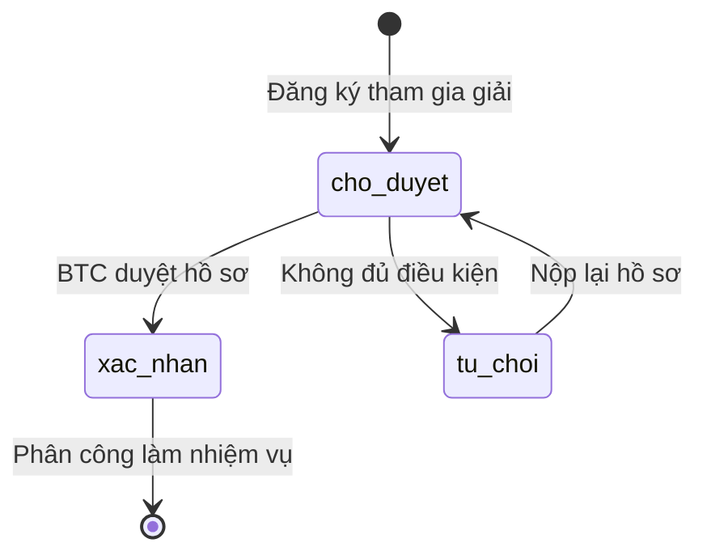
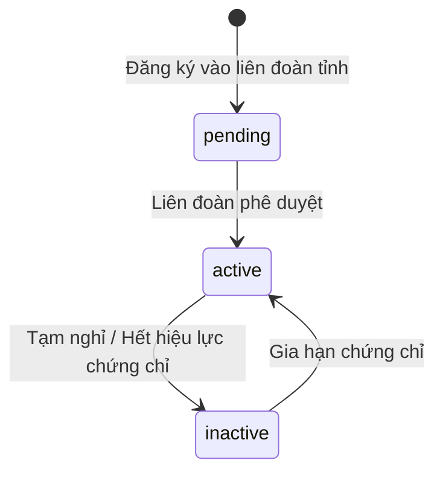
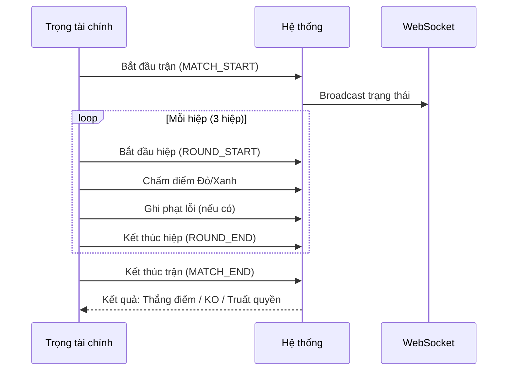
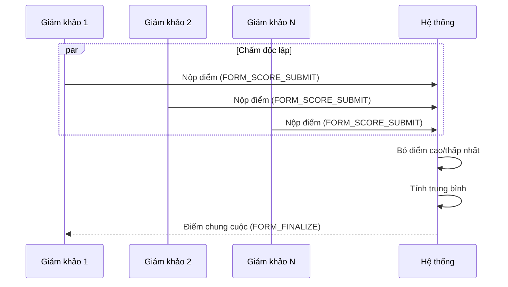
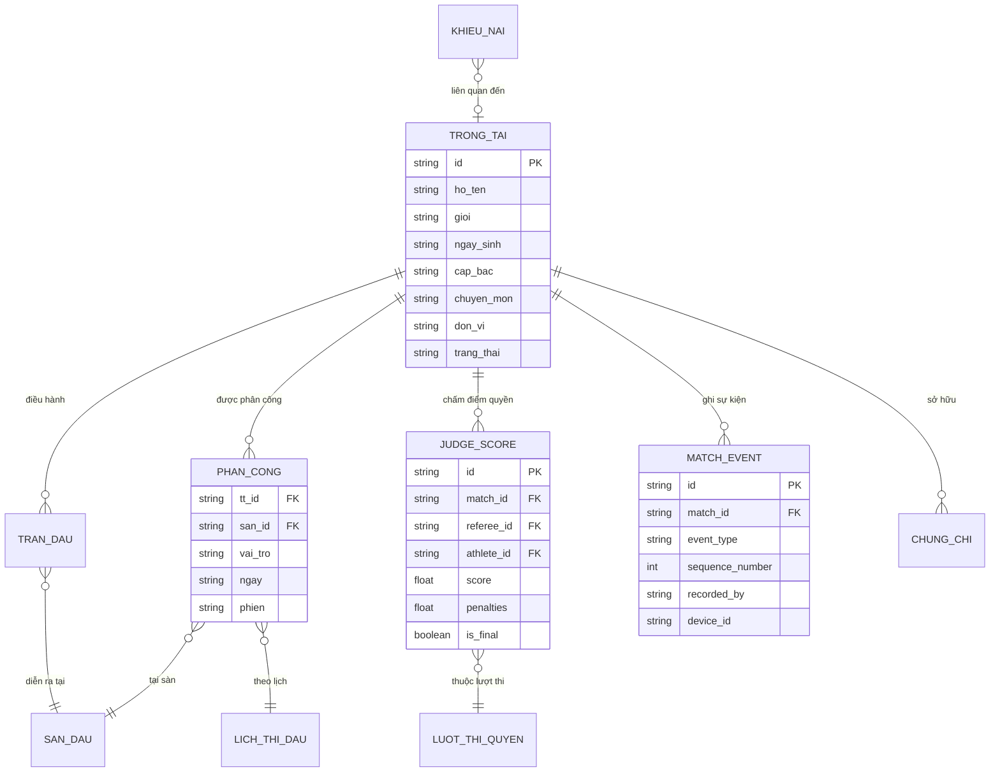

# Phân Tích Nghiệp Vụ: Trọng Tài (Referee)

## 1. Tổng Quan

**Trọng tài (TT)** là thực thể quan trọng trong nền tảng VCT Platform, chịu trách nhiệm **điều hành, chấm điểm và giám sát** các trận đấu. Trọng tài hoạt động ở **hai cấp quản lý**: cấp quốc gia (phục vụ giải đấu) và cấp tỉnh (thuộc liên đoàn địa phương). TT liên kết chặt chẽ với các domain: **Giải đấu**, **Sàn đấu**, **Trận đấu đối kháng**, **Lượt thi quyền**, **Chấm điểm (Scoring)**, **Phân công**, **Chứng nhận**, và **Khiếu nại**.

---

## 2. Mô Hình Dữ Liệu Hiện Tại

### 2.1 Backend — Domain Model (`domain.Referee`)

| Trường | Kiểu | Mô tả |
|--------|------|-------|
| `id` | string | Mã định danh duy nhất (VD: `TT01`) |
| `ho_ten` | string | Họ và tên đầy đủ |
| `gioi` | GioiTinh (`nam` / `nu`) | Giới tính |
| `ngay_sinh` | string | Ngày sinh |
| `cap_bac` | string | Cấp bậc trọng tài |
| `chuyen_mon` | string | Chuyên môn (đối kháng / quyền / cả hai) |
| `don_vi` | string | Đơn vị trực thuộc |
| `sdt` | string | Số điện thoại |
| `email` | string | Email |
| `trang_thai` | string | Trạng thái duyệt |
| `created_at` | time | Thời gian tạo |
| `updated_at` | time | Thời gian cập nhật |

### 2.2 Backend — Provincial Domain (`ProvincialReferee`)

| Trường | Kiểu | Mô tả |
|--------|------|-------|
| `id` | string | Mã định danh (VD: `TT-HCM-001`) |
| `province_id` | string | Tỉnh/thành quản lý |
| `full_name` | string | Họ tên |
| `gender` | string | Giới tính |
| `date_of_birth` | string | Ngày sinh |
| `referee_rank` | string | Cấp bậc (VD: "Trọng tài cấp II") |
| `cert_number` | string | Số chứng chỉ |
| `expertise` | string | Chuyên môn |
| `phone` | string | SĐT |
| `email` | string | Email |
| `status` | MemberStatus | Trạng thái: `active` / `pending` / `inactive` |
| `created_at` / `updated_at` | time | Thời gian |

### 2.3 Frontend — Type `TrongTai`

| Trường | Mô tả |
|--------|-------|
| `id` | Mã TT |
| `ho_ten` | Họ tên |
| `gioi` | Giới tính |
| `ngay_sinh` | Ngày sinh |
| `cap_bac` | Cấp bậc (`quoc_gia`, `cap_1`, `cap_2`, `cap_3`) |
| `chuyen_mon` | `doi_khang`, `quyen`, `ca_hai` |
| `don_vi` | Đơn vị |
| `sdt` / `email` | Liên hệ |
| `trang_thai` | `xac_nhan`, `cho_duyet`, `tu_choi` |
| `kinh_nghiem` | Mô tả kinh nghiệm (text tự do) |
| `ghi_chu` | Ghi chú |

### 2.4 Hệ Thống Cấp Bậc Trọng Tài

```
┌─────────────┐
│  Quốc tế    │ ← Chứng nhận WVTF / liên đoàn quốc tế
├─────────────┤
│  Quốc gia   │ ← Chứng chỉ từ Liên đoàn VCT Việt Nam
├─────────────┤
│  Cấp I      │ ← Kinh nghiệm 10+ giải
├─────────────┤
│  Cấp II     │ ← Kinh nghiệm 5-10 giải
├─────────────┤
│  Cấp III    │ ← Mới được cấp chứng chỉ
└─────────────┘
```

---

## 3. Vòng Đời Trạng Thái (State Machine)

### 3.1 Cấp Quốc Gia (Giải đấu)



### 3.2 Cấp Tỉnh (Quản lý nhân sự)



---

## 4. Vai Trò Trọng Tài Tại Giải Đấu

Hệ thống hiện hỗ trợ **4 vai trò** khi phân công vào sàn đấu:

| Vai trò | Mô tả |
|---------|-------|
| **Trọng tài chính** (`chinh`) | Điều hành trận đấu, quyết định final |
| **Trọng tài phụ** (`phu`) | Hỗ trợ TT chính, giám sát góc đài |
| **Giám định viên** (`giam_dinh`) | Chấm điểm quyền thuật, xác nhận kỹ thuật |
| **Thống kê viên** (`thong_ke`) | Ghi chép điểm, thời gian, sự kiện trận đấu |

---

## 5. Các Nghiệp Vụ Chính

### 5.1 Quản Lý Hồ Sơ Trọng Tài (CRUD)

| Thao tác | API | Phân quyền | Mô tả |
|----------|-----|-----------|-------|
| **Tạo TT** | `POST /api/v1/referees` | `referees:create` | Yêu cầu `ho_ten`, mặc định `trang_thai = cho_duyet` |
| **Xem danh sách** | `GET /api/v1/referees` | `referees:view` | Hỗ trợ filter theo tournament |
| **Xem chi tiết** | `GET /api/v1/referees/:id` | `referees:view` | Thông tin đầy đủ 1 TT |
| **Cập nhật** | `PATCH /api/v1/referees/:id` | `referees:update` | Patch từng field |
| **Xoá** | `DELETE /api/v1/referees/:id` | `referees:delete` | Xoá TT khỏi giải |

**Cấp tỉnh:**

| Thao tác | API |
|----------|-----|
| **Xem DS** | `GET /api/v1/provincial/referees?province_id=X` |
| **Tạo TT tỉnh** | `POST /api/v1/provincial/referees` |
| **Xem chi tiết** | `GET /api/v1/provincial/referees/:id` |

### 5.2 Duyệt Trọng Tài

Quy trình duyệt trọng tài tham gia giải đấu:

1. **Nộp hồ sơ** → trạng thái `cho_duyet`
2. **BTC kiểm tra**: Cấp bậc, chứng chỉ, kinh nghiệm
3. **Duyệt / Từ chối** → `xac_nhan` hoặc `tu_choi`
4. **Bulk approve**: Chọn nhiều TT → Duyệt hàng loạt
5. **Broadcast WebSocket**: Thông báo realtime khi có thay đổi

### 5.3 Phân Công Trọng Tài Vào Sàn

Trang phân công (`Page_referee_assignments`) cung cấp:

| Tính năng | Mô tả |
|-----------|-------|
| **Phân công thủ công** | Chọn TT → chọn Sàn → chọn Vai trò → chọn Ngày/Phiên |
| **Auto-assign (Round-robin)** | Thuật toán tự động phân bổ đều TT vào các sàn theo phiên (sáng/chiều/tối) |
| **Ma trận phân công** | View dạng matrix: TT (hàng) x Phiên (cột) |
| **Phiên thi đấu** | 3 phiên: 🌅 Sáng, ☀️ Chiều, 🌙 Tối |

**Thuật toán Auto-assign (Round-robin):**
```
Input: Danh sách TT đã duyệt, Danh sách sàn, Ngày thi đấu
Output: Mảng Assignment (TT → Sàn → Vai trò → Phiên)
Logic: Duyệt từng sàn × từng phiên, luân phiên gán TT vào vai trò "chinh"
```

### 5.4 Chấm Điểm Trận Đấu (Scoring Portal)

**Cổng chấm điểm mobile-first** cho TT điều hành trận đấu:

| Loại | Chức năng |
|------|-----------|
| **Đối kháng (Combat)** | Chấm điểm theo hiệp (round), ghi nhận điểm Đỏ/Xanh, phạt lỗi, timeout, KO, medical stop |
| **Quyền thuật (Forms)** | Mỗi giám khảo chấm độc lập, điểm trung bình, thuật toán bỏ cao/thấp (drop high/low) |

**Event Sourcing Architecture:**

Hệ thống chấm điểm sử dụng mô hình **Event Sourcing** - mọi hành động đều là sự kiện bất biến:

| Event | Mô tả |
|-------|-------|
| `MATCH_START` / `MATCH_END` | Bắt đầu / Kết thúc trận |
| `ROUND_START` / `ROUND_END` | Bắt đầu / Kết thúc hiệp |
| `SCORE_RED` / `SCORE_BLUE` | Ghi điểm cho Đỏ / Xanh |
| `PENALTY_RED` / `PENALTY_BLUE` | Phạt lỗi |
| `TIMEOUT` / `TIMEOUT_END` | Timeout |
| `MEDICAL_STOP` | Dừng trận vì lý do y tế |
| `DISQUALIFY` | Truất quyền |
| `FORM_SCORE_SUBMIT` | Nộp điểm quyền |
| `FORM_FINALIZE` | Finalize điểm quyền |

**Scoring Config** (tuỳ chỉnh theo giải):

| Tham số | Mặc định | Mô tả |
|---------|----------|-------|
| `combat_rounds` | 3 | Số hiệp đối kháng |
| `round_duration_sec` | 120 | Thời gian hiệp (giây) |
| `break_duration_sec` | 60 | Nghỉ giữa hiệp (giây) |
| `combat_judge_count` | 3 | Số TT đối kháng |
| `ko_wins_match` | true | KO thắng tuyệt đối |
| `forms_judge_count` | 5 | Số giám khảo quyền |
| `forms_drop_high_low` | true | Bỏ điểm cao/thấp nhất |
| `forms_max_score` | 10.0 | Điểm tối đa quyền |

### 5.5 Hồ Sơ Trọng Tài (Profile)

Trang hồ sơ (`Page_referee_profile`) hiển thị:

| Tab | Nội dung |
|-----|----------|
| **Tổng quan** | Thông tin cá nhân, thống kê (năm kinh nghiệm, số giải, rating) |
| **Chứng chỉ** | Danh sách chứng nhận (Quốc tế, Quốc gia A/B, Cấp tỉnh) với trạng thái: Còn hạn / Sắp hết / Hết hạn |
| **Lịch sử phân công** | Danh sách giải đã điều hành, vai trò, địa điểm, trạng thái |
| **Thống kê theo năm** | Số giải, số trận, độ chính xác (%) |

---

## 6. Hệ Thống Chấm Điểm Chi Tiết

### 6.1 Đối Kháng (Combat Scoring)



### 6.2 Quyền Thuật (Forms Scoring)



---

## 7. Quan Hệ Với Các Domain Khác

### 7.1 Sàn Đấu (Arena)

Mỗi sàn đấu có danh sách TT được phân công (`trong_tai: string[]`). Sàn đấu hiển thị TT đang điều hành và trạng thái trận hiện tại.

### 7.2 Trận Đấu Đối Kháng

Mỗi trận đấu có mảng `trong_tai: string[]` chứa ID các TT được phân công. Kết quả trận đấu được TT quyết định qua scoring portal.

### 7.3 Khiếu Nại

Khiếu nại liên quan đến TT bao gồm:
- Bỏ qua cú đấm/đá hợp lệ
- Chấm điểm chênh lệch bất thường
- Thiên vị trong chấm điểm

### 7.4 An Toàn Thi Đấu

TT có quyền kích hoạt `MEDICAL_STOP` khi VĐV gặp chấn thương, đảm bảo an toàn thi đấu.

---

## 8. Frontend Pages

| Trang | File | Chức năng |
|-------|------|-----------|
| Quản lý TT (giải đấu) | [Page_referees.tsx](file:///d:/VCT%20PLATFORM/vct-platform/packages/app/features/tournament/Page_referees.tsx) | CRUD, duyệt hồ sơ, bulk approve, filter theo pipeline |
| Phân công TT | [Page_referee_assignments.tsx](file:///d:/VCT%20PLATFORM/vct-platform/packages/app/features/tournament/Page_referee_assignments.tsx) | Phân công vào sàn, auto-assign round-robin, ma trận phân công |
| Chấm điểm (Portal) | [Page_referee_scoring.tsx](file:///d:/VCT%20PLATFORM/vct-platform/packages/app/features/portals/Page_referee_scoring.tsx) | Scoring mobile-first, timer, haptic feedback, real-time WebSocket |
| Hồ sơ TT | [Page_referee_profile.tsx](file:///d:/VCT%20PLATFORM/vct-platform/packages/app/features/people/Page_referee_profile.tsx) | Thông tin cá nhân, chứng chỉ, lịch sử, thống kê |
| DS TT (nhân sự) | [Page_referees.tsx](file:///d:/VCT%20PLATFORM/vct-platform/packages/app/features/people/Page_referees.tsx) | Danh sách TT toàn liên đoàn, filter theo cấp bậc/chuyên môn |
| TT cấp tỉnh | [Page_provincial_referees.tsx](file:///d:/VCT%20PLATFORM/vct-platform/packages/app/features/provincial/Page_provincial_referees.tsx) | CRUD TT thuộc liên đoàn tỉnh |

---

## 9. Các Vai Trò Tương Tác Với Trọng Tài

| Vai trò | Quyền hạn |
|---------|-----------|
| **Admin liên đoàn** | Quản lý toàn bộ TT, cấp chứng chỉ, phê duyệt cấp bậc |
| **BTC giải** | Duyệt hồ sơ TT, phân công vào sàn, giám sát chấm điểm |
| **Tổng trọng tài** | Xem tổng quan chấm điểm, giải quyết khiếu nại liên quan TT |
| **Trọng tài (tự quản)** | Xem hồ sơ cá nhân, chấm điểm qua portal, xem lịch phân công |
| **Trưởng đoàn** | Nộp khiếu nại liên quan đến quyết định TT |
| **Liên đoàn tỉnh** | Quản lý TT thuộc tỉnh, đề xuất cử TT đi giải |

---

## 10. Sơ Đồ Quan Hệ Thực Thể



---

## 11. Gaps & Đề Xuất Mở Rộng

### 🔴 Thiếu Sót Hiện Tại

| # | Vấn đề | Mô tả |
|---|--------|-------|
| 1 | **Thiếu liên kết TT ↔ User Account** | TT chưa có tài khoản đăng nhập riêng, không thể truy cập portal tự quản |
| 2 | **Thiếu module quản lý chứng chỉ TT** | Profile hiển thị mock data, chưa có API backend cho chứng chỉ TT |
| 3 | **Thiếu lịch sử chấm điểm cá nhân** | Không có API truy vấn lịch sử chấm điểm theo referee_id |
| 4 | **Model bất đồng bộ Backend ↔ Frontend** | Backend `Referee` thiếu `kinh_nghiem`, `ghi_chu` so với frontend `TrongTai` |
| 5 | **Thiếu cơ chế đánh giá TT** | Không có hệ thống rating/đánh giá chất lượng trọng tài |
| 6 | **Auto-assign chưa xét chuyên môn** | Round-robin chưa phân TT theo chuyên môn (đối kháng vs quyền) phù hợp với loại sàn |
| 7 | **Thiếu kiểm soát xung đột lịch** | Chưa có logic kiểm tra TT bị phân công trùng phiên/sàn |
| 8 | **Thiếu cổng TT (Referee Portal)** | Chưa có portal riêng cho TT xem lịch phân công, nhận thông báo |

### 🟡 Đề Xuất Phát Triển

| # | Đề xuất | Ưu tiên |
|---|---------|---------| 
| 1 | Đồng bộ model Backend ↔ Frontend | **Cao** |
| 2 | Xây dựng Referee Portal (cổng TT tự quản) | **Cao** |
| 3 | Module quản lý chứng chỉ TT (CRUD + gia hạn) | **Cao** |
| 4 | Liên kết TT ↔ User Account + phân quyền | **Cao** |
| 5 | Smart-assign: phân công theo chuyên môn + kinh nghiệm | Trung bình |
| 6 | Hệ thống đánh giá/rating TT sau giải | Trung bình |
| 7 | Lịch sử & thống kê chấm điểm cá nhân | Trung bình |
| 8 | Kiểm soát xung đột lịch phân công | Trung bình |
| 9 | Thông báo push cho TT (phân công, thay đổi lịch) | Thấp |
| 10 | Dashboard riêng cho Tổng trọng tài | Thấp |
