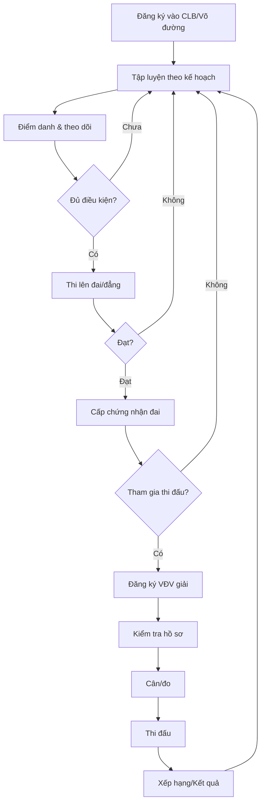
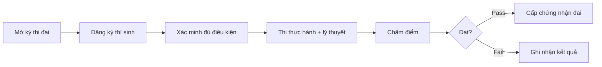

# Phân Tích Nghiệp Vụ: Võ Sinh (Martial Arts Practitioner)

## 1. Định Nghĩa & Vai Trò

**Võ sinh** là người tập luyện võ thuật cổ truyền, được đăng ký và quản lý thông qua hệ thống CLB/võ đường. Trong VCT Platform, võ sinh được quản lý dưới tên gọi kỹ thuật **"Athlete" (VĐV — Vận Động Viên)** khi tham gia thi đấu, nhưng bản chất nghiệp vụ rộng hơn.

### Phân biệt Võ sinh vs VĐV

| Khía cạnh | Võ Sinh (rộng) | VĐV (hẹp) |
|-----------|----------------|------------|
| **Phạm vi** | Tất cả người tập võ | Chỉ người đăng ký thi đấu |
| **Độ tuổi** | Mọi lứa tuổi (từ 5+) | Theo quy định giải |
| **Hoạt động chính** | Tập luyện, thi đai, biểu diễn | Thi đấu giải chính thức |
| **Bắt buộc thuộc CLB** | ✅ Có | ✅ Có (qua đoàn) |
| **Cần chứng nhận y tế** | ❌ Không bắt buộc | ✅ Bắt buộc |

---

## 2. Vòng Đời Nghiệp Vụ (Lifecycle)



---

## 3. Các Nghiệp Vụ Chi Tiết

### 3.1 Đăng Ký & Quản Lý Thành Viên

**Trạng thái hiện có trong code:**

| Trạng thái | Mô tả | File |
|-----------|-------|------|
| `pending` | Chờ duyệt bởi CLB/Liên đoàn tỉnh | [service.go](file:///D:/VCT%20PLATFORM/vct-platform/backend/internal/domain/provincial/service.go#L377) |
| `active` | Đã được duyệt, đang hoạt động | [service.go](file:///D:/VCT%20PLATFORM/vct-platform/backend/internal/domain/provincial/service.go#L384) |
| `inactive` | Ngưng hoạt động | Provincial constants |

**Thông tin võ sinh cần quản lý** (từ `ProvincialAthlete`):

- **Thông tin cá nhân**: Họ tên, giới tính, ngày sinh, CCCD/CMND, ảnh, SĐT, địa chỉ
- **Thông tin thể lực**: Cân nặng, chiều cao
- **Thông tin võ thuật**: Đẳng cấp đai (`belt_rank`), CLB trực thuộc
- **Trạng thái**: Chờ duyệt → Hoạt động → Tạm ngưng

> [!IMPORTANT]
> Hiện tại codebase chưa phân biệt rõ giữa "Võ sinh" (người tập) và "VĐV" (người thi đấu). Cả hai đều dùng chung model `ProvincialAthlete` / `Athlete`.

---

### 3.2 Tập Luyện & Điểm Danh

**Module:** `training` — [service.go](file:///D:/VCT%20PLATFORM/vct-platform/backend/internal/domain/training/service.go)

| Nghiệp vụ | Mô tả | Đã triển khai |
|-----------|-------|:-------------:|
| **Kế hoạch tập luyện** | Tạo lịch tập theo tuần, nội dung theo cấp | ✅ `TrainingPlan` |
| **Lịch tập định kỳ** | Ngày, giờ, địa điểm cố định | ✅ `ScheduleSlot` |
| **Giáo trình** | Nội dung kỹ thuật theo tuần | ✅ `CurriculumEntry` |
| **Điểm danh** | Có mặt/Vắng/Trễ/Có phép | ✅ `AttendanceRecord` |
| **Thống kê chuyên cần** | Tỉ lệ tham dự tổng hợp | ✅ `AttendanceStats` |
| **E-learning** | Khóa học trực tuyến (kỹ thuật, lý thuyết) | ✅ `ElearningCourse` |

---

### 3.3 Thi Đai / Đẳng Cấp (Belt Exam)

**Module:** `training` — [service.go](file:///D:/VCT%20PLATFORM/vct-platform/backend/internal/domain/training/service.go#L239)



| Yếu tố | Chi tiết |
|--------|---------|
| **Cấp tổ chức** | CLB / Tỉnh / Quốc gia (`organizer_type`) |
| **Hội đồng thi** | Gồm Trưởng hội đồng + Giám khảo (`PanelMember`) |
| **Chấm điểm** | Điểm thực hành + lý thuyết |
| **Kết quả** | `pass` / `fail` → Tự động cấp `certificate_id` |

---

### 3.4 Chứng Nhận & Bằng Cấp

**Module:** `certification` — [service.go](file:///D:/VCT%20PLATFORM/vct-platform/backend/internal/domain/certification/service.go)

Các loại chứng nhận liên quan đến võ sinh:

| Loại | Mã | Mô tả |
|------|-----|-------|
| Chứng nhận đẳng cấp đai | `belt_rank` | Sau khi thi đai đạt |
| Chứng nhận y tế | `medical_clearance` | Bắt buộc khi thi đấu |
| Bảo hiểm thể thao | `insurance` | Bắt buộc khi thi đấu |

**Vòng đời chứng nhận:** `pending` → `active` → `expiring` → `expired` → `renewed` / `revoked`

Mỗi chứng nhận có **mã QR xác thực** (`verify_code`) để tra cứu công khai.

---

### 3.5 Đăng Ký Thi Đấu (Giải)

**Module:** `athlete` + `registration` — [models.go](file:///D:/VCT%20PLATFORM/vct-platform/backend/internal/domain/models.go#L82)

Khi võ sinh muốn thi đấu → Trở thành **VĐV (Athlete)** với quy trình:

1. **Đăng ký vào đoàn** (Team, thuộc tỉnh/đơn vị)
2. **Khai báo thông tin**: Họ tên, giới tính, ngày sinh, cân nặng, chiều cao
3. **Nộp hồ sơ**: Chứng nhận đai, y tế, bảo hiểm
4. **Duyệt hồ sơ**: `nhap` → `cho_xac_nhan` → `du_dieu_kien` / `thieu_ho_so`
5. **Đăng ký nội dung thi**: Quyền / Đối kháng (qua `Registration`)
6. **Cân/đo** (weigh-in)
7. **Thi đấu**

---

### 3.6 Chuyển CLB

**Module:** `provincial` — [service.go](file:///D:/VCT%20PLATFORM/vct-platform/backend/internal/domain/provincial/service.go#L461)

Võ sinh có thể chuyển CLB qua quy trình:

```
Yêu cầu chuyển → Chờ duyệt (pending) → Đồng ý (approved) / Từ chối (rejected)
```

Cần ghi nhận: CLB cũ, CLB mới, lý do, người duyệt.

---

### 3.7 An Toàn & Bảo Vệ Sức Khỏe

**Module:** `v7_models` — `AthleteDailyLoad`

| Chỉ số | Mô tả |
|--------|-------|
| Tổng số trận/ngày | Giới hạn tối đa |
| Tổng hiệp đấu/ngày | Ngưỡng an toàn |
| Tổng phút thi đấu | Giám sát quá tải |
| Thời gian nghỉ giữa trận | Tối thiểu bắt buộc |
| Trạng thái tải | `NORMAL` → `HIGH` → `EXCESSIVE` → `BLOCKED` |
| Giấy chứng nhận y tế | Bắt buộc khi `medical_clearance = true` |

---

## 4. Ma Trận Quyền Hạn (RBAC)

Võ sinh tương tác với hệ thống qua các role:

| Vai trò | Hành động trên dữ liệu võ sinh |
|---------|-------------------------------|
| **Võ sinh (User)** | Xem hồ sơ cá nhân, đăng ký thi đai, xem kết quả |
| **HLV / Chủ CLB** | Thêm/sửa/duyệt võ sinh, điểm danh, đề cử thi đai |
| **Liên đoàn Tỉnh** | Duyệt đăng ký, quản lý chuyển CLB, tổ chức thi đai cấp tỉnh |
| **Liên đoàn Quốc gia** | Xem tổng hợp, duyệt VĐV cấp quốc gia, cấp chứng nhận |
| **Admin / BTC** | Toàn quyền CRUD trên `/athletes`, `/registration` |

---

## 5. Các Module Liên Quan Trong Codebase

| Module | File chính | Vai trò |
|--------|-----------|---------|
| `provincial` | [service.go](file:///D:/VCT%20PLATFORM/vct-platform/backend/internal/domain/provincial/service.go) | Quản lý võ sinh cấp tỉnh (CRUD, duyệt, chuyển CLB) |
| `athlete` | [service.go](file:///D:/VCT%20PLATFORM/vct-platform/backend/internal/domain/athlete/service.go) | Quản lý VĐV trong giải (đăng ký, trạng thái) |
| `training` | [service.go](file:///D:/VCT%20PLATFORM/vct-platform/backend/internal/domain/training/service.go) | Tập luyện, điểm danh, thi đai, e-learning |
| `certification` | [service.go](file:///D:/VCT%20PLATFORM/vct-platform/backend/internal/domain/certification/service.go) | Chứng nhận đai, y tế, bảo hiểm |
| `registration` | [models.go](file:///D:/VCT%20PLATFORM/vct-platform/backend/internal/domain/models.go#L130) | Đăng ký nội dung thi đấu |
| `ranking` | domain/ranking | Xếp hạng ELO/Glicko |
| `v7_models` | [v7_models.go](file:///D:/VCT%20PLATFORM/vct-platform/backend/internal/domain/v7_models.go) | An toàn tải lượng, GDPR, bảo mật dữ liệu |

---

## 6. Khoảng Trống Nghiệp Vụ (Gap Analysis)

> [!WARNING]
> Các tính năng sau chưa được triển khai đầy đủ hoặc chưa phân biệt rõ trong codebase:

| # | Gap | Mô tả | Ưu tiên |
|---|-----|-------|---------|
| 1 | **Chưa phân biệt Võ sinh vs VĐV** | Cùng dùng `Athlete` model, chưa có model riêng cho người chỉ tập luyện | 🔴 Cao |
| 2 | **Thiếu quản lý lứa tuổi** | Chưa có phân nhóm thiếu nhi / thiếu niên / thanh niên / trung niên | 🟡 TB |
| 3 | **Thiếu hệ thống đai chi tiết** | Chưa có lookup table cho hệ thống đai cổ truyền (đai vàng → đai đen + đẳng) | 🔴 Cao |
| 4 | **Thiếu quản lý phụ huynh** | Võ sinh dưới 18 cần liên kết với phụ huynh/giám hộ | 🟡 TB |
| 5 | **Thiếu lý lịch võ thuật** | Chưa có timeline sự nghiệp (thành tích, đai, giải) | 🟡 TB |
| 6 | **Thiếu học phí / tài chính** | Module `finance` chưa kết nối với từng võ sinh | 🟢 Thấp |
| 7 | **Thiếu role riêng cho võ sinh** | Auth system chưa có role `vo_sinh` hoặc `member` | 🔴 Cao |
