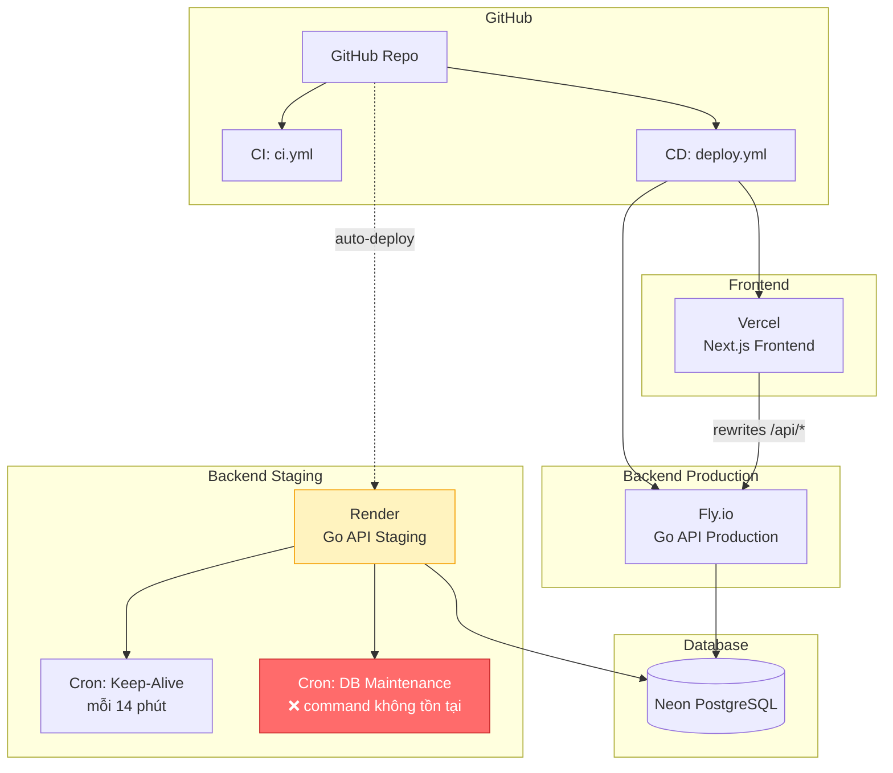

# 🚀 VCT Platform — Deployment Audit Report

## Tổng quan kiến trúc deploy

| Platform | Mục đích | Config files | Trạng thái |
|----------|---------|-------------|-----------|
| **Vercel** | Frontend (Next.js) | `vercel.json`, `next.config.js` | ⚠️ Có vấn đề |
| **Fly.io** | Backend Production (Go) | `fly.toml`, `Dockerfile` | ⚠️ Có vấn đề |
| **Render** | Backend Staging + Cron | `render.yaml`, `Dockerfile.render` | 🔴 Lỗi nghiêm trọng |
| **GitHub Actions** | CI/CD Pipeline | 5 workflow files | ⚠️ Thiếu sót |

---

## 🔴 Lỗi Nghiêm Trọng (Critical)

### 1. `Dockerfile.render` — Build sẽ fail

> [!CAUTION]
> File [Dockerfile.render](file:///D:/VCT%20PLATFORM/vct-platform/backend/Dockerfile.render) dùng base image `golang:1.26` (Debian) nhưng gọi `apk add` (Alpine package manager). Build sẽ **100% fail**.

```diff
# Fix: dùng Alpine image giống Dockerfile chính
-FROM golang:1.26 AS builder
+FROM golang:1.26-alpine AS builder
```

### 2. `render.yaml` — Maintenance command không tồn tại

> [!CAUTION]
> Line 74: `dockerCommand: "/app/vct-backend maintenance"` — Backend binary **không có** subcommand `maintenance`. Chỉ có `cmd/server` và `cmd/migrate`. Cron job `vct-db-maintenance` sẽ fail mỗi lần chạy.

**Fix:** Tạo maintenance command trong backend, hoặc đổi sang dùng `cmd/migrate`:
```diff
-    dockerCommand: "/app/vct-backend maintenance"
+    dockerCommand: "/app/vct-migrate up"
```
*(hoặc build thêm binary `vct-migrate` trong Dockerfile.render)*

### 3. Port mismatch — Fly.io vs Render

| Setting | Fly.io | Render |
|---------|--------|--------|
| `VCT_BACKEND_ADDR` | `:8080` | `:18080` |
| `internal_port` / `EXPOSE` | `8080` | `18080` |

> [!WARNING]
> Fly.io `fly.toml` set `VCT_BACKEND_ADDR=:8080` và `internal_port=8080`, nhưng `Dockerfile` (dùng cho Fly.io) lại `EXPOSE 18080`. **Mismatch!** Fly.io sẽ health check trên port 8080 nhưng container có thể đang expose 18080.

```diff
# Fix trong Dockerfile (cho Fly.io):
-EXPOSE 18080
+EXPOSE 8080
```

---

## ⚠️ Vấn đề cần Fix (Important)

### 4. Vercel — `NEXT_PUBLIC_API_BASE_URL` hardcoded rỗng

Trong [next.config.js](file:///D:/VCT%20PLATFORM/vct-platform/apps/next/next.config.js) line 83:
```js
env: {
    NEXT_PUBLIC_API_BASE_URL: '',  // ← Luôn rỗng, ignore env var từ Vercel dashboard
},
```

**Giải pháp:** Dùng env var thay vì hardcode:
```diff
  env: {
-    NEXT_PUBLIC_API_BASE_URL: '',
+    NEXT_PUBLIC_API_BASE_URL: process.env.NEXT_PUBLIC_API_BASE_URL || '',
  },
```

### 5. Vercel — `BACKEND_URL` cho rewrites chưa set

`next.config.js` line 70: `const BACKEND_URL = process.env.BACKEND_URL || 'http://localhost:18080'`

> [!IMPORTANT]
> Trên Vercel cần set env var `BACKEND_URL` = `https://vct-platform-api.fly.dev` (hoặc URL Fly.io thực tế). Nếu không, rewrites sẽ proxy về `localhost:18080` → **fail**.

### 6. Render — `VCT_CORS_ORIGINS` thiếu domain thực tế

[render.yaml](file:///D:/VCT%20PLATFORM/vct-platform/render.yaml) line 30:
```yaml
value: "https://vct-platform.vercel.app,https://*.onrender.com"
```
Nếu frontend domain thực tế khác thì cần cập nhật.

### 7. GitHub Actions — `cd-production.yml` và `cd-staging.yml` chưa hoàn thiện

Cả 2 file đều có `TODO` và chỉ `echo`:
- [cd-production.yml](file:///D:/VCT%20PLATFORM/vct-platform/.github/workflows/cd-production.yml) line 30-32: `echo "Production deploy steps to be configured"`
- [cd-staging.yml](file:///D:/VCT%20PLATFORM/vct-platform/.github/workflows/cd-staging.yml) line 30-32: `echo "Deploy steps to be configured"`

> [!NOTE]
> File `deploy.yml` đã hoạt động tốt (test → build frontend → deploy Fly.io → migrate). 2 file kia là placeholder chưa dùng.

### 8. Fly.io `fly.toml` — Thiếu secrets config

`fly.toml` không có `VCT_JWT_SECRET`, `VCT_POSTGRES_URL`, `VCT_CORS_ORIGINS` trong `[env]`. 

> [!IMPORTANT]
> Phải chắc chắn đã set qua Fly.io CLI:
> ```bash
> fly secrets set VCT_JWT_SECRET="..." VCT_POSTGRES_URL="..." VCT_CORS_ORIGINS="https://vct-platform.vercel.app"
> ```

---

## 📋 Checklist — Những gì cần làm

### Render (thiếu nhiều nhất)
- [ ] **Fix `Dockerfile.render`** — đổi `golang:1.26` → `golang:1.26-alpine`
- [ ] **Fix hoặc xóa maintenance cron** — command `maintenance` không tồn tại
- [ ] **Set secrets trên Render dashboard** — `VCT_POSTGRES_URL`, `VCT_JWT_SECRET`
- [ ] **Test deploy lần đầu** — chưa rõ đã deploy Render lần nào chưa

### Vercel
- [ ] **Fix `NEXT_PUBLIC_API_BASE_URL`** — dùng env var thay vì hardcode `''`
- [ ] **Set `BACKEND_URL` env var** — URL backend trên Fly.io
- [ ] **Verify Vercel env vars** — kiểm tra dashboard đã có đủ vars

### Fly.io
- [ ] **Fix `EXPOSE` port trong `Dockerfile`** — 18080 → 8080 (match với fly.toml)
- [ ] **Verify secrets đã set** — `VCT_JWT_SECRET`, `VCT_POSTGRES_URL`, `VCT_CORS_ORIGINS`

### GitHub Actions
- [ ] **Hoàn thiện hoặc xóa** `cd-production.yml` và `cd-staging.yml` (đang placeholder)
- [ ] **Verify GitHub Secrets** — `FLY_API_TOKEN`, `NEON_DATABASE_URL`

---

## 🏗️ Kiến trúc deploy hiện tại


