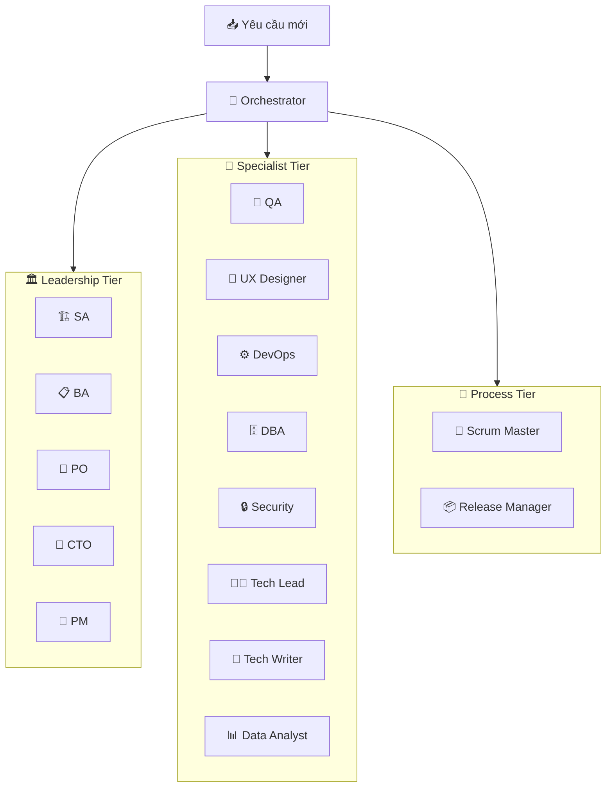

# AI Agent Skills System — Complete Walkthrough

## Summary

Built a comprehensive **16 role-based AI Agent Skills** system to orchestrate the entire VCT Platform development process, organized into 4 tiers.

## Architecture

## Skills Created

### Phase 1 — Leadership (6 skills)
| Skill | File | Role |
|---|---|---|
| [vct-sa](file:///D:/VCT%20PLATFORM/vct-platform/.agent/skills/vct-sa/SKILL.md) | SKILL.md | Solution Architect |
| [vct-ba](file:///D:/VCT%20PLATFORM/vct-platform/.agent/skills/vct-ba/SKILL.md) | SKILL.md | Business Analyst |
| [vct-po](file:///D:/VCT%20PLATFORM/vct-platform/.agent/skills/vct-po/SKILL.md) | SKILL.md | Product Owner |
| [vct-cto](file:///D:/VCT%20PLATFORM/vct-platform/.agent/skills/vct-cto/SKILL.md) | SKILL.md | CTO |
| [vct-pm](file:///D:/VCT%20PLATFORM/vct-platform/.agent/skills/vct-pm/SKILL.md) | SKILL.md | Project Manager |
| [vct-orchestrator](file:///D:/VCT%20PLATFORM/vct-platform/.agent/skills/vct-orchestrator/SKILL.md) | SKILL.md | Meta-Orchestrator |

### Phase 2 — Specialist (8 skills)
| Skill | File | Role |
|---|---|---|
| [vct-qa](file:///D:/VCT%20PLATFORM/vct-platform/.agent/skills/vct-qa/SKILL.md) | SKILL.md | QA Engineer |
| [vct-ux-designer](file:///D:/VCT%20PLATFORM/vct-platform/.agent/skills/vct-ux-designer/SKILL.md) | SKILL.md | UX Designer |
| [vct-devops](file:///D:/VCT%20PLATFORM/vct-platform/.agent/skills/vct-devops/SKILL.md) | SKILL.md | DevOps / SRE |
| [vct-dba](file:///D:/VCT%20PLATFORM/vct-platform/.agent/skills/vct-dba/SKILL.md) | SKILL.md | Database Administrator |
| [vct-security](file:///D:/VCT%20PLATFORM/vct-platform/.agent/skills/vct-security/SKILL.md) | SKILL.md | Security Engineer |
| [vct-tech-lead](file:///D:/VCT%20PLATFORM/vct-platform/.agent/skills/vct-tech-lead/SKILL.md) | SKILL.md | Tech Lead |
| [vct-tech-writer](file:///D:/VCT%20PLATFORM/vct-platform/.agent/skills/vct-tech-writer/SKILL.md) | SKILL.md | Technical Writer |
| [vct-data-analyst](file:///D:/VCT%20PLATFORM/vct-platform/.agent/skills/vct-data-analyst/SKILL.md) | SKILL.md | Data Analyst |

### Phase 2 — Process (2 skills)
| Skill | File | Role |
|---|---|---|
| [vct-scrum-master](file:///D:/VCT%20PLATFORM/vct-platform/.agent/skills/vct-scrum-master/SKILL.md) | SKILL.md | Scrum Master |
| [vct-release-manager](file:///D:/VCT%20PLATFORM/vct-platform/.agent/skills/vct-release-manager/SKILL.md) | SKILL.md | Release Manager |

## Verification

- ✅ **26 total SKILL.md files** found in `.agent/skills/` (16 role-based + 10 execution/vendor)
- ✅ All files have valid YAML frontmatter (`name:` + `description:`)
- ✅ Orchestrator updated to reference all 16 roles across 3 tiers
- ✅ Category matrix expanded from 10 to 15 request categories
- ✅ No conflicts with existing execution skills
