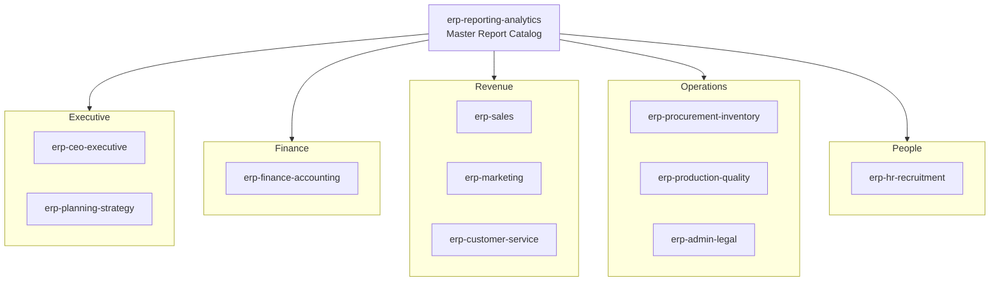

# Enterprise Reporting Skills - Walkthrough

## Summary
Created **7 new ERP skills** providing comprehensive enterprise reporting coverage for VCT Platform, bringing the total ERP skills to **16 modules**.

## New Skills Created

| # | Skill | Reports Covered |
|---|-------|----------------|
| 1 | [erp-finance-accounting](file:///d:/VCT%20PLATFORM%20ERP/.agents/skills/erp-finance-accounting/SKILL.md) | P/L, Balance Sheet, Cash Flow, Tax (VAT/TNDN), AR/AP Aging, Financial Ratios, Budget vs Actual |
| 2 | [erp-hr-recruitment](file:///d:/VCT%20PLATFORM%20ERP/.agents/skills/erp-hr-recruitment/SKILL.md) | Headcount, Recruitment Pipeline, Payroll, L&D, Performance Review, Attendance, Turnover, Insurance |
| 3 | [erp-procurement-inventory](file:///d:/VCT%20PLATFORM%20ERP/.agents/skills/erp-procurement-inventory/SKILL.md) | Procurement Spend, ABC Analysis, Inventory Movement, Supplier Scorecard, Logistics |
| 4 | [erp-admin-legal](file:///d:/VCT%20PLATFORM%20ERP/.agents/skills/erp-admin-legal/SKILL.md) | Fixed Assets, Contracts, Compliance, Office Costs, Vehicle Management, Insurance |
| 5 | [erp-production-quality](file:///d:/VCT%20PLATFORM%20ERP/.agents/skills/erp-production-quality/SKILL.md) | OEE, QC Metrics, Maintenance (MTBF/MTTR), BOM Costing, Labor Productivity |
| 6 | [erp-customer-service](file:///d:/VCT%20PLATFORM%20ERP/.agents/skills/erp-customer-service/SKILL.md) | Ticket/SLA, NPS/CSAT/CES, Warranty Claims, Churn Analysis, Knowledge Base |
| 7 | [erp-reporting-analytics](file:///d:/VCT%20PLATFORM%20ERP/.agents/skills/erp-reporting-analytics/SKILL.md) | **Master Skill** - 60+ report catalog, cross-module dashboards, export patterns, scheduling, VN formatting |

## Complete ERP Ecosystem (16 modules)

## Key Features per Skill
- ✅ Vietnamese business context (VAS standards, VNĐ, dd/mm/yyyy)
- ✅ SQL templates for each report type (PostgreSQL 18+)
- ✅ KPIs with formulas, targets, and benchmarks
- ✅ Frequency matrix (daily → annually)
- ✅ RBAC permissions per role
- ✅ Export format recommendations (PDF/Excel/CSV)
