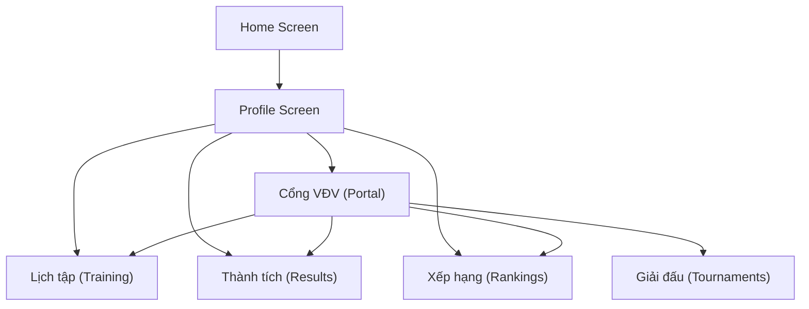

# Walkthrough — Mobile Athlete Screens

## Changes Made

### New File
#### [athlete-screens.tsx](file:///d:/VCT%20PLATFORM/vct-platform/packages/app/features/mobile/athlete-screens.tsx)
5 complete native mobile screens with Vietnamese labels and mock data:

| Screen | Purpose | Key Features |
|--------|---------|-------------|
| `AthletePortalMobileScreen` | Dashboard | Hero card, stats, quick actions, skill bars, belt timeline, goals |
| `AthleteTournamentsMobileScreen` | Giải đấu | Stats header, tournament cards, doc checklist with ✅/❌ |
| `AthleteTrainingMobileScreen` | Lịch tập | Attendance rate, upcoming/completed sessions, type breakdown |
| `AthleteResultsMobileScreen` | Kết quả | Medal breakdown 🥇🥈🥉, competition history, Elo |
| `AthleteRankingsMobileScreen` | Xếp hạng | Elo/medals/tournaments stats, skill bars, goals, ranking positions |

### Modified Files

#### [index.tsx](file:///d:/VCT%20PLATFORM/vct-platform/packages/app/navigation/native/index.tsx)
- Imported 5 athlete screen components
- Registered 5 `Stack.Screen` entries: `athlete-portal`, `athlete-tournaments`, `athlete-training`, `athlete-results`, `athlete-rankings`

#### [profile-screen.tsx](file:///d:/VCT%20PLATFORM/vct-platform/packages/app/features/mobile/profile-screen.tsx)
- Added `useRouter` import
- Quick action buttons now navigate to: Cổng VĐV → athlete-portal, Lịch tập → athlete-training, Thành tích → athlete-results, Xếp hạng → athlete-rankings

## Navigation Flow

> [!NOTE]
> All screens use **static mock data**. API integration will be a follow-up phase.
